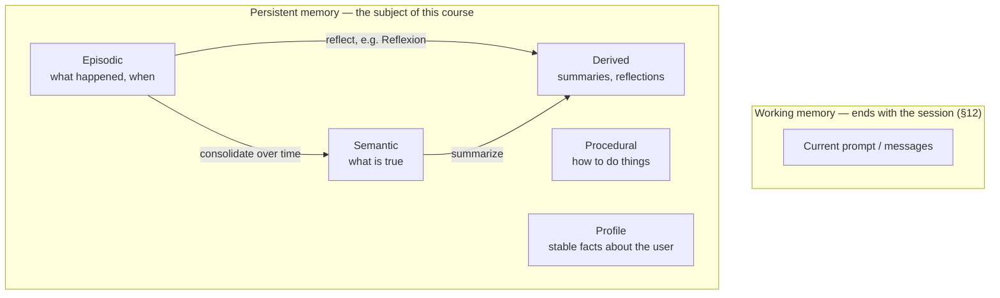

**Goal:** get a vocabulary before you build. "Memory" is not one thing — an agent has
several *kinds*, each with its own content, lifecycle, and storage. This unit describes a
practical taxonomy (working, episodic, semantic, procedural, plus profile and derived). It
helps you answer the one question that matters before you write code: **which of these does
*my* agent actually need?** Build the kinds your problem requires; skip the rest.

**Where this fits:** Unit 0 separated context management from memory and promised a
vocabulary. This is that vocabulary. Everything later — what you persist (Unit 2), what you
embed (Unit 3), what you put in the graph (Units 5–6) — is easier once you can name *which
kind* of memory a given fact is.

---

## The kinds of memory

The frame comes from **CoALA** (Sumers et al., *TMLR* 2024; arXiv:2309.02427), which takes
ideas from cognitive science to give agents a memory architecture. Its four main types, plus
two more that are useful in practice:

| Kind | What it holds | Example | Lifecycle |
|---|---|---|---|
| **Working** | The current context — what's in the prompt *right now* | The active `messages` list | Ends with the session (§12) |
| **Episodic** | Specific past events, "what happened" | "Last Tuesday we debugged the auth bug together" | Persisted; recalled by relevance |
| **Semantic** | General facts the agent knows | "Acme Corp is in Portland" | Persisted; updated as facts change |
| **Procedural** | How to do things — skills, routines | A tool-use pattern, a workflow, code | Rarely changes; often in weights/code |
| **Profile** | Stable facts about *this user* | "Allergic to shellfish; prefers short answers" | Long-lived; privacy-sensitive |
| **Derived** | Computed *from* other memory | A summary, a reflection, a consolidation | Recomputed as raw memory grows |

You already built **working memory** — it is the context management of §12, and it is *not*
the subject of this course. The other kinds are the persistent ones.

The difference between **episodic** ("what happened, when") and **semantic** ("what is true")
is the most important one to learn, because it changes how you store and retrieve. Episodic
memory is *time-stamped and specific* — you recall it by recency and relevance ("what did we
decide about the migration?"). Semantic memory is *timeless and general* — you recall it by
lookup or by meaning ("where is Acme based?"). A good system turns episodic memory into
semantic memory over time: many turns about Acme's location combine into one durable fact.

**Reflexion** (Shinn et al., *NeurIPS* 2023; arXiv:2303.11366) is the clearest example of
**derived, episodic-verbal** memory. An agent reviews a failed attempt, writes a short
lesson in words ("I forgot to check the return code"), stores it, and retrieves it next time
to do better. The reflection is not a raw event — it is *derived* from one. This is why
"derived" deserves its own row: the most useful memory is often something you *computed*, not
something a user said directly.

## Which does your agent need?

The goal of a taxonomy is not to use every kind — it is **subtraction**. Most agents need a
*subset*, and building memory you do not need is exactly the over-engineering this course
tries to avoid. Map your agent onto the decision tree from Unit 0:

- A **stateless Q&A bot** over documents needs **semantic** memory (the documents) and
  nothing else — that is plain RAG (§18–19). Stop there; do not build episodic stores or a
  graph.
- A **personal assistant** needs **profile** (your preferences) + **episodic** (what you have
  discussed) + **semantic** (facts it has learned about your world). This is the case that
  moves you down the tree toward correlation — and eventually a graph.
- A **coding agent** uses **procedural** memory (how this repo builds, your conventions) plus
  episodic memory (what we tried last time — Reflexion's area).

Name the kinds your agent needs, and you have set the scope of the rest of the course for
yourself.

---

> **Security:** The memory types do not carry equal risk. **Profile** memory is, by
> definition, personal data — names, preferences, health facts like the shellfish allergy —
> so it carries privacy duties (retention, deletion, access scope) as soon as you persist it.
> **Semantic** memory learned from untrusted conversation can be *poisoned* (a false "fact"
> added on purpose). If you tag memory by kind, you can apply the right policy to each; Unit
> 10 shows how.

## Challenges

1. **List your agent's memory.** For an assistant you want to build, list every "thing it
   should remember" and tag each with a kind from the table. *Success:* you can point to at
   least one kind you *do not* need — and explain why you skip it.
2. **Episodic vs. semantic.** Take five things a user might say and sort them into episodic
   ("what happened") and semantic ("what is true"). *Success:* you can explain why "we met
   Tuesday" is stored and recalled differently from "the user is vegetarian."
3. **Find the derived memory.** Identify one fact your agent would be better off *computing*
   (a summary, or a preference inferred from behavior) rather than storing word for word.
   *Success:* you can name what it is derived *from*, and when you would recompute it.

## Recap

- "Memory" is several kinds: **working** (context, §12), **episodic** (events), **semantic**
  (facts), **procedural** (skills), plus **profile** (user data) and **derived** (computed).
- The **episodic → semantic** difference drives storage and retrieval: events are recalled by
  time/relevance and combine into timeless facts.
- **Derived** memory (Reflexion's reflections, summaries) is often the most useful — it is
  computed, not stated.
- A taxonomy is for **subtraction**: build only the kinds your agent's place on the decision
  tree requires.
- Different kinds carry different **risk** — profile is personal data; semantic can be poisoned.

## Next

**Unit 2 — The Naive Baseline:** enough theory — we build. You will persist turns to SQLite
and recall them by recency and keyword, the simplest possible memory, and see exactly where
it breaks — so you know what each later piece adds.
