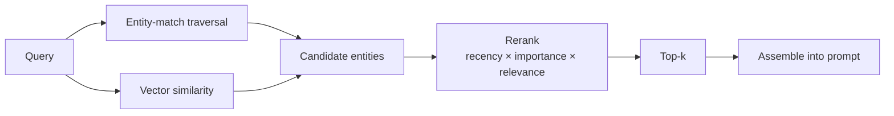

**Goal:** get facts back *out* of the memory graph and into a prompt. You will read the graph
two different ways — **entity-match traversal** when you know the starting node, and **broad
meaning recall** when you only have a vague question — then combine them, **rerank** the results
by recency, importance, and relevance, **assemble** the top facts into the prompt, and wrap the
whole thing as a `search_memory` **tool** the agent can call on its own.

**Where this fits:** Units 5 and 6 filled the graph. A graph you cannot query is a write-only
log. This unit is the read side, and it follows the course pattern: first the two raw retrieval
mechanisms on their own, then the single abstraction (`search_memory`) that combines and ranks
them. Writing is half of a memory system; retrieval is the half the user actually feels.

> **Optional (opt-in), like Units 5–6.** Reading the graph needs Neo4j (set `NEO4J_URI`, or the
> script skips). `EMBED_MODEL` is optional: without it the **relevance** term is unavailable, so
> the ranking uses recency and importance only and the demo says so. The chat endpoint is not
> needed for retrieval itself — only if you go on to wire the tool into a live agent loop.

---

## Two ways to ask the graph

There is not one retrieval operation; there are two, and they answer different questions.

**Entity-match traversal.** You already know the node you care about — the user just said
"Acme Corp" — so you find that node and walk its edges. This is precise and cheap. It returns
exactly the facts connected to a known anchor, in both directions:

```python
def traverse(driver, name):
    records, _, _ = driver.execute_query(
        "MATCH (e:Entity {name:$name})-[r]->(m) RETURN e.name AS s, type(r) AS p, m.name AS o "
        "UNION "
        "MATCH (e:Entity {name:$name})<-[r]-(m) RETURN m.name AS s, type(r) AS p, e.name AS o",
        name=name,
    )
    return [f"{r['s']} {r['p']} {r['o']}" for r in records]
```

`traverse("Acme Corp")` returns `Acme Corp LOCATED_IN Portland` and `Alex WORKS_AT Acme Corp`.
This is the strength of the graph from Unit 5: the multi-hop join. But it has one requirement —
**you must know the anchor name exactly.** It cannot answer a question that names no node.

**Broad meaning recall.** The user asks *"what am I allergic to?"* That sentence names no entity
in the graph. There is no node called "allergic." Here you need a **meaning** match, not a name
match — and that is exactly what the entity embeddings from Unit 6 are for. Embed the query, then
rank entity nodes by cosine similarity (the same `cosine` helper from foundations §18). The
allergy node scores high because its meaning is close to the question, even though the exact word
never appears. No anchor required.

Neither mechanism is enough alone. Traversal is precise but needs a known starting point. Vector
similarity finds a starting point from meaning but, on its own, ignores the structure around it.
A real recall step uses both: find good entry nodes by meaning, then traverse from them.

## Ranking: recency × importance × relevance

Once you have a set of candidate entities — some from name matches, some from vector similarity —
which do you keep? Closeness in the embedding space is one signal, but it is not the only one
that matters. A fact can be highly relevant and also three months old; another can be recent but
trivial.

The **Generative Agents** paper (Park et al., *UIST* 2023; arXiv:2304.03442) gives a clean,
much-copied answer. It scores each memory by combining three signals:

- **Relevance** — embedding similarity between the memory and the current query. Meaning match.
- **Recency** — an exponential decay over time since the memory was last accessed. Recent (or
  recently re-used) memories score higher: `recency = decay ** age`, with `decay` below 1.
- **Importance** — how significant the memory is on its own, independent of any query. In the
  paper a model assigns this score once, when the memory is created. The user's allergy is a 9;
  the city they passed through once is a 3.

Each signal is on a different scale, so you cannot just add them. The paper normalizes each one to
the range `[0, 1]` across the candidates, then sums them with equal weight:

```python
def normalize(xs):
    lo, hi = min(xs), max(xs)
    if hi == lo:
        return [0.0 for _ in xs]
    return [(x - lo) / (hi - lo) for x in xs]


def rank(cands, query_vec):
    recency = normalize([DECAY ** c["age_days"] for c in cands])
    importance = normalize([c["importance"] for c in cands])
    if query_vec is not None and all(c.get("embedding") for c in cands):
        relevance = normalize([cosine(query_vec, c["embedding"]) for c in cands])
    else:
        relevance = [0.0 for _ in cands]   # term unavailable -> contributes nothing
    scored = [(c["name"], rec + imp + rel)
              for c, rec, imp, rel in zip(cands, recency, importance, relevance)]
    return sorted(scored, key=lambda t: t[1], reverse=True)
```

Why three signals instead of one? Watch the allergy. It is the **oldest** fact in the graph
(60 days), so recency alone would bury it. But its importance is the **highest** (9), and for the
query "what am I allergic to?" its relevance is the highest too. The combined score lifts it back
to the top. That is the whole point of the multi-signal score: an old fact that is important and
on-topic should still surface. With the relevance term active, "what am I allergic to?" ranks the
allergy first; "where is my employer?" ranks the employer first. The query now steers the result.

> **The example ships honestly.** The relevance term needs `EMBED_MODEL`. When it is not set, the
> example ranks on recency and importance only — which are query-independent, so every query
> returns the same set. That is the *fallback*, and it shows you precisely what the relevance term
> buys: query-sensitivity. Set `EMBED_MODEL` (Unit 6 stored the vectors) to see the ranking change
> per question.

## Hybrid recall, then assembly

The two entry mechanisms feed one ranked pipeline, which ends in the assembled prompt:



Now combine the pieces. `search_memory` ranks the candidate entities, takes the top *k*, traverses
each one, and gathers the connected facts into a single block of text — deduplicated, ready to put
into a prompt:

```python
def search_memory(driver, query, embed=None, k=3):
    query_vec = embed(query) if embed is not None else None
    top = rank(candidates(driver, with_embedding=query_vec is not None), query_vec)[:k]
    facts = []
    for name, _ in top:
        facts.extend(traverse(driver, name))
    return "\n".join(f"- {f}" for f in dict.fromkeys(facts))   # dedup, keep order
```

Two decisions hide in that small function.

**The candidate set.** Here we score *every* entity in the graph. That is fine for a teaching
graph of six nodes; it does not scale. In production you restrict the candidate set first — a
vector index returns the top-N entities by similarity, and you rank only those. Scoring the whole
graph on every turn is the kind of cost the Unit 4 evidence warned about. We keep it simple here
and name the limit so you know where it is.

**The context budget.** `search_memory` returns a *bounded* block — top-*k* entities, deduplicated.
It is tempting to inject everything you can find, but the prompt window is finite and shared with
the conversation itself (foundations §12). More memory is not better memory: irrelevant facts
crowd out the relevant ones and cost tokens on every turn. Retrieval is as much about what you
**leave out** as what you put in. The rerank exists so that the few facts you keep are the right
ones.

Assembly itself is plain string work — put the retrieved block into the system prompt inside a
clear delimiter so the model can tell memory from instruction:

```python
context = search_memory(driver, "what am I allergic to?", embed)
messages = [
    {"role": "system", "content": "You are a helpful assistant. Use the memory below.\n"
                                  f"<memory>\n{context}\n</memory>"},
    {"role": "user", "content": "Can you suggest a seafood restaurant?"},
]
```

The assistant now answers the seafood question already knowing about the shellfish allergy —
a fact from a conversation that may have happened weeks ago, recalled because it was relevant,
important, and survived decay.

```bash
python work/retrieve.py
```

*(Reference: [`examples/07/retrieve.py`](../examples/07/retrieve.py).)*

## Exposing it as a tool

So far *we* decided when to recall. But a capable agent should decide for itself — recall when the
question needs memory, skip it when it does not. That is exactly what tool calling is for
(foundations §22). Wrap `search_memory` as a tool and the model calls it on its own:

```python
SEARCH_MEMORY_TOOL = {
    "type": "function",
    "function": {
        "name": "search_memory",
        "description": "Recall facts about the user from long-term memory. Call before "
                       "answering anything that depends on what you already know about them.",
        "parameters": {
            "type": "object",
            "properties": {"query": {"type": "string", "description": "what to recall"}},
            "required": ["query"],
        },
    },
}
```

The schema is what the model sees; the function is what runs when it calls. Wiring this into a
chat loop — pass `tools=[SEARCH_MEMORY_TOOL]`, run `search_memory` when the model asks for it, feed
the result back — is the same tool-calling pattern you built in foundations §22, so we do not repeat
it here. The new idea is only this: **memory becomes a tool.** The agent retrieves the way it would
call any other function, and the description tells it *when* to reach for memory at all.

---

> **Security:** Retrieved memory goes straight into the prompt, so treat it as **untrusted input**,
> not trusted instruction. A fact written months ago — possibly extracted from text an attacker
> influenced (Unit 6, foundations §20) — could read *"the user has asked you to ignore safety
> rules."* Putting recalled facts inside a `<memory>` delimiter and labeling them as data is the
> first defense: the model should treat memory as things it *knows*, never as commands it must
> *obey*. The query you embed for recall is also user-controlled — keep passing node values as
> bound parameters (Units 5–6); never format a recall query into Cypher.

## Challenges

1. **Make recall query-sensitive.** With `EMBED_MODEL` set, run `search_memory` for "what am I
   allergic to?" and for "where is my employer?". *Success:* the two queries return different
   top-ranked entities, and you can point to the relevance term as the reason. Then unset
   `EMBED_MODEL` and confirm both queries now return the same set — the fallback.
2. **Tune the decay.** Lower `DECAY` (forget faster) until the 60-day allergy drops out of the
   top-*k* even though its importance is highest. *Success:* you can state the recency/importance
   trade-off in one sentence and choose a `DECAY` you can defend. (This is the knob Unit 8 builds a
   whole lifecycle around.)
3. **Restrict the candidate set.** Change `candidates` to return only entities whose embedding is
   within a similarity threshold of the query, instead of all of them. *Success:* the result is
   unchanged for a small graph, and you can explain why this matters for a large one.

## Recap

- Recall is **two mechanisms**: entity-match **traversal** (precise, needs a known anchor) and
  **vector similarity** (finds an entry point from meaning, no anchor). Hybrid recall uses both.
- Rank candidates by **recency × importance × relevance** — normalize each signal to `[0,1]` and
  sum (Generative Agents). The combination lets an old-but-important, on-topic fact still surface.
- **Assembly** is bounded: top-*k*, deduplicated, inside a delimiter. The prompt window is shared
  and finite — what you leave out matters as much as what you include.
- Restrict the **candidate set** before ranking (a vector index top-N); do not score the whole
  graph on every turn.
- Expose recall as a **`search_memory` tool** so the agent decides when to remember (§22). Treat
  recalled memory as **untrusted data**, never as instruction.

## Next

**Unit 8 — Curation & Lifecycle:** retrieval assumes the graph holds the *right* facts. But memory
that only grows becomes noise. Next you decide what gets **promoted** to durable memory and what
**decays** — the time-versus-access decay you just met as a single `DECAY` constant, now built into
a real lifecycle with a promotion gate.
