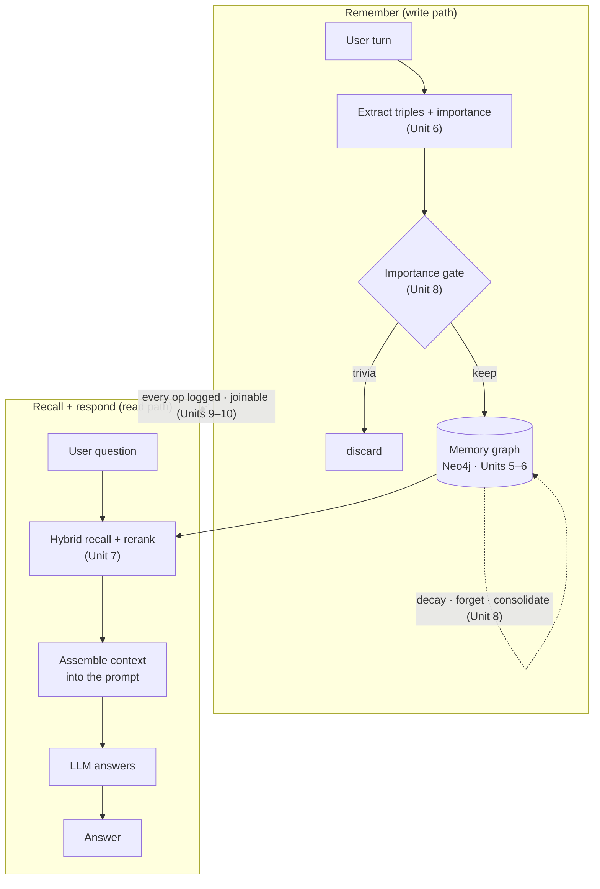
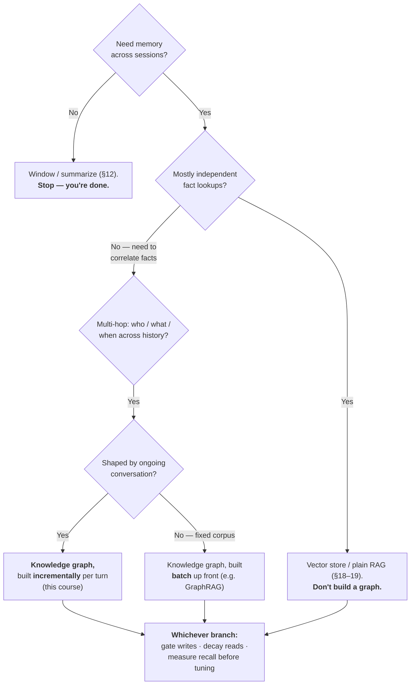

**Goal:** put it all together. In one agent loop you will wire ingestion (Unit 6), the graph
(Unit 5), hybrid retrieval (Unit 7), the lifecycle gate (Unit 8), and the controls from Units
9–10 into a single **memory-backed agent** — then step back and answer the question the whole
course has been building toward: *when is this machine worth building, and when should you not
build it at all?*

**Where this fits:** this is the synthesis. Every prior unit built one piece in isolation so you
could see it clearly. Here the pieces become one system, and the course delivers its opinion — a
defensible default, with the honest boundaries around it.

> **Needs both backends.** This is a graph-backed agent that calls an LLM, so the example needs
> Neo4j *and* the chat endpoint. It skips cleanly if either is missing. `EMBED_MODEL` is optional
> (recall falls back to importance ranking).

---

## The whole loop

A memory-backed agent does three things per turn: it **remembers** what the user told it, it
**recalls** what is relevant to the current question, and it **responds** with that memory in the
prompt. Each arrow below is a unit you already built.



The write path is one function — extract, gate, write:

```python
def remember(driver, client, embed, turn):
    extraction = Extraction.model_validate_json(...)        # Unit 6: extract triples + importance
    kept = [e for e in extraction.entities if e.importance >= IMPORTANCE_GATE]   # Unit 8: gate
    for e in kept:                                          # Units 5-6: write + embed
        driver.execute_query("MERGE (e:Entity {name:$name}) ...", name=e.name, ...)
        if embed is not None:
            driver.execute_query("MATCH (e:Entity {name:$name}) SET e.embedding=$v", ...)
    for rel in extraction.relations:
        if rel.subject in keep_names and rel.object in keep_names:
            driver.execute_query(f"... MERGE (a)-[:{safe_rel(rel.predicate)}]->(b)", ...)
```

The read path ranks entities (by relevance when embeddings exist, else importance), traverses the
top few, and assembles their facts — the Unit 7 `search_memory`, compacted. Then the answer is a
normal chat call with that memory in the system prompt.

Run it and watch memory cross a session boundary:

```
USER: Hi! I'm Alex ... at Acme Corp here in Portland, and I'm allergic to shellfish. The weather's lovely today.
   gate dropped (low importance): ['weather']
   remembered: ['Acme Corp', 'Alex', 'Portland', 'data engineer', 'shellfish']

USER: I'm booking a seafood restaurant for dinner. Anything I should keep in mind?
   recalled memory:
- Alex HAS_ALLERGY shellfish
- Alex LOCATED_IN Portland
   ...
ASSISTANT: Since you have a shellfish allergy, it's important to ensure the restaurant can
accommodate your dietary needs ... ask about cross-contamination ...
```

The gate dropped the weather. The allergy — stated once, in passing, in a self-introduction —
was recalled to answer a seafood question that never mentioned it. That is the entire promise of
the course, working end to end.

```bash
python work/agent.py
```

*(Reference: [`examples/11/agent.py`](../examples/11/agent.py).)*

Every operation above also emits one **joinable telemetry line** on stderr — the foundations
§9 shape (`session_id` / `trace_id` / `step`), with PII redacted at the boundary (Unit 10).
Run it with `2> run.jsonl` and a single `grep` on the `trace_id` replays the whole turn:

```json
{"operation": "remember", "session_id": "9f3a2b1c", "trace_id": "7c1d4e8a", "step": 0, "kept": "['Acme Corp', 'Alex', 'Portland', 'data engineer', 'shellfish']", "dropped": "['weather']", "gate": "4"}
{"operation": "recall", "session_id": "9f3a2b1c", "trace_id": "7c1d4e8a", "step": 1, "query": "I'm booking a seafood restaurant ...", "ranked_by": "relevance", "recalled": "2"}
```

> **Observe:** The capstone is where the through-line pays off. Every `remember`, `recall`,
> and `respond` emits a joinable record, so you can answer *what did the agent remember, under
> what gate, and which memories did recall surface for this question?* — the whole system made
> visible from one shared key. The `recall` line is also the feedback signal: its `recalled`
> count and `ranked_by` tell you, *before the answer does*, when recall surfaced nothing or
> fell back to importance ranking because embeddings were missing. This is the repo's
> [Observability Standard](../../OBSERVABILITY.md) — telemetry built with the agent, not after.

## The decision tree

Now the opinion. This course argues *toward* a knowledge graph with hybrid retrieval — but it
gets there by walking down a tree, and it sends you away early if your problem does not need it.



The honest part is the early exits. Most applications stop at the first two boxes — a window, or
plain RAG — and are right to. The graph earns its place only when you must **correlate** facts
across a history (Unit 4's conditional evidence), and *incremental* construction is favored only
when memory arrives as conversation rather than a fixed corpus. The last box is the one rule that
holds on every branch: gate what you write, decay what you read, and measure before you tune.

## When *not* to build this

Being opinionated includes saying when the opinion does not apply. Do **not** build this if:

- **A window or summary is enough.** If the agent only needs the last few turns, you do not need
  cross-session memory at all (foundations §12). This is most chat features.
- **Lookups are independent.** If your facts are unrelated documents and queries are "find the
  passage that answers this," a vector store is simpler, faster, and cheaper. Unit 4's numbers are
  blunt: graph traversal cost far more tokens than top-*k* vector search on simple lookups, and
  did not retrieve better. A graph you do not need is pure cost and latency.
- **Latency or cost is the binding constraint.** Extraction, embedding, and traversal each add
  time and tokens to a turn. If that budget is tight, the graph is the wrong place to spend it.
- **You have not measured.** If you cannot yet say what recall@k your current retrieval gets
  (Unit 9), you are not ready to choose a substrate — you are guessing.

## Production comparators

You do not have to build the lifecycle from scratch in production. Two systems package these
ideas, and seeing where they land validates the course's design:

- **Mem0** (Chhikara et al., 2025; arXiv:2504.19413) extracts, consolidates, and retrieves salient
  facts from conversation, with an optional **graph** variant for relational structure — the same
  split this course teaches (vector by default, graph when you must correlate). On the LoCoMo
  benchmark (Unit 9) its authors report large latency and token savings versus stuffing the full
  history into context, which is the cost argument from Unit 4, measured.
- **Zep / Graphiti** (Rasmussen et al., 2025; arXiv:2501.13956) builds a **bi-temporal,
  incrementally constructed** knowledge graph from conversation — exactly the "memory arrives one
  turn at a time" branch of the decision tree (Unit 6). It is the closest production analogue to
  what you built here.

Treat their headline numbers the way Unit 4 taught: as *"this paper reports,"* not settled fact —
and measure on **your** data (Unit 9) before adopting any of them. The value of building it
yourself across these eleven units is that you can now read these systems' choices critically,
because you have made each of those choices by hand.

## Recap

- A memory-backed agent is a loop: **remember** (extract → gate → write), **recall** (hybrid rank
  → traverse → assemble), **respond** (memory in the prompt). Every step is a unit you built.
- The **decision tree** is the course's opinion: window → vector RAG → graph, taking the graph only
  to **correlate** facts, and building **incrementally** only for conversational memory. On every
  branch: gate writes, decay reads, measure recall.
- Know **when not to build it**: a window suffices, lookups are independent, latency/cost is
  binding, or you have not measured yet.
- **Mem0** and **Zep/Graphiti** package these patterns in production and validate the design — but
  their numbers are conditional, so measure on your own data.

## Where to go next

You have built, by hand, a complete agent-memory system and the judgment to know when it is
warranted. From here: take an optional advanced path into **document ingestion** (the spine of
this course was conversation; a fixed corpus favors the batch branch and GraphRAG), harden the
**consolidation** pass (Unit 8) into a scheduled job, or fold this `search_memory` tool into a
real agent from foundations §22. Whatever you build, keep the last rule of the tree: **measure
before you optimize.**
