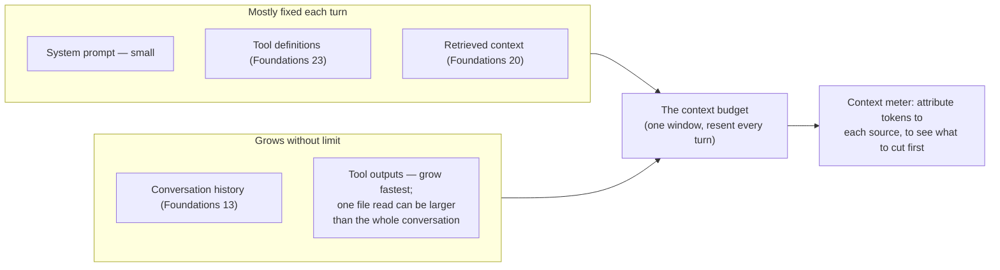

**Goal:** before you can manage a budget, you have to read it. In this unit you build a
**context meter**: a small tool that counts the tokens in your prompt *and* attributes them to
where they came from — system prompt, tool definitions, history, and tool outputs — so you can
see *what* is filling the window, not just that it is full. You will count without a tokenizer,
check that count against the server, and emit the first joinable telemetry line of this course.

**Where this fits:** Unit 0 said the window is a budget you already overspend. This unit measures
it. It leans on [Foundations Lesson 4 — Tokens & the Context Window](../../lessons/04-tokens-and-the-context-window.md) (tokens, and the course's rule: ask the *server*, do not guess), [Foundations Lesson 10 — Observability & Logging](../../lessons/10-observability-and-logging.md) (the
joinable `session_id`/`trace_id`/`step` log line), [Foundations Lesson 13 — Conversation State & Memory](../../lessons/13-conversation-state-and-memory.md) (the `messages` list), and [Foundations Lesson 23 — Agents](../../lessons/23-agents.md) (tool
schemas). It is also the first unit with an `Observe` note that *builds* something, not just
points forward — the meter you write here is the baseline every later compaction is measured
against.

---

## Count without a tokenizer

You need a token count to know how full the window is. The exact count depends on the model's
tokenizer — but this course takes no Hugging Face downloads and no `tiktoken` ([Lesson 4 — Tokens & the Context Window](../../lessons/04-tokens-and-the-context-window.md)). For
*budgeting* that is fine, because budgeting does not need the exact number; it needs a number
good enough to answer "are we getting close?"

A simple heuristic does the job: English text runs roughly **four characters per token**, and
each message costs a few extra tokens of structure (its role, and the delimiters the chat
template wraps around it) that the content itself does not show. Sum that over the messages:

```python
_CHARS_PER_TOKEN = 4
_PER_MESSAGE_OVERHEAD = 4   # role + chat-template framing, per message

def estimate_tokens(messages):
    return sum(len(m["content"]) // _CHARS_PER_TOKEN + _PER_MESSAGE_OVERHEAD for m in messages)
```

This is a rule of thumb, not a tokenizer — it drifts with code, other languages, and unusual
whitespace, and it is typically within 10–20% of the truth. That is close enough to decide when
to act, and cheap enough to run on every turn without a network call. *(Reference:
[`examples/common_context.py`](../examples/common_context.py), which also handles structured
message content.)*

## Ask the server when it matters

Sometimes 10–20% is not good enough — you are right at the limit, or a decision turns on the
exact number. Then do what [Lesson 4 — Tokens & the Context Window](../../lessons/04-tokens-and-the-context-window.md) taught: **ask the server.** Every completion already reports the
exact input count in `usage.prompt_tokens`, so the smallest possible call returns the truth:

```python
def server_prompt_tokens(client, messages, model):
    r = client.chat.completions.create(model=model, messages=messages, max_tokens=1)
    return r.usage.prompt_tokens   # exactly how many input tokens the model saw
```

(If your endpoint exposes vLLM's `/tokenize`, that returns the count without generating
anything.) The division of labour is the point: the **heuristic for budgeting** — fast, free,
every turn — and the **server for precision** — exact, but a real call. The course leans on the
first and reaches for the second only when a choice depends on it.

## Where the budget goes

A single total tells you the window is filling. It does not tell you *what to cut*. For that,
attribute the tokens to their source — and the sources are exactly the parts Unit 0 listed. Two
of them are mostly fixed each turn; two grow without limit, which is where the meter earns its
keep:



```python
breakdown = {
    "system":       estimate_tokens([m for m in messages if m["role"] == "system"]),
    "tools":        estimate_tokens(json.dumps(tools)),          # schemas, resent every turn (Foundations 23)
    "history":      estimate_tokens([m for m in messages if m["role"] in ("user", "assistant")]),
    "tool_outputs": estimate_tokens([m for m in messages if m["role"] == "tool"]),
}
```

Print that as a budget bar and the shape of the problem appears immediately. Run the meter on a
short session whose agent has read one file *(Reference:
[`examples/01/meter.py`](../examples/01/meter.py))*:

```
context meter  (budget 8000 tokens)
  system            32    1%
  tools             97    3%   #
  history           53    2%   #
  tool_outputs    2704   94%   #####################################
  TOTAL           2886   36% of budget
```

Six messages, and **94% of the tokens are one tool output** — a single file the agent read. The
system prompt, the tools, and the entire conversation together are a rounding error beside it.
This is the lesson Unit 0 promised, now measured: history and tool outputs grow without limit,
and tool outputs grow *fastest*. When you later decide what to compress, the meter has already
told you where to look first — and it tells you per turn, so you watch the shape change as the
session runs.

## Instrument it: the meter is the first telemetry line

A meter you read once and forget is not observability. The course's discipline is to **emit**
every measurement as a structured, joinable line, so the whole run reconstructs from a shared
key ([Lesson 10 — Observability & Logging](../../lessons/10-observability-and-logging.md)). The meter is where that through-line begins:

```python
session_id, trace_id = uuid.uuid4().hex[:8], uuid.uuid4().hex[:8]
log_event(session_id, trace_id, 0, "context_meter",
          budget=BUDGET, total=total, fraction=round(total / BUDGET, 3), **breakdown)
```

```json
{"operation": "context_meter", "session_id": "88194aab", "trace_id": "3317d685", "step": 0,
 "budget": 8000, "total": 2886, "fraction": 0.361, "system": 32, "tools": 97,
 "history": 53, "tool_outputs": 2704}
```

That one line is the baseline. Every later unit performs a compaction and logs *another* line
with the same tuple — so you can replay a session and see the window fill, a compaction fire,
and the total drop, all joined by `trace_id`. You cannot manage a budget you cannot see; from
here on, you can see it. *(`log_event` lives in
[`examples/common_context.py`](../examples/common_context.py) and is reused by every unit.)*

> **Security:** log the *shape* of the context, never its *content*. The meter records token
> counts and percentages — safe, high-value metadata — but a message body can carry secrets or
> personal data, so it must not land in a log without a policy ([Lesson 10 — Observability & Logging](../../lessons/10-observability-and-logging.md)). The meter also doubles as a
> tripwire: the context-overflow attack from Unit 0 — a hostile tool result or pasted document
> padding the window to push your system prompt out — shows up here as a sudden spike in
> `tool_outputs`. You will not catch that by eye in a 100-turn run; you will catch it in the
> telemetry.

> **Observe:** this unit *is* the start of the through-line. It emits one joinable
> `context_meter` line per measurement — `total`, `fraction` of budget, and the per-source
> breakdown — using the [Lesson 10 — Observability & Logging](../../lessons/10-observability-and-logging.md) tuple. The loop it closes is the most basic one in the
> course: you now have a number for "how full, and with what?", which every later unit needs to
> decide *whether* to compress and to prove the compaction actually helped.

## Challenges

1. **Build the meter.** Write `estimate_tokens` and the four-part breakdown in your own `work/`
   folder, and run it on a conversation you build. *Success:* a budget bar that names which
   source is largest — and, for the example session, it is the tool output by a wide margin.
2. **Trust, then verify.** If you have an endpoint, compare your heuristic total to
   `server_prompt_tokens`. *Success:* you can state your heuristic's error as a percentage, and
   say whether it over- or under-counts for your text.
3. **Watch it climb.** Append turns (or a second big tool output) and re-run the meter each
   time, capturing the `context_meter` lines with `2>> run.jsonl`. *Success:* a JSONL file whose
   `total` rises turn by turn — the budget filling, recorded.

## Recap

- For budgeting you do not need an exact token count, so the course uses a **heuristic**
  (~4 chars/token + a small per-message overhead) — no `tiktoken`, no downloads ([Lesson 4 — Tokens & the Context Window](../../lessons/04-tokens-and-the-context-window.md)).
- When precision matters, **ask the server**: `usage.prompt_tokens` is the exact input count.
- A total is not enough; **attribute tokens to their source** (system / tools / history / tool
  outputs). Tool outputs are usually by far the largest — the meter makes that visible.
- Emit every measurement as a **joinable `context_meter` line** ([Lesson 10 — Observability & Logging](../../lessons/10-observability-and-logging.md) tuple). This is the baseline
  the rest of the course measures compaction against — observability starts in Unit 1, not at
  the end.
- Log the context's **shape, not its content** — and let the meter double as an overflow
  tripwire.

## Next

**[Unit 2 — The Cheapest Compression Is None](02-the-cheapest-compression-is-none.md):** now that you can read the budget, the first
question is when *not* to spend effort. We look at the real cost of compressing too early — to
answer quality and to the prompt cache — and set the course's opening rule: under budget, do
nothing.
