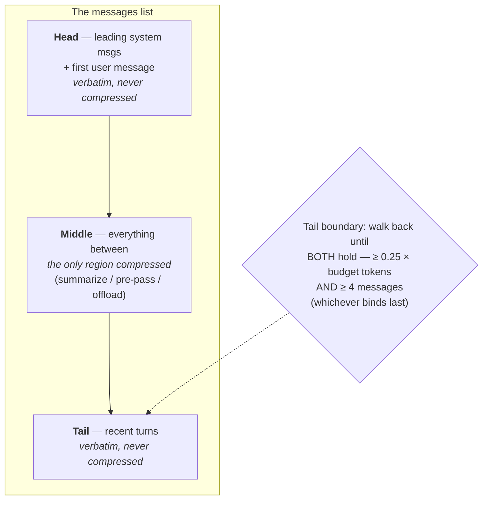

**Goal:** stop compressing the turns the model is still using. Unit 3 anchored the *head* and
dropped from the front; Unit 4 summarized what it evicted. Both worked from one end. But the
*recent* tail — the last few turns, the file open right now — is as load-bearing as the task at
the head, and a front-only window will eventually reach it. This unit makes the rule explicit and
symmetric: **keep the head and the tail verbatim, and only ever compress the middle.**

**Where this fits:** this is the precise shape of the decision tree's third branch (Unit 0) — "losing
content from the *middle* that still matters." It combines Unit 3's head anchor with Unit 4's
middle summarizer, and adds the missing tail anchor. It leans on Unit 0's lost-in-the-middle
result and [Foundations Lesson 11 — Cost, Pricing & Prompt Caching](../../lessons/11-cost-pricing-and-prompt-caching.md) (the cache likes stable ends). It points forward to Unit 6 (a cheap deterministic
pre-pass *inside* the middle, before you pay the summarizer) and Unit 9 (the cache-frozen layout,
which is exactly a `[head][recap][tail]` rebuild done on a schedule).

---

## Two ends matter, not one

Unit 0's lost-in-the-middle finding (Liu et al., *Lost in the Middle*, TACL 2024) is usually read
as a warning — a model attends most to the start and end of its context and least to the middle,
so facts buried in the middle get missed. Read it the other way and it is a *design rule*: the two
positions the model attends to most, the head and the tail, are the two you should protect from
compression. The head holds the task and the rules. The tail holds the live working set — the last
question, the file just read, the error just seen. Compress either and you damage exactly the part
the model relies on.

Unit 3's window protected only the head. That is safe while the conversation is short, but a window
that always drops from the front has no lower bound on the tail: keep dropping and eventually the
"oldest" message it removes is one from a minute ago that the next turn needs. The fix is a second
anchor. The pattern — keep a verbatim head, a verbatim tail, and compress only what is between them
— is old enough to have a name in practice (the head/tail, or Hermes-style, layout). What makes it
work is being precise about where each boundary sits.

## Defining the head and the tail

The head is the same boundary from Unit 3: leading system messages plus the first user message —
the rules and the task — and nothing after them.

```python
def _head_end(messages):
    i = 0
    while i < len(messages) and messages[i]["role"] == "system":
        i += 1
    if i < len(messages) and messages[i]["role"] == "user":
        i += 1
    return i
```

The tail is the new part, and it is defined by **two floors, not one.** Walk back from the most
recent message, growing the tail, and stop only when it satisfies *both*: it holds at least a
**fraction of the budget** in tokens, and it spans at least a **minimum number of recent
messages.** (The production spine phrases the second floor as "≥ 4 turns"; counting messages in the
list is the simple proxy used here.)

```python
def _tail_start(messages, head_end, budget, ratio=0.25, min_msgs=4):
    floor = ratio * budget
    start = len(messages)
    while start > head_end:
        candidate = start - 1
        tail = messages[candidate:]
        if estimate_tokens(tail) >= floor and len(tail) >= min_msgs:
            return _snap_to_pair_boundary(messages, candidate, head_end)
        start = candidate
    return head_end        # nothing meets the floors -> middle is empty, nothing to compress
```

Why two floors? Each catches a case the other misses. The **token floor** (a real harness uses
about **0.25 of the budget**) keeps enough recent material that the model is not reasoning from a
summary of its own last move. But a token floor alone fails when recent messages are tiny — four
short exchanges might be 200 tokens, well under the floor, so a token-only rule would walk back and
include far more of the conversation than needed to reach its quota. The **message floor** (about
**4 messages**) guarantees a minimum number of recent messages survive verbatim regardless of their
size. Whichever floor binds last is the one that sets the boundary. In the example, the token floor
is met three messages
back, but the message floor pulls in one more — you can watch both rules act.

One seam needs care, and it is the tool-pair rule from Unit 3 applied at the boundary: the tail
must never *begin* on a `tool` result, because its assistant tool-call would be on the middle side
and about to be summarized away, leaving an orphan. Snap the boundary back to include the call:

```python
def _snap_to_pair_boundary(messages, idx, head_end):
    while idx > head_end and messages[idx]["role"] == "tool":
        idx -= 1                # pull the boundary back so a tool pair is never split
    return idx
```

## The invariant: only the middle moves

The two boundaries cut the list into three regions; only the middle is ever eligible for
compression, and the tail boundary is set by whichever of the two floors binds last:



With both boundaries fixed, the whole mechanism is one line of intent — head and tail pass through
untouched, the middle is replaced by a recap:

```python
def compress_in_place(messages, budget):
    head_end = _head_end(messages)
    tail_start = _tail_start(messages, head_end, budget)
    head, middle, tail = messages[:head_end], messages[head_end:tail_start], messages[tail_start:]
    return head + compress_middle(middle) + tail      # compress_middle is Unit 4's summarizer
```

`compress_middle` is the plug for Unit 4: in production it is the structured summarizer with its
graceful fallback; in the example it is the static marker, so the unit stays offline and focused on
the split. Either way the invariant is the same and worth checking by **object identity**, not just
equality — every head and tail message in the output is the *same object* you put in, so you know it
was carried through byte-for-byte and not re-rendered:

```
split: head 2 msgs/36 tok | middle 6 msgs/5571 tok | tail 4 msgs/2570 tok
after compress-in-place: 7 messages, 2617 tokens, 33% of budget -- compressed 6 middle message(s)
invariant: head verbatim True | tail verbatim True | middle replaced by 1 recap message(s)
```

That "byte-for-byte" is not only correctness — it is a cache property ([Lesson 11 — Cost, Pricing & Prompt Caching](../../lessons/11-cost-pricing-and-prompt-caching.md)). Within a single
compression pass, the head and the tail are kept unchanged and the one region that is replaced is
the recap in the middle, so the change is confined to one place. (Across turns the boundary is
recomputed each pass, so the layout is not yet stable enough for the cache to span turns — keeping
it byte-identical between scheduled rebuilds is Unit 9's job.) The head/tail split is what makes
that frozen layout possible at all.

## The honest part

The numbers are configurable parameters, not fixed constants. `0.25` of the budget and `4`
messages are one harness's choices; a workload with long, dense recent messages wants a smaller
token fraction, and a chatty one with tiny messages wants a larger message floor. There is a real
tradeoff in the tail floor: every token you reserve for a verbatim tail is a token you have chosen
*not* to compress, so a generous tail leaves less headroom and trips the threshold sooner. Set it
from the workload, and measure.

And the deeper limit, the one that carries into the next units: this layout decides *what* to
compress (the middle) but not *how well*. If a middle turn still holds a fact a later turn needs —
the path to the file you are mid-edit on — summarizing it is exactly Unit 4's lossy trade, now
aimed at the middle. The middle is the *safest* place to lose fidelity, not a free one. That is why
only the middle is eligible for compression, and why it is summarized (Unit 4) — and when its bulk
is a giant tool output, pre-collapsed cheaply first (Unit 6) or offloaded whole (Unit 8) — when its
contents are still needed, rather than blindly dropped the way Unit 3's blunt baseline would.

> **Security:** the head/tail anchors are a defense and a target at once. Anchoring means an
> attacker who pads the context cannot push your system prompt out of the head or your safety-relevant
> recent turns out of the tail — good. But the middle is now the *only* place compression happens,
> so it is where an injection will aim: a crafted middle turn tries to survive summarization with
> its instruction intact, or to get a safety fact dropped as "old." Treat both boundaries as
> security-critical code, and remember the recap is model-written text from possibly-hostile middle
> turns (Unit 4's warning) sitting between two regions the model trusts.

> **Observe:** this unit emits a `compaction` record with `strategy="head-tail"`,
> `head_tokens`/`middle_tokens`/`tail_tokens`, and `head_verbatim`/`tail_verbatim` flags — using the
> [Foundations Lesson 10 — Observability & Logging](../../lessons/10-observability-and-logging.md) joining tuple. The loop it closes is the invariant itself: both verbatim flags must be `true` on
> every record, checked by object identity, so the log *proves* the head and tail were carried
> through unchanged and only the middle region was replaced, rather than asserting it. The three
> token counts also show, run over run, how the split is moving — a middle that keeps growing while
> the tail floor holds steady is the signal that compression is doing its job on the right region.

## Challenges

1. **Find the binding floor.** Run the example and read the split line. *Success:* you can say
   which floor set the tail boundary (token or message), and predict how the split changes if you
   halve `ratio` or raise `min_msgs` — then change them and confirm.
2. **Prove the invariant.** Confirm the printed check shows `head verbatim True` and
   `tail verbatim True`, with only the middle replaced. *Success:* you can explain why the check
   uses object identity (`is`) rather than equality, and what bug an equality check would hide.
3. **Break it at the seam.** Move the recent `tool` result so the tail boundary would land on it,
   and confirm `_snap_to_pair_boundary` pulls the boundary back to keep the pair whole. *Success:*
   you can show the assembled transcript has no orphaned tool result, and name what most providers
   would do if it did.

## Recap

- The model attends most to the **head and the tail** (Unit 0's U-shape read as a design rule), so
  protect both from compression — Unit 3's head-only anchor eventually lets the window remove the
  live tail.
- The **head** is leading system messages + the first user message. The **tail** is defined by
  **two floors**: at least a fraction of the budget in tokens (~0.25) *and* at least a minimum
  number of recent messages (~4) — whichever binds last sets the boundary.
- The **invariant**: only the **middle** is ever compressed; head and tail pass through
  **byte-verbatim** (check it by object identity). This also confines cache invalidation to the
  one region that changes ([Lesson 11 — Cost, Pricing & Prompt Caching](../../lessons/11-cost-pricing-and-prompt-caching.md)), which is what makes Unit 9's frozen layout possible.
- Snap the tail boundary so it never **splits a tool pair** (the Unit 3 rule, at the seam).
- Be honest: the floors are **configurable** (set from the workload) with a real tradeoff (a bigger
  verbatim tail = less headroom), and the middle is the *safest* place to lose fidelity, **not a free
  one** — which is why only the middle is eligible for compression: summarized (Unit 4),
  pre-collapsed (Unit 6), or offloaded (Unit 8) when still needed, rather than blindly dropped like
  Unit 3's baseline.

## Next

**[Unit 6 — Cheap Before Smart: The Deterministic Pre-Pass](06-deterministic-pre-pass.md):** the middle is usually mostly one
thing — a giant tool output. Before paying an LLM to summarize it, collapse it deterministically to
a one-line descriptor for free. You will build the pre-pass and meet the finding that simple
observation masking can match LLM summarization at a fraction of the cost.
