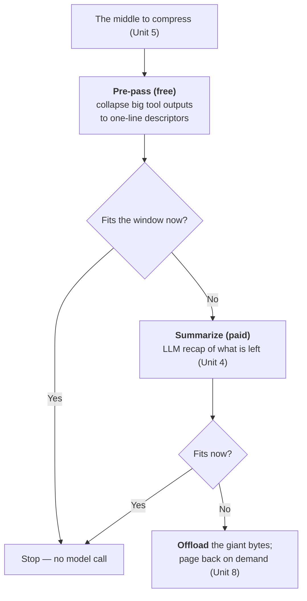

**Goal:** shrink the middle for free before you pay to summarize it. Unit 5 isolated the middle
as the only region you compress; Unit 4 handed it to an LLM summarizer. But most of the time the
middle is not a subtle conversation that needs an intelligent summary — it is one or two enormous
**tool outputs** (a file read, a search dump) surrounded by a few short messages. Those you can
collapse deterministically, with no model call at all. This unit builds that pre-pass and states
the rule it teaches: **cheap before smart** — do the free, mechanical compression first, and only
use the paid, intelligent one if you still need it.

**Where this fits:** this is the decision tree's fourth branch (Unit 0): "compressing the middle?
→ run a cheap deterministic pre-pass before you pay an LLM summarizer." It sits *inside* Unit 5's
middle, *before* Unit 4's summarizer in the pipeline. It uses Unit 1's meter to size the saving
and leans on §4 (tokens) and §23 (tool outputs are the biggest, most resendable thing an agent
produces). It points forward to Unit 7 (when this fires) and Unit 8 (when a giant output should be
*offloaded* and paged back, not just collapsed).

---

## The middle is usually one big thing

Unit 1's meter made the point already: in a real agent session the single largest consumer of the
window is almost never the conversation — it is the tool outputs. A file the agent read, a search
result, a command's stdout. One `read_file` can be thousands of tokens; the user and assistant
turns around it are tens. So when Unit 5 passes you "the middle" to compress, what you are usually
holding is a couple of giant tool messages and a few short messages.

That changes the cheapest move. You do not need an LLM to understand a 2,000-token file dump well
enough to shrink it — you need to *recognize that it is a file dump* and replace it with a note
saying so. The expensive, intelligent summarizer from Unit 4 is the right tool for compressing
*reasoning* and *decisions* spread across many turns. It is the wrong tool for a single block of
bytes whose only role, by the time it is in the cold middle, is to be remembered as "a thing that
was read." For that, a deterministic descriptor is faster, free, and predictable.

## Collapse before you summarize

The pre-pass is a single rule applied to every message: if it is a **tool output at or above a
size threshold**, replace its content with a one-line **shape descriptor** — what kind of thing it
was and how big — and leave everything else untouched.

```python
def prepass(messages, threshold=800):
    out, collapsed, saved = [], 0, 0
    for m in messages:
        content = m.get("content") or ""
        is_big_tool = m["role"] == "tool" and estimate_tokens(content) >= threshold
        if is_big_tool and not _is_error(content):
            new = dict(m)                       # copy keeps tool_call_id -> pair stays valid
            new["content"] = _describe(content) # "<text output: 761 lines, 15960 chars (collapsed)>"
            saved += estimate_tokens(content) - estimate_tokens(new["content"])
            collapsed += 1
            out.append(new)
        else:
            out.append(m)                       # small outputs and errors pass through untouched
    return out, collapsed, saved
```

Three details make it safe. It **preserves `tool_call_id`** (the descriptor copy keeps it), so the
assistant-call/tool-result pair stays valid — the tool-pair rule from Unit 3, again. It uses a
**size threshold** (a real harness uses **800 tokens**) so it never bothers collapsing a small
output whose descriptor would be as long as the content. And the descriptor keeps the **shape**, not
just a marker: "761 lines, 15960 chars" or "json object: 1 key: matches" tells the model what was
there and that it could be fetched again, which is the reference Unit 8 turns into real paging.

The effect is large because the inputs are large. On the example session — a file read, a search
dump, and an error — the pre-pass alone takes the prompt from **155% of budget to 24%**, collapsing
two outputs and saving about 5,200 tokens, with no model call:

```
before: 9 messages, 6182 tokens, 155% of budget (OVER)
after pre-pass: 972 tokens, 24% of budget -- collapsed 2 large tool output(s), saved ~5210 tokens (no model call)
```

## All-or-nothing, never the middle

There is a strict rule in *how* the descriptor replaces the content: it replaces the **whole**
output, or none of it. It never keeps "the first 40 and last 20 lines" of a tool output and drops
the middle. This is the course's signature *when-not-to-compress* case, and it is worth stating
plainly: **head/tail truncation of a tool output corrupts the thing the model is reading.** If the
agent ran `cat`, `grep`, or `sed` to read a file and you silently delete the middle of that result,
the model now holds a file that looks complete but is not — and it will edit, patch, or reason about
the corrupted version, shipping a broken artifact. A production harness measured exactly this
failure and **parked** its tool-result middle-truncation feature off by default as a result.

So the safe operations on a giant tool output are: replace it **whole** with a descriptor (this
unit), or **offload** the bytes and page them back on demand (Unit 8) — never truncate its interior.
The pre-pass is all-or-nothing by design.

The same logic is why **errors are kept verbatim**, even when they are large. An error message is
short relative to its value: it is the one piece of a tool output the model most needs intact to
recover — the exact exception, the host and port, the failing line. Collapse a file dump to a
descriptor; never collapse the traceback that explains why the next step failed.

## Observation masking vs. LLM summarization

It is tempting to see the pre-pass as merely a *pre*-step — a way to make the summarizer's job
cheaper. Recent work suggests it is often the complete answer. The JetBrains study *The Complexity
Trap* compared simple **observation masking** (collapsing stale tool outputs to a placeholder,
exactly this pre-pass) against full LLM summarization for agent context management, and found
masking **matches or slightly beats** summarization on SWE-bench Verified while roughly **halving
the cost of the raw agent run** — and it avoids the summarizer's own LLM call entirely. Anthropic's
context-editing feature (`clear_tool_uses`) ships the same idea in production: when the context
crosses a threshold it clears old tool results and keeps only the most recent few.

The lesson is not "never summarize." It is that the intelligent step has a real cost — tokens,
latency, and the cache-invalidation cost from Unit 4 — and a large fraction of real compaction
pressure is simple bulk that a free deterministic pass removes just as well. Spend the smart step
only on what actually needs intelligence.

## When the pre-pass isn't enough

Sometimes the pre-pass is not enough. If the middle is genuinely many turns of dense reasoning, or
if collapsing every big tool output still leaves you over budget, the pre-pass passes its smaller,
cleaner middle to Unit 4's summarizer — which now has less to read and so costs less. The pipeline
order is the central idea of the unit: **pre-pass (free) → summarize (paid) → offload (Unit 8)**,
each step run only if the cheaper one before it did not already fit the window. The example logs
which steps were needed, so you can see the cheap step replace work the expensive step would
otherwise be billed for.



> **Security:** the shape descriptor is attacker-readable surface. An output whose *shape* you
> advertise ("json object: 12 keys") tells anyone who can see the transcript what your tools return,
> and a crafted tool result could try to make its descriptor misleading — looking small and benign
> while the offloaded bytes (Unit 8) carry an injection. Keep descriptors factual and derived from
> the content, never from the content's own claims about itself; and treat the kept-verbatim error
> path as untrusted text like any other tool output, since "errors kept whole" is also a way to keep
> attacker-controlled text whole.

> **Observe:** this unit emits a `compaction` record with `strategy="prepass"`,
> `tokens_before`/`tokens_after`, `collapsed` (how many outputs), `tokens_saved`, and a
> `summarizer_needed` flag — using the §10 joining tuple. The loop it closes is the cheap-before-smart
> claim itself: `summarizer_needed=false` is a turn where the free pass fit the window and the paid
> LLM call was skipped, so over a run you can measure how much of your compaction was handled without
> model cost — and how often you avoided the summarizer's token, latency, and cache cost entirely.

## Challenges

1. **Measure the free pass.** Run the example and read the before/after. *Success:* you
   can state how many tokens the pre-pass saved with no model call, and confirm `summarizer_needed`
   is `false` — the cheap step alone fit the window.
2. **Keep the error.** Confirm the error tool output is kept verbatim while the file and search are
   collapsed, even though the error is also over the threshold. *Success:* you can explain why an
   error is the one large output you never collapse, and what the model would lose if you did.
3. **Force the smart step.** Lower the budget (or raise the threshold so the big outputs are not
   collapsed) until the pre-pass alone no longer fits. *Success:* `summarizer_needed` flips to
   `true`, and you can describe what the pre-pass hands Unit 4 and why that call is now cheaper than
   summarizing the raw middle would have been.

## Recap

- The middle is usually **one or two giant tool outputs**, not subtle conversation — so the cheapest
  compression is to **recognize and collapse** them, not to summarize them.
- The **pre-pass** replaces each tool output at/above a **threshold** (~800 tokens) with a one-line
  **shape descriptor**, preserving `tool_call_id`. It is deterministic: no model call, no model latency, no
  cache cost.
- It is **all-or-nothing**: replace the whole output or none of it. **Never head/tail-truncate a
  tool output** — that corrupts the file the model is reading (the signature "when not to compress").
  And **keep errors verbatim**, even large ones.
- **Observation masking matches LLM summarization** at lower cost (*The Complexity Trap*; Anthropic
  `clear_tool_uses`) — the free pass is often the complete answer, not just a pre-step.
- Run it as a pipeline: **pre-pass → summarize → offload**, each step only if the cheaper one did not
  already fit. Log `summarizer_needed` to confirm the cheap step is worth running.

## Next

**Unit 7 — When to Fire: Triggers & Async Compression:** we have built the *what* (drop, summarize,
head/tail, pre-pass) but left the timing open. Unit 7 builds the triggers — a soft threshold that
fires compaction in the background and a hard one that blocks — the re-fire cursor that stops it
repeating too often, and the latency argument for doing it off the critical path.
