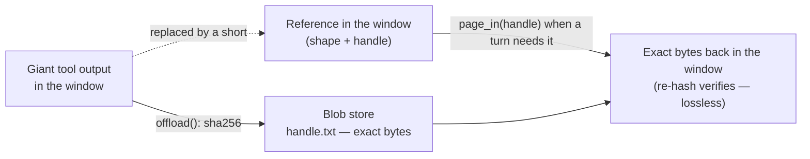

**Goal:** keep a giant artifact without keeping it *in the window*. Some things are too big to
leave in context and too important to summarize — the 2,000-line file the agent is about to edit,
the full API response it will need three turns from now. Dropping it (Unit 3) deletes it;
summarizing it (Unit 4) loses the exact bytes. This unit builds the third option: **offload** the
bytes to storage, leave a compact **reference** in the window, and **page** the exact bytes back
on demand. Unlike every mechanism so far, this one is **lossless** — and that is the whole point.

**Where this fits:** this is the fifth branch of the decision tree (Unit 0): "a single tool
output or artifact is enormous." It builds on Unit 6 (the one-line descriptor — now backed by
real bytes you can retrieve) and Unit 5's middle, uses Unit 1's meter to size the win, and leans
on [Foundations Lesson 13 — Conversation State & Memory](../../lessons/13-conversation-state-and-memory.md) (history) and [Foundations Lesson 23 — Agents](../../lessons/23-agents.md) (an agent paging bytes back with a tool call). It is the **safe**
counterpart to Unit 6's parked tool-result digest, and it points to Unit 9 (the cache) and Unit
12 (when the honest fix is to *decompose* the task, not store harder).

---

## Too big to keep, too important to summarize

Unit 1's meter made the recurring point: the largest thing in the window is almost always one
tool output — a file read, a search dump, an API payload. Units 3–6 gave you three ways to deal
with it, and each loses something. Dropping it (Unit 3) removes it entirely. Summarizing it
(Unit 4) keeps a lossy gist but throws the exact bytes away — fatal if the agent still has to
*edit* that file. Collapsing it to a descriptor (Unit 6) frees the tokens but, on its own, the
bytes are simply gone.

The missing option is the one an operating system uses for memory it cannot fit in RAM: move the
pages out to disk, keep a small entry that says where they went, and read them back when a
program touches them. Applied to a context window, that is **offloading and paging** — the idea
behind ReadAgent's *gist memory* (Lee et al., ICML 2024; arXiv:2402.09727), which keeps short
gists in context and pages in full passages on demand to reach up to ~20× the effective context,
and MemGPT's *virtual context* (Packer et al., preprint; arXiv:2310.08560), which pages between
the window and an external store. Anthropic's memory tool ships the same shape.

## Offload: content-addressed bytes

To offload a blob is to write its bytes somewhere outside the window and keep a **handle** to
them inside it. The course addresses each blob by the **SHA-256 of its content**, so the handle
*is* an integrity check and identical bytes share one handle for free:

```python
def offload(content, store=_DEFAULT_BLOB_DIR) -> str:
    text = content if isinstance(content, str) else _content_str(content)
    raw = text.encode("utf-8")
    handle = hashlib.sha256(raw).hexdigest()        # the handle IS the SHA-256 of the bytes
    blob = Path(store) / f"{handle}.txt"
    if not blob.exists():
        blob.write_bytes(raw)                       # write once; same bytes -> same file
    return handle
```

What stays in the window is not the handle alone — a bare hash tells the model nothing — but the
handle wrapped in Unit 6's **shape descriptor**: *what* it was and how big, plus *how to get it
back*. That is the gist: enough to reason about and to decide whether to fetch.

```
[offloaded: text, 761 lines, 15960 chars — page in with read_blob("a1b2c3…")]
```

The win is the same as Unit 6's pre-pass — the 16,000-character file drops to a one-line
reference — but now the bytes are not gone, only *elsewhere*. *(Reference:
[`examples/08/offloading_and_paging.py`](../examples/08/offloading_and_paging.py); the store
lives in [`examples/common_context.py`](../examples/common_context.py).)*

## Paging back on demand

A gist is only useful if the full bytes can return when the task actually needs them. In an agent
([Lesson 23 — Agents](../../lessons/23-agents.md)) that is a tool call: give the model a `read_blob(handle)` tool, and when a step needs the
content behind a reference, it calls it and the bytes page back into the window for that turn.

```python
def read_blob(handle: str) -> str:
    """Tool: page the full bytes for an offloaded reference back into context."""
    return page_in(handle)        # exact bytes, integrity-checked (below)
```

This keeps the window small in the common case — most turns never touch most blobs — and pays the
token cost only for the blob a turn truly reads. It is the gist/page-in split: the cheap summary
lives in context always; the expensive bytes live there only on the turn that dereferences them.



## Lossless is the whole point

Here is what separates offloading from every earlier mechanism. `page_in` returns the **exact
content** that was offloaded, and proves it **byte-for-byte** by re-hashing what it read:

```python
def page_in(handle, store=_DEFAULT_BLOB_DIR) -> str:
    raw = (Path(store) / f"{handle}.txt").read_bytes()
    if hashlib.sha256(raw).hexdigest() != handle:    # re-hash: bytes must match the handle
        raise ValueError("blob failed its integrity check -- bytes do not match handle")
    return raw.decode("utf-8")
```

That is why offloading is the **safe** answer to the case Unit 6 parked. Recall the signature
*when-not-to-compress* failure: head/tail-truncating a tool output keeps the first 40 and last 20
lines and silently deletes the middle, so the model edits a file that *looks* complete but is
corrupt. Offloading faces the same giant file and never truncates it — it moves the whole thing
out and brings the whole thing back, byte-for-byte. Summarizing is lossy; truncating is
corrupting; offloading is lossless. When the bytes will be *acted on*, lossless is the only
acceptable option.

## The read→edit dependency hazard

Offloading has its own failure mode, and it is worth stating plainly because it is subtle. The
danger is not storing the bytes — it is **acting on the gist instead of the bytes.** If a later
turn edits, patches, or reasons about the artifact from the one-line descriptor (or from a
*stale* copy it paged in earlier) without paging in the *current* bytes, it is working from
something that is not the file. That is the **read→edit dependency**: an edit that depends on a
read the model never actually refreshed.

Content-addressing is part of the defense: a handle is bound to exact bytes, so you cannot
silently page in the wrong or stale version — the hash either matches or the fetch fails loudly.
But the deeper lesson is the one the course keeps returning to. In the production incident behind
this unit, the corruption did not come from the offload store at all; it came from the model
reading a file through *ungoverned* shell commands and an over-eager truncation downstream. The
real fix was not "compress better" — it was to **govern the read and decompose the task** so the
giant artifact never had to round-trip through the window in one piece. That is the thread Unit 12
picks up: the cheapest bytes are the ones you never bring into the window at all.

> **Security:** the blob store is a new attack surface outside the window. Offloaded bytes are
> often attacker-influenced (a fetched page, a pasted document), and a handle the model trusts is
> a pointer it will dereference later — so an attacker who could swap the bytes behind a handle
> could feed the model something it never saw when it offloaded. Content-addressing is the
> defense: the SHA-256 handle binds to exact bytes, so a swap fails the integrity check instead
> of poisoning a later turn. Treat the store like any persistence boundary, too: paged-out
> content can carry PII and secrets, so scope it, decide retention deliberately, and never log the
> bytes (only the handle and shape).

> **Observe:** this unit emits a `compaction` record with `strategy="offload"` —
> `tokens_before`/`tokens_after` (the window reclaimed), `bytes_offloaded`, and the `handle` — plus
> a separate `page_in` event carrying the `handle`, `bytes_returned`, and an `integrity_ok` flag,
> all on the [Foundations Lesson 10 — Observability & Logging](../../lessons/10-observability-and-logging.md) joining tuple. The loop it closes is paging *churn*: by joining offload and
> page_in records on `trace_id` you can see whether you offloaded something and then paged it
> right back in next turn — a sign the blob belonged in the window, not the store — and you can
> confirm every page-in passed its integrity check, which is the lossless guarantee made visible.

## Challenges

1. **Offload and page back.** Run the example, read the meter before and after offloading the big
   tool output, then page it back and confirm it is byte-identical. *Success:* you can state how
   many tokens the reference saved, and show that `page_in` returned exactly the offloaded bytes.
2. **Break the bytes, catch the hazard.** Corrupt one offloaded blob file on disk and page it in
   again. *Success:* `page_in` raises on the integrity check rather than returning the wrong
   bytes, and you can explain how that prevents a read→edit corruption.
3. **Make the agent page in.** With an endpoint set, ask the example's agent a question only
   answerable from the offloaded content and watch it call `read_blob`. *Success:* the model
   answers correctly *after* paging the bytes in, and the run skips cleanly with no endpoint set.

## Recap

- Some artifacts are **too big to keep and too important to summarize**. The third option is to
  **offload** the bytes to storage, keep a compact **reference** in the window, and **page** them
  back on demand (ReadAgent gist memory, MemGPT virtual context, Anthropic's memory tool).
- Address blobs by the **SHA-256 of their content**: the handle doubles as an integrity check and
  identical bytes share one handle. The in-context reference is Unit 6's **shape descriptor** plus
  the handle.
- Offloading is **lossless** — `page_in` returns byte-identical content and proves it by
  re-hashing. That is why it is the **safe** alternative to Unit 6's parked, corrupting tool-result
  truncation: summarizing is lossy, truncating corrupts, offloading neither.
- Watch the **read→edit dependency hazard**: act on the *bytes you paged in*, never on a stale gist.
  Content-addressing stops you paging the wrong bytes; the deeper fix is to **govern and decompose**
  the read (Unit 12), not to store harder.
- **Instrument it**: log the offload (tokens reclaimed, handle) and each page-in (integrity check),
  joined on `trace_id`, so paging churn and the lossless guarantee are both visible.

## Next

**[Unit 9 — Cache-Aware Compaction](09-cache-aware-compaction.md):** every mechanism so far has treated the prompt cache as a
side note; Unit 9 makes it the subject. KV-cache and prefill economics, the byte-identity
invariant, why compaction breaks the cache, and the cost-optimal schedule that decides *how often*
to pay for a rebuild — the central, best-measured win of the whole course.
