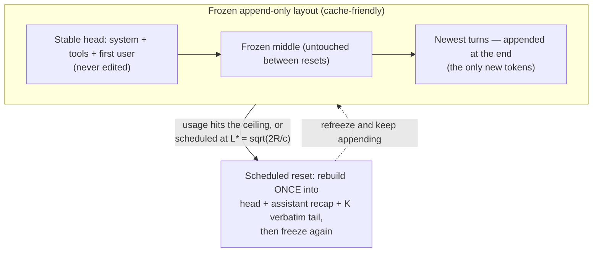

**Goal:** make the prompt cache the subject, not a side note. Every unit so far has treated the
cache as a warning — Unit 2 named it, Unit 4 showed re-inserting a recap breaks it, Units 5 and 7
kept deferring the rewritten layout to "a scheduled reset." This is that unit. You will see *why*
compaction breaks the cache, the **byte-identity** invariant the cache depends on entirely, the
**frozen append-only layout** that keeps it alive, and the **cost-optimal schedule**
(`L* = √(2R/c)`) that decides how often to pay for a rebuild. This is the best-measured win in this
course's production reference — and, tellingly, it is not "compress harder," it is "stop touching
the prefix."

**Where this fits:** this is the sixth branch of the decision tree (Unit 0): "do latency and cost
matter? be cache-aware." It builds directly on §11 (prompt caching) and Unit 2 (the cache cost of
compacting), pays off Unit 4's promise (the recap belongs at a scheduled reset, not re-inserted
every turn) and Unit 5's (the head/tail split is what makes a frozen layout possible), and uses
Unit 7's trigger vocabulary. It points to Unit 11, which can *measure* the one term this unit's
schedule leaves switched off.

---

## The cache is the cost

Recall prompt caching (§11, Unit 2). The server caches the key/value tensors for a prefix of your
prompt; if the next call's prefix is **byte-for-byte identical**, it reuses that work instead of
recomputing it. The prices are lopsided: a cache **read** costs on the order of **0.1×** a fresh
input token, while writing a new cache entry costs **~1.25×** (and about **2×** for a longer cache
lifetime). Anthropic's docs state the rule that governs everything in this unit: a modification
"invalidates the cache from that point onward." The Manus team, writing about building their
agent, call the KV-cache hit rate the single most important production metric and put the gap
between cached and uncached tokens at roughly **10×**.

So the cache is not an optional extra; it is most of the bill. A long agent that appends turns and
never disturbs its prefix gets almost all of its history at the cache-read price. The moment it
*edits* the prefix — which is exactly what compaction does — the server re-prefills everything
from the edit point at full price and pays the cache-write surcharge to re-cache the result.
Measured on a real agent, an accreting tool tail that keeps shifting the prefix re-billed roughly
**40%** of the input every turn.

One distinction to keep straight, because the names collide:

| Term | What it shrinks | Frees window space? |
|---|---|---|
| **Context / prompt compression** (this course) | The **input tokens** the model reads | Yes |
| **Prompt caching** (§11) | The **cost** of an unchanged prefix (KV reuse) | No — it's what compaction *breaks* |
| **KV-cache compression** (StreamingLLM, H2O, SnapKV) | **Runtime activations** during generation | No — frees no context positions |

This unit is about the middle column: not shrinking the window, but not needlessly discarding the
cache while you do.

## Byte-identity: the frozen append-only layout

If the cache reuses a prefix only when it is byte-for-byte identical, the cache-optimal behaviour
is simple to state: **never edit the prefix; only append.** Lay the prompt out by *volatility* —
the things that never change first, the things that change every turn last:

```
[ system + tools + first user message ]   <- frozen head, never edited (cache hit)
[ frozen middle: earlier turns / recap ]   <- not touched between resets (cache hit)
[ newest turns ]                            <- appended at the end (the only new tokens)
```

This is why Unit 5's head/tail split mattered: a layout that only ever *appends* is one whose
prefix stays identical turn to turn, so the cache spans the whole run. The course's heuristic
makes the effect visible by counting the **byte-identical shared prefix** between one turn's
prompt and the next. Run it on a growing conversation under both layouts *(Reference:
[`examples/09/cache_aware_compaction.py`](../examples/09/cache_aware_compaction.py))*:

```
  turn      append-only frozen      compact-the-middle
     1                2152 tok                  32 tok
     ...
     7                2272 tok                  32 tok
  total prefix reused across the run:  append-only 15484 tok  vs  compact-every-turn 224 tok
```

Append-only keeps almost the entire prompt as a cache hit each turn; compacting the middle every
turn resets the shared prefix to about the head alone (~32 tokens), so the whole thing re-prefills.
The magnitudes here are the example's small synthetic prompt — but the *direction* is what a real
system sees at scale: one production A/B test of exactly this layout change moved cross-turn KV
reuse from **0 to about 8,110 tokens** locally (and about **19,542** on a cloud endpoint), **with
answer quality flat** — you lose nothing by not touching the prefix.

## You still have to compact sometime: the scheduled reset

Append-only cannot grow forever; eventually the window fills. The cache-aware move is not to
abandon compaction but to **schedule** it: run append-only for a stretch, then rebuild the layout
**once** and freeze it again, instead of editing it every turn. The rebuild collapses the frozen
region into the structured layout you already know from Units 4 and 5:

```
[ first user message ] [ assistant recap ] [ K verbatim tail turns ]
```

Two details carry over and one is new. The recap's role is **`assistant`**, not `system` (Unit 4:
a non-first system message is dropped by role validation). The tail stays **verbatim** (Unit 5).
And the rebuild fires on a precedence of three rules, in order: a **hard token ceiling** (a real
harness resets at an accumulation ratio of **0.50** of the window — 48,000 tokens of a 96K
window), then an **anti-thrash floor** (never reset more often than a minimum run — about **12**
turns locally, **4** on a cloud endpoint), and only then the cost optimum below. Ceiling first so
you never overflow; floor next so you never thrash; optimum last to tune the rest.



## How often? The cost-optimal run length

Between those guard rails sits a real optimization. A reset costs **R** — you re-prefill the whole
rebuilt layout at full price. Carrying an un-reset prompt costs **c** more per turn — each turn the
frozen region is bigger than it would be just after a reset, so every turn pays a little extra.
Reset too often and you keep paying `R`; reset too rarely and the per-turn `c` accumulates.
Amortize a reset every `L` turns and the per-turn cost is:

```
cost(L) = R / L  +  c · (L − 1) / 2
```

Minimizing over `L` gives the classic square-root schedule — the same shape as economic order
quantity, or any sawtooth refill problem:

```
L* = √( 2R / c )
```

The example computes `L*` and sweeps the run length to show the total cost bottoming out next to
it. There is one honest catch, and it is the kind this course exists to surface. In the production
spine the carry cost is defined as `c = Δ_turn + w_q · Q_slope` with a quality weight `w_q = 4000`
— but `Q_slope` is hardwired to **0.0**, so the whole quality term multiplies out and `c = Δ_turn`
only. The schedule is real and it runs; its quality-awareness is **switched off**. That is exactly
the gap Unit 11 can close: with a measured quality slope, `Q_slope` becomes a real number and the
formula starts trading cost against quality the way it was designed to. Until then, teach `L*` as a
cost-only optimum, and say so.

## The validated win

It is worth stepping back, because this is the strongest result in this course's production
reference. The best-measured improvement in the whole compaction stack was not a cleverer
summarizer or a tighter schema. It was **freezing the layout so the prefix stops moving** —
cross-turn KV reuse from 0 to thousands of tokens, quality flat. The lesson generalizes past
caching: a great deal of "compression" cost is self-inflicted churn, and the most effective move
is often to *stop disturbing what was already paid for*.

> **Security:** the cache is a side channel. Response latency reveals cache hits — a noticeably
> faster reply tells an observer that your prefix was seen before, which can leak whether a
> particular system prompt or document is in play; shared caches across tenants make that a
> cross-user concern, so never assume a cached prefix is private. There is a cost angle too: an
> attacker who pads context to drive you across the 0.50 reset ceiling can force frequent, lossy
> rebuilds — paying `R` again and again on their schedule. The anti-thrash floor is part of the
> defense; the meter that watches the reset rate (below) is the rest.

> **Observe:** this unit emits `compaction` records with `strategy="frozen-reset"`, on the §10
> joining tuple. The example logs two kinds: a *layout* record carrying `layout`
> (`append-only` / `compact-every-turn`) and the cross-turn `prefix_reused` tokens, and a *schedule*
> record carrying `trigger="L*"`, the `R` and `c` that went into the formula, and the computed
> `L*`. A production record would also stamp the `trigger` that actually fired (`ceiling` /
> `min-run` / `L*`) and the `run_length` since the last reset. The loop it closes is the cache
> argument itself: by logging `prefix_reused` you can prove the frozen layout is actually being
> reused (and catch the turn it collapses), and by logging `R`, `c`, and `L*` you can check resets
> fire near the optimum rather than thrashing. It is also where Unit 11 plugs in: feed a measured
> quality slope into `c` and the inert `Q_slope` term becomes active.

## Challenges

1. **Measure the reuse.** Run the example and read the per-turn shared-prefix tokens for the
   append-only layout versus compact-every-turn. *Success:* you can state how many tokens stay
   cached each turn under each strategy, and why the frozen layout keeps almost all of them.
2. **Find the optimum.** Read the `L*` sweep. *Success:* you can state `L*` for the example's `R`
   and `c`, confirm the swept cost is lowest near it, and predict which way `L*` moves if rebuilds
   get cheaper (smaller `R`) or the prompt grows faster per turn (larger `c`).
3. **Switch the quality term on (on paper).** Given `c = Δ_turn + w_q·Q_slope` with `w_q = 4000`,
   explain what happens to `L*` if a Unit 11 measurement finds a real, positive `Q_slope` (quality
   degrades as the run grows). *Success:* one sentence — a positive `Q_slope` raises `c`, which
   *shortens* `L*`, resetting more often to protect quality.

## Recap

- The **cache is most of the cost**: a cache read is ~0.1× and a modification "invalidates the
  cache from that point onward," so editing the prefix re-prefills everything after it (Manus: KV
  hit rate is the #1 metric, ~10× gap). Keep prompt caching distinct from KV-cache compression and
  from context compression.
- The cache lives on **byte-identity**, so the cache-optimal layout is **frozen and append-only**:
  stable head, untouched middle, new turns appended. Unit 5's head/tail split is what makes this
  possible; a real A/B moved cross-turn reuse from 0 to thousands of tokens with quality flat.
- You still compact, but on a **schedule**: run append-only, then **rebuild once** into
  `[first user][assistant recap][K verbatim tail]` (recap role `assistant`) and refreeze. Reset
  precedence: **hard ceiling (0.50) → anti-thrash floor (min run) → cost optimum**.
- The cost optimum is **`L* = √(2R/c)`** (rebuild cost `R`, per-turn carry `c`). Honest caveat:
  production hardwires the quality term to zero (`c = Δ_turn`), so the schedule is cost-only until
  Unit 11 supplies a real `Q_slope`.
- The general lesson: much compaction cost is **self-inflicted churn**; the biggest win is often to
  stop disturbing what the cache already paid for.

## Next

**Unit 10 — Prompt-Level Compression:** so far every mechanism has worked on whole messages —
keep, drop, summarize, offload. Unit 10 goes inside the text itself: perplexity-based token
dropping (LLMLingua) and system-prompt trimming, the compression-ratio-versus-capability tradeoff,
and the robustness caution that makes it risky on small models.
