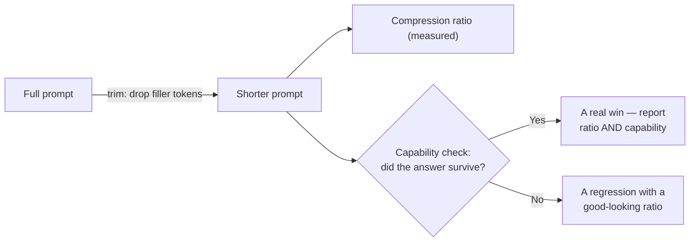

**Goal:** compress *inside* the text, not just at the level of whole messages. Every mechanism so
far has worked on messages — keep one, drop one, summarize a slice, offload a blob. This unit goes
a level down: shrink the tokens *within* a prompt by removing the ones that carry the least
information. That is what perplexity-based methods like **LLMLingua** do, and what trimming a
bloated system prompt does by hand. It is real savings — and the unit that most needs the course's
honesty rule, because aggressive token-dropping can quietly cost you the answer.

**Where this fits:** this sits beside the decision tree rather than on one branch — it is a
*token-level* tool you can apply to any message you keep, especially the fixed parts (the system
prompt and tool definitions from Unit 1's meter) that ride along every single turn. It uses Unit
1's meter to measure the ratio and §11's caching as a caution (rewriting a stable system prompt
breaks its cache, Unit 9). It points to Unit 11, which gives you the capability measurement this
unit insists you pair with every ratio.

---

## A level below the message

Units 3–8 never looked inside a message; they decided whether a whole message stayed, became a
summary, or moved to a blob. But a single message can itself be full of low-information tokens:
filler words, repeated boilerplate, decorative whitespace, polite scaffolding. Prompt-level
compression removes those tokens and keeps the load-bearing ones, producing a shorter prompt that
*reads* worse to a human but carries nearly the same information to a model.

The research result that named this is **LLMLingua** (Jiang et al., EMNLP 2023; arXiv:2310.05736):
use a small language model to score each token's **perplexity** — how predictable it is — and drop
the most predictable (least informative) tokens. The headline number was up to **20×** in the best
case. The honest follow-up, **LLMLingua-2** (Jiang et al., Findings of ACL 2024;
arXiv:2403.12968), reports a more typical **2–5×** on general tasks. A survey (Li et al., NAACL
2025; arXiv:2410.12388) frames the broader space of hard- versus soft-prompt compression.

## We cannot run the real thing here — so measure the principle

There is a constraint worth naming directly: real LLMLingua needs a small Hugging Face model to
score perplexity, and this course takes **no Hugging Face downloads and no `tiktoken`** (§4). So we
do not run LLMLingua; we demonstrate the *principle* with a deterministic trimmer — collapse
whitespace and drop a fixed filler/stopword list — and measure the same two numbers any
compression must report together:

```python
def trim(text):
    text = re.sub(r"\s+", " ", text)                     # collapse whitespace
    kept = [w for w in text.split(" ") if w.lower().strip(".,") not in FILLER]
    return " ".join(kept)
```

This is cruder than perplexity scoring — a fixed stopword list is a blunt stand-in for "least
predictable token" — but it makes the tradeoff visible without a model. Run it on a verbose system
prompt and user message *(Reference:
[`examples/10/prompt_compression.py`](../examples/10/prompt_compression.py))*:

```
before:  136 tokens   after:   72 tokens   ratio: 1.9x
capability check (needs an endpoint): full -> '5432'   trimmed -> '5432'  (survived)
```

> **Want the real method?** If your environment *does* allow Hugging Face models (outside this
> course's rule), the genuine tool is one `pip install llmlingua` away: `PromptCompressor` loads a
> small scorer and exposes `compress_prompt(text, rate=0.5)`. Use it where the principle below says
> it pays — and measure capability the same way.

## The rule: ratio and capability, always together

Here is the honest core of the unit. A compression ratio on its own is **meaningless**, because
you can always hit a bigger ratio by deleting more — the question is whether the model still
answers correctly from what is left. So you never report a ratio without the **retained
capability** beside it. The cautionary example is "500xCompressor" (Li et al.; arXiv:2408.03094),
which reaches extreme ratios but retains only **62–73%** of capability at the high end — a number
that is invisible if you quote the ratio alone.

This is why the example pairs every trim with a **capability check**: ask the model a question
whose answer lives in the prompt, once with the full prompt and once with the trimmed one, and see
whether the answer survived. A trim that saved 60% of the tokens but lost the one number the user
asked for is not a 2.5× win; it is a regression with a good-looking headline.

| | Reported alone | Reported together |
|---|---|---|
| **Compression ratio** | Looks like pure win | Half the story |
| **Retained capability** | Usually omitted | The half that decides if the ratio was worth it |



## Where it pays, and where it does not

Prompt-level compression is not free, and it is not always right.

- **It pays** on large, stable, low-density text the model reads but does not need verbatim: a
  verbose system prompt, boilerplate instructions, a retrieved passage you only need the gist of.
- **It does not pay** on tokens that are already dense and load-bearing: code, identifiers, exact
  file contents, structured data. Dropping a token from a file path or a JSON key corrupts it as
  surely as truncating it (Unit 6's signature failure, at a finer grain).
- **It is risky on small models.** A capable model tolerates a mangled, telegraphic prompt; a
  smaller one is more brittle and may misread the compressed text. Test on *your* model — a ratio
  that is safe on a frontier model can break a 7B one.

And one cache caution from Unit 9: the system prompt is the most tempting target because it rides
every turn, but it is also the *front of your prefix*. Compress it once and freeze it (a cache
write you pay once); recompress it every turn and you re-prefill the whole conversation each time.
Trim the stable parts statically, once, not on every turn.

> **Security:** prompt-level compression is lossy in a way that can silently drop *safety* tokens.
> A trimmer that removes "low-information" words can strip a "not" or a "never" from a safety
> instruction, or delete a qualifying clause that bounded a permission — turning "never run a
> command without confirmation" into something far more permissive. Treat the system prompt and
> safety rules as **load-bearing, do-not-compress** text, the same way you treat code and
> identifiers; aggressive ratios belong on disposable boilerplate, never on the rules.

> **Observe:** this unit emits a `prompt_compress` record — `tokens_before`/`tokens_after`, the
> `ratio`, and (when an endpoint is set) a `capability_ok` flag from the full-versus-trimmed answer
> check — on the §10 joining tuple. The loop it closes is the rule of the unit made measurable: a
> ratio logged *without* a capability result is the exact gap this unit warns about, so the
> record carries both, and a run that logs `capability_ok=false` is a compression you can prove hurt
> the answer rather than helped the bill. Unit 11 turns this pairing into a no-regression gate.

## Challenges

1. **Trim and measure both numbers.** Run the example and read the ratio. *Success:* you can state
   the compression ratio *and* whether the capability check passed — and explain why quoting the
   ratio alone would be dishonest.
2. **Break it with density.** Point the trimmer at a code snippet or a JSON payload instead of
   prose. *Success:* you can show a case where the trim corrupts a load-bearing token, and state
   the rule (compress low-density prose, never dense identifiers/code).
3. **Find the cache cost.** Explain what happens to the prompt cache if you re-compress the system
   prompt every turn versus once. *Success:* one sentence connecting it to Unit 9 — recompressing
   the front of the prefix re-prefills everything after it each turn.

## Recap

- Prompt-level compression works **inside** a message: drop the least-informative tokens and keep
  the load-bearing ones. The real method is perplexity-based (**LLMLingua**, up to 20× best-case;
  **LLMLingua-2**, an honest 2–5×); this course shows the *principle* with a deterministic trimmer
  because it runs no Hugging Face models (§4).
- **Always report ratio and retained capability together.** A ratio alone is meaningless — you can
  always delete more; the question is whether the answer survived ("500xCompressor": 62–73%
  capability at extreme ratios).
- **It pays** on large, stable, low-density text (verbose system prompts, boilerplate, gist-only
  passages) and **does not** on dense, load-bearing tokens (code, identifiers, exact files) or on
  brittle small models — test on your own model.
- Mind the **cache** (Unit 9): trim stable text once and freeze it; recompressing the front of the
  prefix every turn re-prefills the whole conversation.
- Treat **safety rules as do-not-compress** text — a dropped "never" is a security bug.

## Next

**Unit 11 — Measuring Compression Quality:** every unit has emitted a record; this one consolidates
them into a harness. The feedback loop (did you drop something referenced later?), before/after
token curves, whether the *output* changed, and a no-regression gate you can run in CI — the
through-line becomes a tool.
