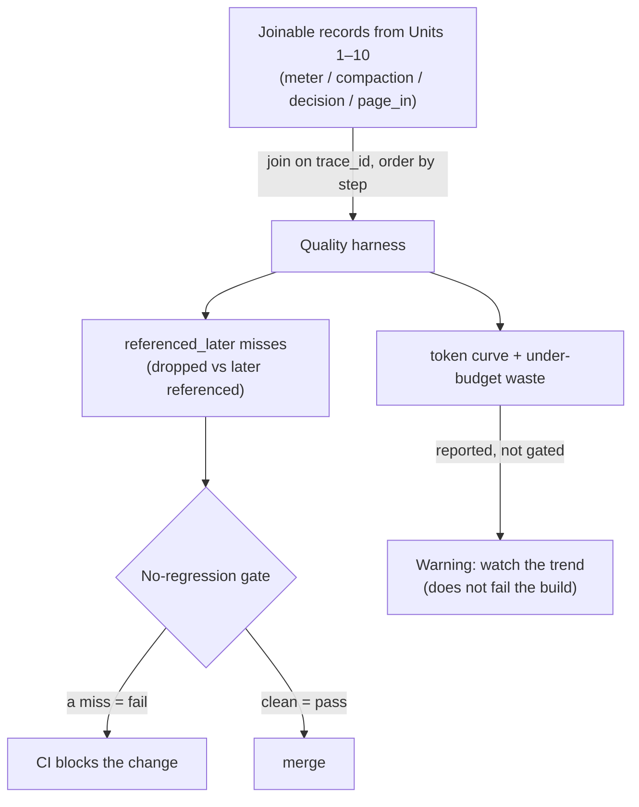

**Goal:** turn the through-line into a tool. Every unit since Unit 1 has emitted a joinable record
— a meter reading, a compaction with its before/after tokens, a decision, a page-in, a ratio. On
their own they are a pile of log lines. This unit reads them back as a **timeline** and answers the
question every record was secretly for: *did the compression cost us anything we needed?* You will
build a quality harness that measures the feedback loop — did a compaction drop something a later
turn referenced? — draws the before/after token curve, and exposes a **no-regression gate** you can
run in CI.

**Where this fits:** this is the consolidation the course promised in Unit 0, where the `Observe`
note was announced beside the `Security` note. It does not add a compaction mechanism; it reads the
telemetry that Units 1–10 already emit (the §10 joining tuple) and closes the loop. It feeds back
into Unit 9 (the quality slope its schedule leaves switched off) and forward into Unit 12, where the
capstone surfaces these signals to the user.

---

## The records were always for this

Recall what each unit logged, all with the same `session_id`/`trace_id`/`step` tuple (§10):

| Unit | Record | The question it lets you answer later |
|---|---|---|
| 1 | `context_meter` | how full, and with what? |
| 2 | `compaction_decision` | did we compress while under budget? (waste) |
| 3–9 | `compaction` (`strategy=…`) | what did each compaction cost in tokens, and keep/drop? |
| 4 | `…` + `lost_ids`/`fallback` | which identifiers did a summary drop? did it fall back? |
| 8 | `page_in` | did we offload something and need it right back? |
| 10 | `prompt_compress` | ratio *and* capability together |

A single record is a fact; the **joined stream** is a story. The harness reads one run's records,
orders them by `step`, and computes the things no single line can show *(Reference:
[`examples/11/quality_harness.py`](../examples/11/quality_harness.py), which reads a `run.jsonl` you
captured with `2>> run.jsonl`, or generates a sample so it runs standalone)*.

## The headline loop: was a dropped thing referenced later?

This is the question the whole course has deferred to here. A compaction is only a mistake if it
removed something you needed *afterwards*. Every lossy unit logged the identifiers it dropped —
Unit 4's `lost_ids`, and the same idea for a dropped turn or an offloaded blob. The instrumentation
this unit adds is the other half: when a later turn **references** an identifier, log it too. Then
the check is a join:

```python
def referenced_later(records):
    lost = {}                                   # id -> step it was dropped
    misses = []
    for r in records:
        for i in r.get("lost_ids", []):
            lost.setdefault(i, r["step"])
        for i in r.get("referenced_ids", []):   # an id a later turn actually needed
            if i in lost and r["step"] > lost[i]:
                misses.append((i, lost[i], r["step"]))
    return misses
```

A non-empty result is a measured quality failure: identifier `FRE-512` was dropped at step 1 and
needed at step 3. That is invisible in any compression ratio — the ratio looked great precisely
*because* it dropped `FRE-512`. The feedback loop is what catches it.

This is also where the course is, quietly, ahead of its own source. The production reference only
recently discovered it had **no plain "a compaction happened" event** at all — only an alert that
fired when quality had already gone wrong. The discipline from Unit 2 (log every decision, including
the skip) is what makes a *preventive* check like this possible instead of a postmortem.

## The token curve, the waste count, and the output diff

Three more signals fall out of the same stream:

- **The before/after token curve.** Plot `total` from the meter and the `tokens_before`/`after` of
  each compaction across steps, and you see the window fill, a compaction bite a chunk out, and
  fill again — the sawtooth Unit 9's schedule is shaped around. A curve that never approaches the
  budget is a sign you are compressing too eagerly (Unit 2).
- **The waste count.** Count the `compaction_decision` records with `decision="compress"` while
  `fraction` was below the soft line. Each one spent cache and quality to solve a problem you did
  not have (Unit 2). The target is zero, and now you can prove it from the log.
- **Did the output change?** The strongest check needs the model, not just logs: run the same task
  with the full context and with the compacted context and diff the answers. An identical answer is
  evidence the compaction was safe; a changed answer is a flag to investigate. This one is opt-in
  (it costs two real calls), but it is the ground truth the cheaper signals approximate.

And the loop back to Unit 9: the per-step quality this harness measures is exactly the **`Q_slope`**
that the cost-optimal schedule hardwires to zero. Fit a slope to quality-versus-run-length here and
you can hand Unit 9 a real number, so the reset schedule finally trades cost against quality the way
its formula was written to.

## A no-regression gate

Measurement only changes behaviour if something acts on it. The last step turns the harness into a
**gate**: a check that returns non-zero when quality regressed, so it can run in CI and block a
change that makes compaction drop something needed.

```python
def gate(report):
    # Fail only on a real regression -- a dropped thing was needed later.
    # Under-budget waste (Unit 2) is reported as a warning, not a build-breaker.
    return 1 if report["referenced_later_misses"] > 0 else 0
```

Now a pull request that "improves" the compressor and quietly raises the referenced-later miss rate
fails the build instead of shipping, while the under-budget waste count rides along as a warning to
watch. The through-line that started as a single meter in Unit 1 ends as a guardrail.



> **Security:** the quality log is itself sensitive, in two ways. First, redaction (Unit 1, §10
> R5): the harness joins on *identifiers*, and an identifier can be a secret (a token, an internal
> hostname) — so log the *shape* and hashed or scoped ids, never raw content, or the quality log
> becomes a leak. Second, a gate is a target: an attacker who can influence what counts as a "miss"
> (or pad the logs so a real miss is lost in noise) can make a regression invisible — so treat the
> gate's inputs as integrity-sensitive and alert on log gaps, not just on logged failures.

> **Observe:** this unit *is* the observability payoff — it does not emit a new per-turn record, it
> **consumes** the stream every other unit emitted and produces one `quality_report` record —
> `referenced_later_misses`, `under_budget_compactions`, `peak_tokens` (the token-curve summary), and
> the gate's `pass`/`fail` — stamped with the analyzed run's `session_id`/`trace_id` so it joins back
> to the stream it summarizes. The loop it closes is the whole course's: the
> meter told you *how full*, each unit told you *what it did*, and this harness finally tells you
> *whether it cost you anything* — and fails the build if it did. Unit 12 puts this report in front
> of the user as a session meter.

## Challenges

1. **Catch the miss.** Run the harness on the sample (or your own `run.jsonl`). *Success:* it
   reports at least one `referenced_later` miss, and you can name the identifier, the step it was
   dropped, and the step it was needed.
2. **Fail the build.** Confirm the gate returns non-zero when a miss is present, and zero when you
   remove the offending record. *Success:* you can describe how you would wire this as a CI check
   that blocks a compaction regression.
3. **Draw the curve.** From the token-curve output, identify the compaction step (the big drop) and
   say whether the run ever approached the budget — and therefore whether any compaction was
   premature (Unit 2). *Success:* one sentence tying the curve back to the do-nothing rule.

## Recap

- Every unit's record was **for this**: joined on the §10 tuple and ordered by `step`, the pile of
  log lines becomes a timeline you can measure.
- The **headline loop** is `referenced_later`: join the identifiers a compaction **dropped** against
  the ones a later turn **referenced**. A miss is a measured quality failure the compression ratio
  hides.
- The same stream yields the **before/after token curve**, the **under-budget waste count** (Unit
  2), and — with the model — an **output-change** check; together they approximate, then confirm,
  whether a compaction was safe.
- Feed the measured quality slope back to **Unit 9** so its cost-optimal schedule stops treating
  quality as zero.
- Turn it into a **no-regression gate**: non-zero exit on a miss, run in CI, so a compaction change
  that drops something needed cannot merge. The through-line becomes a guardrail.

## Next

**Unit 12 — The Measured Default:** the capstone. Wire the whole arc into one agent — the decision
tree from "do nothing" to cache-aware, the four-mechanism taxonomy, the session meter that surfaces
all of this to the user — and the honest closing move: when the cheapest tokens are the ones you
never generate, *decompose the task* instead of compressing the giant.
