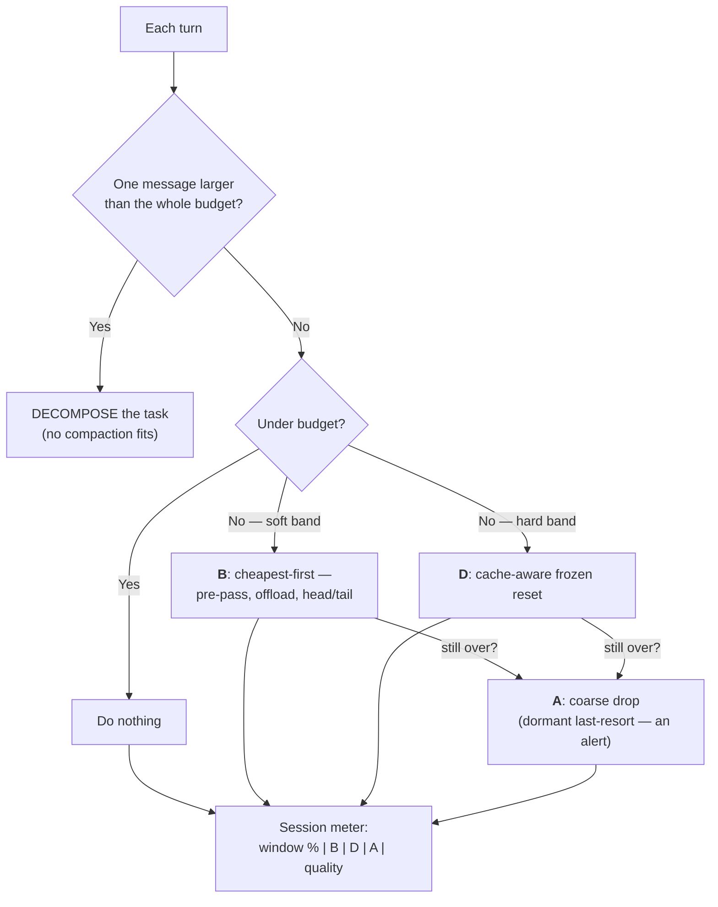

**Goal:** assemble the whole course into one defensible default. You have built every branch of
the decision tree from Unit 0 — measuring, doing nothing, dropping, summarizing, head/tail,
pre-pass, triggers, offloading, cache-aware scheduling, and a quality gate. This unit wires them
into a single policy that does **the least that works** each turn, surfaces what it did to the
user with a **session meter**, and ends on the honest move the whole course has been circling: the
cheapest tokens are the ones you never generate, so when a turn is too big to compress, **decompose
the task** instead.

**Where this fits:** this is the capstone. It completes Unit 0's decision tree with every branch now
built (Units 1–11), follows the repo's [Observability Standard](../../OBSERVABILITY.md) by making
the capstone actually emit telemetry and surface a quality signal, and closes the arc the README
promised: a layered strategy that does the least it needs to, preserves what matters, and measures
the rest.

---

## The decision tree, now built

Unit 0 stated the tree as a promise; here it is with each branch pointing at the unit that built
it:

1. **Under budget?** → do nothing (Unit 2). The cheapest compression is none.
2. **Over the line?** → drop or window the oldest turns (Unit 3), keeping the **head and tail**
   verbatim (Unit 5).
3. **Middle still too big?** → run the **deterministic pre-pass** first (Unit 6), then the LLM
   **summarizer** only if needed (Unit 4).
4. **A single artifact is enormous?** → **offload** it and page it back on demand (Unit 8).
5. **Cost and latency matter?** → be **cache-aware**: append-only, and **schedule** the rebuild
   (Unit 9), fired by **soft/hard triggers** (Unit 7).
6. **Whatever you did** → **measure** it and gate on regressions (Units 1, 11).

The order is not arbitrary — it is *cheapest and least-lossy first*. Do nothing if you can. When you
must act, the capstone's dispatcher tries the free, low-loss moves first — pre-pass a big tool
output, then offload a giant — before the lossier head/tail drop, and pays the summarizer only if
those did not fit; the cache-aware reset runs on the hard path, and the coarse budget drop is the
dormant last resort. (The numbered tree above is the conceptual escalation by *severity*; the
dispatcher orders the same mechanisms by *cost and loss*.)



## The four mechanisms, and what the user sees

Underneath the tree, a production agent runs four distinct compaction mechanisms — and the useful
way to think about the system is by what each one is *for* and how it should appear on a meter the
user can read:

| | Mechanism | Role | Meter signal |
|---|---|---|---|
| **A** | Budget drop (Unit 3) | Last-resort coarse net; **dormant** in healthy runs | ⚠ quality alert (it fired = something was wrong) |
| **B** | Within-session head/tail + pre-pass + summarize (Units 4–6) | The everyday compaction | ⟳ compaction count |
| **C** | Tool-result middle-truncation | **Parked** — the signature *when-not-to-compress* (Units 6, 8) | (off; never silently truncate a read) |
| **D** | Cache-aware frozen reset (Unit 9) | The validated cost win | ↻ cache resets |

Two of these carry the course's strongest opinions. **C is parked on purpose**: truncating the
middle of a tool output corrupts the file the model is reading, so the safe operations on a giant
output are the all-or-nothing descriptor (B's pre-pass) or offload (Unit 8), never interior
truncation. And **A is dormant by design**: if the coarse budget drop ever fires, treat it as an
alert, not a routine — it means the lighter mechanisms did not keep up.

## Surface it to the user

Observability is not only logs for you; at the capstone it becomes a **feature for the user.** A
long-running agent that silently compresses its own memory is one the user cannot trust. So the
capstone prints a compact **session meter** — how full the window is, how many compactions and
cache resets have happened, and whether any quality alert has fired *(Reference:
[`examples/12/measured_default.py`](../examples/12/measured_default.py))*:

```
session meter | window 41% | B compactions 3 | D resets 1 | A alerts 0 | quality OK
```

That one line is the whole course made visible: the budget (Unit 1), the everyday compaction count
(B), the cache resets (D), the dormant last-resort net (A), and the quality gate (Unit 11). A user
who sees `A alerts 1` or `quality DEGRADED` knows to look; a user who sees a steady, low meter
knows the agent is healthy. Compression you can see is compression you can trust.

## The measured default

Pulling it together, here is the default this course argues for — earned from the telemetry, not
asserted by the author:

- **Do nothing under budget.** Spend most of the run here; log the skip so you can prove it.
- **When you must act, cheapest and least-lossy first:** pre-pass big tool outputs for free and
  offload giants (keeping the bytes), then the lossier head/tail drop, and only then pay the
  summarizer.
- **Keep bytes you might need:** offload giant artifacts and page them back, rather than
  summarizing away the exact content.
- **Be cache-aware:** append-only, schedule the rebuild, do not rewrite the prefix every turn.
- **Measure everything and gate on it:** a referenced-later miss fails the build; a steady meter
  reassures the user.

It is a *layered* default: each layer is cheaper and safer than the one below, and you only descend
when the layer above does not fit the window.

## When not to compress: decompose

And the move underneath all of them, the one the course keeps returning to: **the cheapest tokens
are the ones you never generate.** Every mechanism so far assumes the content already exists in one
window and asks how to fit it. But some turns should never have been one turn. If a single tool
output, or a single sub-task, is so large that it alone exceeds the budget, no compaction saves you
— summarizing loses the detail, offloading just moves the problem, and the model still has to
*reason over* something that does not fit.

The fix is to **decompose the task** so the giant never enters a single window. Anthropic's
multi-agent research system gives each sub-agent its **own context window** and a narrow sub-task,
then combines the results — reporting both a large token cost (about **15×** a single chat) and a
strong quality gain (about **90.2%** over a single agent) as *separate* facts to weigh, not a free
gain. Cognition argues the opposite for many cases — *don't* build multi-agents; share one
context and keep writes single-threaded — because hand-offs lose context. Both are right about
their regime, and the honest reading is the course's whole thesis at a higher level: compression is
a tradeoff to measure, and sometimes the winning move is to *restructure the work* so the pressure
never builds.

> **Security:** the capstone inherits every earlier attack surface — a padded context that steers
> the window (Units 0, 3), an injected summary (Unit 4), a swapped offload handle (Unit 8), a
> forced cache reset (Unit 9) — and adds one defense: the **session meter** is also an early warning.
> An attacker driving the agent toward the hard ceiling, or forcing the dormant budget drop to fire,
> shows up as a moving meter — `A alerts` rising, resets climbing — before it shows up as a bad
> answer. Surface the meter, alert on its anomalies, and keep the parked mechanisms (C) parked.

> **Observe:** this is the observability payoff the course was built toward. The capstone actually
> *emits* the joinable record for every mechanism it runs (`strategy` ∈ drop / head-tail / prepass /
> offload / frozen-reset / decompose, on the §10 tuple) **and** renders the session meter **and** carries the
> Unit 11 quality gate — the standard's "the capstone wires it for real" rule. The loop it closes is
> the entire course's: you can replay any session, see every compaction it made, prove what it kept
> and dropped, and show the user a single honest line about the health of their context.

## Challenges

1. **Run the layered policy.** Run the capstone on a simulated session and read the meter each
   turn. *Success:* you can name, for one over-budget turn, which layer of the tree acted (do-nothing
   / drop / pre-pass / offload) and why it was the cheapest one that fit.
2. **Make it alert.** Drive the session until the coarse last-resort drop (A) would fire. *Success:*
   the meter shows `A alerts 1`, and you can explain why A firing is a signal that B/D did not keep
   up — not a routine event.
3. **Find the turn you cannot compress.** Add a single message larger than the whole budget.
   *Success:* the policy flags **decompose** instead of compacting, and you can say in one sentence
   why no mechanism in the tree can fit it and what decomposing would do instead.

## Recap

- The course is one **layered, cheapest-first default**: do nothing under budget; drop/head-tail;
  pre-pass then summarize; offload giants; cache-aware scheduled resets; measure and gate. You
  descend a layer only when the one above does not fit.
- Four mechanisms, with opinions: **A** budget drop is a **dormant** last-resort (its firing is an
  alert); **B** within-session is the everyday compaction; **C** tool-result truncation is **parked**
  (it corrupts files); **D** cache-aware reset is the validated cost win.
- **Surface it:** a session meter (window %, B compactions, D resets, A alerts, quality) turns
  observability into a feature the user can trust.
- The default is **measured, not authoritative** — every choice is one the telemetry can defend, and
  a regression fails the build (Unit 11).
- The deepest move is **decomposition**: the cheapest tokens are the ones you never generate, so when
  a turn cannot fit, restructure the work (sub-agents with their own windows; or a shared,
  single-threaded context) rather than compressing the giant.

## Where to go next

That is the course: from a window you could not see, to a budget you measure, to a layered default
you can defend and a meter the user can read. Two directions from here. Sideways, into the
[Agent Memory](../../agent-memory/README.md) course — its sibling — for what an agent keeps *across*
sessions. And forward, into the theme this course kept tying to its code: **observability and
feedback loops** deserve to be the subject, not just the through-line. Whatever you build next, keep
the habit this course was really about: let the measurements hold the opinions.
