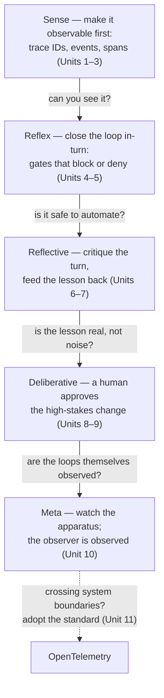

**Goal:** understand the problem this course solves, and why it is harder than "add some
logging." A modern agent decides and acts on its own — it picks tools, spends money, retries,
and sometimes changes its own behavior. Each of those is a *feedback loop*: it senses something,
decides, and acts. This course is about building those loops so you can trust them — and the
thing that makes a loop trustworthy is **observability**. A loop you cannot see is a loop you
cannot debug, cannot improve, and should not let run on its own. The course argues that autonomy
is *earned*, and what earns it is the telemetry that makes every decision visible.

**Where this fits:** this is the start of the **fourth** course, a sibling of the
[Agent Memory](../../agent-memory/README.md) and
[Context Compression](../../context-compression/README.md) courses — read them in any order. It
assumes the foundations course: §10 (observability and logging — the joinable
`session_id`/`trace_id`/`step` line you reuse here), §13 (conversation state), and §23 (agents and
the tool-use loop). The other courses make observability a *through-line beside* the topic; this
one makes it the *subject*. It is the "Course 4 (Observability & Feedback)" the repo's
[Observability Standard](../../OBSERVABILITY.md) anticipates.

---

## A short, true story

On one real morning, a production agent was asked a simple question: *check the token stats —
prompt cache, usage, compaction — and analyze them by model and path.* A question about its own
behavior.

It never answered. On one path it called the same telemetry tool **24 times in a row**; on
another it called a different query tool **50 times**. Each call returned something it could not
turn into an answer, so it tried again, and again. It did not stop on its own. A separate
safeguard — a **loop gate** — finally stopped it at a hard iteration limit. The user received a
long block of raw tool-call JSON instead of a reply. (This is a real incident; in the harness this
course draws on, it became ADR-0068.)

Read that twice, because it is two failures, not one:

1. **It could not see its own state.** Asked to look at its telemetry, it had no reliable way to
   query it, so it retried the same call without making progress.
2. **It could not see its own behavior.** It repeated the same move dozens of times and never
   noticed it was stuck. Something *else* had to notice for it.

Both failures are the same kind of failure: **the agent was a black box to itself.** That is the
problem this course attacks. And notice the one thing that worked — the loop gate that stopped the
runaway. That gate is a feedback loop. It is the first one you will build (Unit 4). The morning
was saved by a loop, and lost to the lack of one.

## A feedback loop is a controller

Strip away the AI vocabulary and a feedback loop is an old, well-understood thing: a
**controller**. It does three things, forever:

- **Sense** — read some signal (a token count, a tool result, a cost, the model's own output).
- **Decide** — compare that signal to a goal or a rule.
- **Act** — do something that changes what happens next (block a call, retry, summarize, escalate).

Control engineers call a system that acts on its own measurements a **closed loop**, and one that
acts blindly an **open loop**. Military strategy calls the same cycle **OODA** (observe, orient,
decide, act). The names differ; the shape is identical, and your agent is full of them whether you
designed them or not.

There is a fourth thing a good controller does, and it is the one this course will not let you
skip: **the loop emits its own telemetry.** The gate that blocked the runaway does not just block —
it records *why*. Without that, you have a controller you cannot inspect, which is how you get a
24-call loop nobody saw coming. So the real shape is **sense → decide → act → and report what you
did**, so that a human, or a higher loop, can supervise it.

## The autonomy gradient

Not every loop should run by itself. The safe ones are narrow, fast, and reversible; the dangerous
ones are broad, slow, and hard to undo. This course is organized as a climb up an **autonomy
gradient** — from loops that close in milliseconds inside one turn, to loops that take days and
keep a human in the middle:

Every arrow upward is **gated by observability**. You earn the right to let a loop run on its own
only once you can see it well enough to trust it. A narrow, deterministic gate (reflex) is safe to
close automatically because it is fully observed and easy to undo. "Rewrite my own instructions"
(deliberative) is not — so a human stays in that loop until the telemetry is good enough to prove
it should not. That is the whole argument of the course in one sentence: **autonomy is a function
of observability.**

## Observability is the core, not a chapter

It is tempting, in an age of AI-assisted and AI-*driven* development, to let the model, the
harness, and the memory do their work and treat the result as a black box that usually behaves.
This course refuses that posture. It teaches the instinct of a **site reliability engineer**: you
do not get to call a system trustworthy because it usually behaves — you make its behavior
*visible*, then you decide. The black box is precisely the thing you cannot debug when it fails in
production, and an autonomous agent *will* fail in ways you did not plan for.

So observability here is not a final unit you bolt on. It is the first thing you build (Unit 1) and
the spine of everything after. Every loop in this course ships with the instrumentation that makes
it inspectable, because **a loop you cannot see is a loop you cannot trust** — and trust is the
entire point of letting an agent act on its own.

## The thesis

This course is **measured, not authoritative**. I am a student of this material, not an expert in
it. Rather than assert that agents should be autonomous, it argues that autonomy is *earned*, and
it walks there down a decision tree — the autonomy gradient, read as questions:

1. **Can you see the decision at all?** No → you have no business automating it. Instrument first.
2. **Is the signal joinable?** A loop is only as good as its signal — stamp
   `session_id`/`trace_id`/`step` so what feeds the loop is precise. Garbage signal, garbage control.
3. **Is the action narrow, deterministic, reversible?** → close the loop in-turn with a gate (reflex).
4. **Is the action a judgment over the whole turn?** → reflect, but feed it back carefully —
   dedup before you act (reflective).
5. **Is the action broad or high-stakes** (changing the agent itself)? → keep a **human in the
   loop**; the human's verdict is signal too (deliberative).
6. **Are your loops themselves observed?** → watch the apparatus; the observer must be observed (meta).
7. **Crossing process / service / substrate boundaries?** → adopt the **standard** (OpenTelemetry)
   so the signal stays joinable across systems.
8. **Whatever tier you are in:** measure the loop's effect before you trust it.
   *Earn autonomy by being observable.*

One point about honesty, because this field oversells autonomy: most "self-improving agent" loops
are not closed at all — they are **open loops a human closes.** This course marks clearly which
loops act automatically (and ship today) and which still need a person, and it treats every "let it
decide for itself" reflex as a tradeoff to be earned with telemetry, not assumed.

> **Security:** an observable system is also an *attackable* one, in two directions. Telemetry
> records prompts, tool outputs, and arguments — exactly where secrets and personal data leak, so
> you redact at the boundary, not after. And a feedback loop is a control surface: an attacker who
> can shape what the agent senses (a poisoned tool result, a crafted error) can steer what it
> *decides* — drive it into a retry storm, or trip a gate to deny a legitimate action. Every later
> unit has a security note, because every loop that reads the world can be fed a lie.

> **Observe:** this course makes observability the subject, the way the others make it a
> through-line. Every later unit carries an `Observe` note: it states the signal the loop emits and
> the decision that signal closes, using the joinable `session_id`/`trace_id`/`step` line from
> foundations §10. You start measuring in Unit 1, not at the end. This follows the repo's
> [Observability Standard](../../OBSERVABILITY.md).

## Challenges

These are thinking-and-experiment tasks; the building starts in Unit 1.

1. **Find a loop you did not design.** Take any §23 agent script and let it run on a task that
   makes it retry (a flaky tool, a file that does not exist). *Success:* you can name the sense →
   decide → act loop it fell into, and say what — if anything — would have stopped it.
2. **Place a loop on the gradient.** Pick three things an agent might do on its own: retry a failed
   call, summarize old turns, edit its own system prompt. *Success:* you can order them reflex →
   reflective → deliberative and justify which you would let run automatically *today*.
3. **Spot the black box.** For one agent you have built or used, write down one decision it makes
   that you currently *cannot* see after the fact. *Success:* a one-sentence statement of what
   telemetry you would need to make that decision inspectable — the thing Unit 1 starts building.

## Recap

- An agent is full of **feedback loops** — sense → decide → act — whether you designed them or
  not. The 24/50-call runaway was a loop nobody could see, stopped only by another loop (a gate).
- A feedback loop is a **controller**, and a good controller also **reports what it did**. The
  fourth step — emit telemetry — is the one this course refuses to skip.
- Loops sit on an **autonomy gradient**: reflex → reflective → deliberative → meta. Every step up
  is gated by observability — *you earn autonomy by being able to see the loop.*
- **Observability is the core**, not a closing chapter. Don't ship a black box: make behavior
  visible first, then decide what to automate.
- The course is **measured, not authoritative**, and honest that most "self-improving" loops are
  still **open loops a human closes**.

## Next

**Unit 1 — Joinable Signal: Trace & Session IDs by Hand:** before a loop can act on a signal, the
signal has to be trustworthy and joinable. You will build the correlation primitive by hand — a
`session_id`, a `trace_id`, a `step` — and emit the first joinable telemetry line this whole course
is built on. Garbage signal, garbage control; so we start with the signal.
