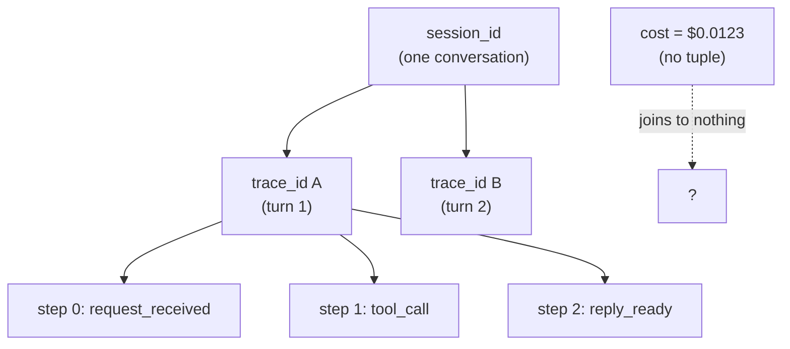

**Goal:** build the smallest piece of observability that everything else depends on — a
**joinable signal**. Before a feedback loop can act, it needs to read a signal it can trust, and
"trust" starts with being able to tie records together: this log line, that cost, this tool call
all belong to *the same run*. You will build a tiny correlation primitive by hand — a
`session_id`, a `trace_id`, and a `step` — and emit one joinable JSONL record per operation. It
is an OpenTelemetry-shaped context, built without the SDK; Unit 11 meets the standard.

**Where this fits:** this is the first build of the course and the bottom of the autonomy
gradient (Unit 0) — pure *sensing*, no loop closed yet. It reuses the foundations §10 telemetry
line (the joinable tuple) and the agent loop from §23. Units 2 and 3 add a vocabulary and timing
on top of this same tuple; every later loop reads the signal you stamp here.

---

## Garbage signal, garbage control

A feedback loop is only as good as the signal feeding it. If the signal is noisy or
unattributable, the loop acts on noise — it blocks the wrong call, bills the wrong session, or
"learns" from a run it cannot reconstruct. So the first thing to get right is not the loop; it is
making the signal **joinable**.

Here is what *not* joinable looks like, from the harness this course draws on. While preparing a
data replay, an audit found that the cost table — `api_costs` — had a `trace_id` of `NULL` on
**every row: 4,077 of 4,077**. The system had spent real money on thousands of model calls and
could not link a single cost back to the session or request that produced it (ADR-0074). The
instrumentation was rich — 30-plus event types, durable tables — but the **join key was missing**,
so none of it could be tied together. You cannot build a budget loop (Unit 5) on cost records that
join to nothing.

The diagnosis in that ADR is the rule for this whole unit: *"Optional means the system doesn't
know if its data is joinable."* An id you are allowed to omit is the id that will be missing
exactly when you need it.

## The tuple: session, trace, step

The fix is a small, mandatory tuple stamped on every record (foundations §10):

| Field | Scope | Answers |
|---|---|---|
| `session_id` | the whole conversation / user session | "which user, which conversation?" |
| `trace_id` | one logical operation — a turn, an agent run | "which run produced this?" |
| `step` | integer order within a trace | "in what order did this happen?" |

Server ids — `response.id`, an `x-request-id` header — identify *one* call. They cannot tie a
run together, because a single turn makes many calls. The tuple is the missing foreign key: it is
what lets you `WHERE trace_id = …` and get the whole run back.

You build it by hand, as a frozen value carried *by value* through the call path:

```python
@dataclass(frozen=True)
class Trace:
    session_id: str          # stable across turns
    trace_id: str            # one operation
    step: int = 0            # order within the trace
    kind: str = "user"       # "user" or "system:<source>" (Unit 2)

    def tick(self) -> "Trace":
        return replace(self, step=self.step + 1)   # next step; nothing mutated
```

Frozen matters: a trace context that anyone can quietly mutate is a context you cannot trust two
function calls later. This is exactly the shape of `personal_agent`'s `telemetry/trace.py`, whose
`TraceContext` is *"a frozen dataclass and should never be modified after creation,"* with
`new_trace()` to mint one and `new_span()` to derive a child — *"OpenTelemetry-compatible without
the full OTel SDK."* You are reconstructing the real thing.

## Emit one joinable record per operation

With the tuple in hand, every operation writes one structured line stamped with it. The
[`examples/common_loops.py`](../examples/common_loops.py) helper does just that, then advances the
step so ordering stays monotonic with no bookkeeping:

```python
def log_event(trace, operation, **fields):
    record = {"session_id": trace.session_id, "trace_id": trace.trace_id,
              "step": trace.step, "kind": trace.kind, "operation": operation, **fields}
    print(json.dumps(record), file=sys.stderr)
    return trace.tick()
```

Used as `trace = log_event(trace, "tool_call", tool="search")`, the return-the-next-trace idiom
makes it hard to write two records at the same step by accident. (Reference:
[`examples/01/joinable_signal.py`](../examples/01/joinable_signal.py).)

## The payoff: reconstruct a run, spot an orphan

The example runs two turns under one session, then writes one deliberately broken record — a cost
line with no tuple. Filtering by `trace_id` rebuilds a turn in order; the broken record joins to
nothing:

```
run for trace_id=67411e0d… (3 steps):
  step 0: request_received
  step 1: tool_call
  step 2: reply_ready

orphaned records (no trace_id): 1 -> [{'operation': 'cost', 'usd': 0.0123}]
```

That orphan is the 4,077-rows bug in miniature: a real event you cannot attribute to a run. The
hierarchy you just made joinable looks like this — one session, many traces, ordered steps:



## The standard, foreshadowed

You have just hand-built a `trace_id` that correlates the records of one run — which is what
OpenTelemetry calls a *trace*, with context propagation. OpenTelemetry goes one step further:
within a trace it nests *spans*, each with its own `span_id` and a `parent_span_id`, so you can
see which operation contained which. You add timing spans in Unit 3, and `personal_agent`'s
`TraceContext` already carries a `parent_span_id` and a `new_span()` — *"OpenTelemetry-compatible
without the full OTel SDK."* The harness kept this hand-rolled layer on purpose (thin
dependencies) and stayed *compatible* with the standard rather than adopting its SDK. Keep that in
mind: in Unit 11, once the signal has to cross process and service boundaries, the hand-rolled
shape starts to strain, and meeting OpenTelemetry becomes the relief. For now, by hand is exactly
right — you understand every field.

> **Security:** the joining tuple is metadata and safe to log freely; the **fields** you attach
> are not. Tool arguments, prompts, and results carry secrets and personal data — redact them at
> the point you build the record, never after it has reached a log or index (Observability
> Standard R5). And treat the ids as opaque: a `session_id` is a join key, not an authorization
> token — never let "same session_id" stand in for "same authenticated user."

> **Observe:** this unit emits the foundational signal — one JSONL record per operation stamped
> with `session_id`/`trace_id`/`step`. The loop it closes is the precondition for every other loop
> in the course: *can I reconstruct this run?* If a record can't be joined (the orphaned cost
> line), no downstream loop — budget, reflection, eval — can act on it correctly. Joinable by
> construction (R2): stamp the tuple where you write the record, and make it non-optional.

## Challenges

1. **Make identity non-optional.** Change `log_event` (or a wrapper) to *raise* if `session_id`
   or `trace_id` is missing or empty, the way ADR-0074 made `api_costs` reject NULL identity.
   *Success:* a test that proves an unattributable record can no longer be written.
2. **Join across operations.** Emit records for a turn that makes two tool calls and one model
   call, then write a function that returns the full ordered run for a given `trace_id`.
   *Success:* the function reconstructs the run in `step` order and ignores records from other
   traces.
3. **Find the orphan rate.** Given a list of mixed records (some with the tuple, some without),
   compute the percentage that cannot be joined. *Success:* a single number, and a one-sentence
   statement of which downstream loop that orphaned signal would have broken.

## Recap

- A feedback loop is only as good as its signal; the first job is to make the signal **joinable**.
- The real failure is concrete: **4,077 of 4,077** cost rows with a NULL `trace_id` — money spent,
  none of it attributable — because the join key was *optional* (ADR-0074).
- The fix is a small, mandatory tuple — `session_id` / `trace_id` / `step` — stamped on every
  record and carried as a **frozen** value, the shape of `personal_agent`'s `TraceContext`.
- You hand-built `trace_id` correlation: an **OpenTelemetry-shaped** trace without the SDK. OTel
  adds `span_id`/`parent_span_id` hierarchy on top; Unit 11 meets the standard when the signal must
  cross boundaries.

## Next

**Unit 2 — An Event Vocabulary, Not Log Lines:** a joinable record is only useful if you can ask
questions of it. You will replace ad-hoc log strings with a small catalog of **semantic events**,
give each event one fixed shape, and separate the agent's own background traffic from real user
activity — so the signal is not just joinable, but *queryable*.
