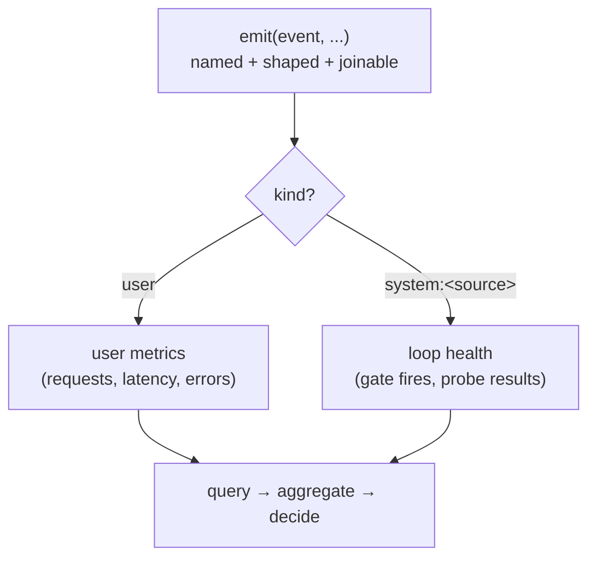

**Goal:** make the joinable signal from Unit 1 *queryable*. A log full of free-text strings —
`"calling search tool"`, `"search done"`, `"search failed!"` — cannot be counted, aggregated, or
alerted on, because nothing ties the three together. You will replace ad-hoc strings with a small
**vocabulary of semantic events**: named constants, each with one fixed shape. Then you will
separate the agent's own background traffic from real user activity, so a feedback loop's
self-monitoring never looks like a user.

**Where this fits:** still the *sensing* tier of the gradient (Units 1–3). It builds directly on
Unit 1's tuple — every event still carries `session_id`/`trace_id`/`step` — and adds the
`operation` field and a shared catalog. Units 4 onward emit events from this vocabulary
(`gate_blocked`, `budget_denied`), so the loops you build later are queryable from birth.

---

## A string is not a signal

Three developers logging the same tool failure will write three different strings. None of them
can answer *"how many tool calls failed in the last hour, by tool?"* — the question a reliability
loop actually asks. The query needs a stable name and a stable shape, not prose.

So you define the names once, as constants, grouped by subsystem:

```python
REQUEST_RECEIVED    = "request_received"
REPLY_READY         = "reply_ready"
TOOL_CALL_COMPLETED = "tool_call_completed"
TOOL_CALL_FAILED    = "tool_call_failed"
GATE_BLOCKED        = "gate_blocked"        # a feedback-loop event (Unit 4)
```

This is exactly what `personal_agent`'s `telemetry/events.py` is: a single catalog of ~40 event
constants — `REQUEST_RECEIVED`, `MODEL_CALL_COMPLETED`, `TOOL_CALL_FAILED`, `POLICY_VIOLATION`,
`MODE_TRANSITION`, … — grouped by subsystem (orchestrator, LLM client, tools, brainstem,
governance). Its docstring states the rule plainly: *"All log events should use these constants
rather than magic strings to ensure consistency and enable reliable querying and analysis."* The
vocabulary **is** the query interface.

## One event name, one shape

A name is half the contract; the **shape** is the other half. If `tool_call_completed` sometimes
carries `latency_ms` and sometimes does not, every query that aggregates latency is silently wrong.
So each event declares its required fields, and the emitter refuses to write a malformed one:

```python
REQUIRED_FIELDS = {
    TOOL_CALL_COMPLETED: {"tool", "latency_ms"},
    TOOL_CALL_FAILED:    {"tool", "error"},
}

def emit(trace, operation, **fields):
    missing = REQUIRED_FIELDS.get(operation, set()) - fields.keys()
    if missing:
        raise ValueError(f"event {operation!r} missing required fields: {sorted(missing)}")
    return log_event(trace, operation, **fields)
```

The harness enforces the same idea at a higher grade: `CANONICAL_MODEL_CALL_STARTED_FIELDS` and
`CANONICAL_MODEL_CALL_COMPLETED_FIELDS` are `frozenset`s *"imported by the parity test as the
single source of truth — adding a required field here forces both clients (and any future model
client) to emit it."* The shape is checked in CI, not hoped for.

This rule is not pedantry; it has a war story. The harness once emitted `model_call_started` from
*two* places with two different payloads — *"same event name, two different payloads, ambiguous
Kibana queries"* — and had to split the orchestrator's emit into a distinct `step_planning_started`
event to fix it (ADR-0074). One name, one shape: break it and your dashboards lie.

## Separate the agent's own traffic

Once you build feedback loops, the agent generates telemetry about *itself*: a background monitor
checks for runaway loops, a scheduler runs reflection, a probe walks the data. If that traffic is
tagged `kind="user"`, it pollutes every user-facing metric — your "requests per hour" now counts
the agent talking to itself.

So the trace carries a `kind`: `"user"` for organic traffic, `"system:<source>"` for background
loops. `personal_agent` does this with a `SystemTraceContext` that mints `kind="system:<source>"`
traces (scheduler ticks, reflection, probes), and a `TraceContext.is_system` flag, *"so organic vs
background traffic is filterable."* You filter by it the moment you have more than one kind of
producer:



The example ([`examples/02/event_vocabulary.py`](../examples/02/event_vocabulary.py)) emits a user
turn and one `system:loop_monitor` event, then counts events by name and splits the two kinds —
and shows the contract rejecting a `tool_call_completed` with no `latency_ms`.

## Designing your own vocabulary

You do not need forty events on day one. Start with the lifecycle boundaries you will actually
query: request received, reply ready, tool completed, tool failed — plus one event per feedback
loop you build (`gate_blocked` in Unit 4, `budget_denied` in Unit 5). Add the field a query needs
*when* you write the query, and put it in `REQUIRED_FIELDS` so it is never optional again. The
catalog grows with your questions, not ahead of them.

> **Security:** an event name is a low-cardinality label and safe; the fields can leak. `error`
> strings love to embed stack traces, file paths, and tokens; `args` can contain a password. Keep
> the **name and metadata** rich and the **content** redacted (R5). A second, quieter risk:
> `kind` is a trust boundary — never let an external input set `kind="system:…"`, or an attacker
> can disguise their traffic as the agent's own privileged background activity.

> **Observe:** this unit emits **named, shaped, kind-tagged** events on top of Unit 1's tuple. The
> loop it closes is *"can I ask a precise question of my telemetry?"* — count `tool_call_failed`
> by tool, watch `gate_blocked` rate, separate user latency from background noise. A free-text log
> can be read; only a vocabulary can be *queried*, and a loop that can't query its signal can't
> act on it.

## Challenges

1. **Catch a shape drift.** Add a second emit site for `tool_call_completed` that forgets
   `latency_ms`. *Success:* the contract raises at the bad call site, and you can state which
   dashboard the drift would have corrupted.
2. **Query by name.** From a JSONL file of mixed events, compute the failure rate
   (`tool_call_failed` / all tool calls) per tool. *Success:* a per-tool number that would have
   been impossible with free-text strings.
3. **Filter out the agent.** Given a mixed stream, compute "user requests per minute" counting
   only `kind="user"` traffic. *Success:* the number does not move when you add background
   `system:*` events.

## Recap

- Free-text log strings can't be **counted, aggregated, or alerted on**; a feedback loop needs a
  queryable signal, not prose.
- A **vocabulary of named events** — the shape of `personal_agent`'s `events.py` catalog — makes
  telemetry queryable: the names *are* the query interface.
- **One name, one shape.** Declare each event's required fields and reject malformed events (the
  harness enforces this in CI with `CANONICAL_MODEL_CALL_*_FIELDS`); the "two payloads, ambiguous
  queries" bug is what happens otherwise.
- Tag traffic with **`kind`** (`user` vs `system:<source>`) so the agent's own background loops
  stay separable from real user activity.

## Next

**Unit 3 — Spans & the Latency Breakdown:** you can now name *what* happened and join it to a run.
Next you measure *how long* each part took. You will build a small span timer that breaks a turn
into phases — setup, context, routing, inference, tools — so you can see where the time goes, which
is the signal a latency or cost loop acts on.
