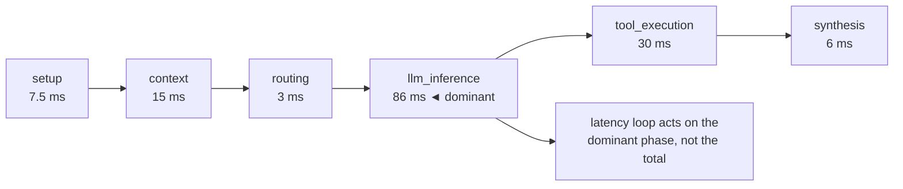

**Goal:** measure *where* a turn spends its time, not just that it was slow. "The turn took 4
seconds" is not an actionable signal — a latency or cost loop needs to know *which phase* burned
the time. You will build a small **span timer** that records each phase of a turn on a monotonic
clock, classifies spans into phases (setup, context, routing, inference, tools, synthesis), and
emits a latency **breakdown** as one joinable record.

**Where this fits:** the last of the *sensing* units (1–3). It uses Unit 1's `trace_id` (one timer
per trace) and Unit 2's event vocabulary (the breakdown is emitted as a `request_timing` event).
Together, Units 1–3 are the **lens** — the observability substrate every loop from Unit 4 onward
reads. After this, you start closing loops.

---

## A duration is not a diagnosis

A single number — total latency — tells you a turn was slow but not *why*, and "why" is the only
thing you can act on. Was it the model? A slow tool? Context assembly? Each points to a different
fix and a different feedback loop. To separate them you record **spans**: named, timed segments of
the turn.

Two details make spans trustworthy:

- **Use a monotonic clock.** Wall-clock time (`time.time()`) can jump backward when the system
  clock is adjusted, producing negative or absurd durations. `time.monotonic_ns()` only moves
  forward — it exists for exactly this.
- **Time inline, as the turn runs.** You *could* reconstruct timing afterward by scanning logs,
  but some phases — a context-window assembly, a DB lookup — emit no log of their own, so they would
  be invisible. `personal_agent`'s `request_timer.py` says this directly: unlike *"the post-hoc
  log-scanning approach in metrics.py, this captures precise monotonic-clock measurements including
  phases that may not emit their own log events."*

A context manager makes spans painless:

```python
@contextmanager
def span(self, name):
    start = time.monotonic_ns()
    try:
        yield
    finally:
        end = time.monotonic_ns()
        self._seq += 1
        self._spans.append(Span(name, self._seq, classify(name),
                                offset_ms=(start - self._start) / 1e6,
                                duration_ms=(end - start) / 1e6))
```

This is the shape of the harness's `RequestTimer.span()` — a monotonic clock, a sequence counter,
and a span recorded on exit. (Reference:
[`examples/03/spans_and_latency.py`](../examples/03/spans_and_latency.py).)

## Classify spans into phases

Individual span names (`llm_call:primary`, `tool_execution:search`) are precise but too granular to
aggregate. So each span name is classified into a **phase** — a coarse category you can sum over.
A small prefix map does it, specific prefixes before generic ones:

```python
PHASE_MAP = [
    ("llm_call",       "llm_inference"),
    ("tool_execution", "tool_execution"),
    ("context",        "context"),
    ("routing",        "routing"),
    ("synthesis",      "synthesis"),
    ("session",        "setup"),
]
```

The harness's `_PHASE_MAP` carries the full production pipeline — setup → context → routing →
llm_inference → tool_execution → synthesis → persistence — and the comment *"Order matters: more
specific prefixes … before generic ones"* is load-bearing: `llm_call:router` must classify as
routing before the generic `llm_call:` catches it.

## Read the breakdown

Sort the spans by offset and append a total, and the turn tells you where it went. Running the
example:

```
span                   phase             offset_ms  duration_ms
session_lookup         setup                   0.0          7.5
context_window         context                 7.6         15.0
routing_decision       routing                22.6          3.0
llm_call:primary       llm_inference          25.6         86.4
tool_execution:search  tool_execution        112.0         30.0
synthesis              synthesis             142.1          6.0
TOTAL                  total                   0.0        148.1

slowest phase: llm_inference (86.4 ms of 148.2 ms)
```

The shape is the same one production turns show: **inference dominates**, tools are second,
everything else is noise. Now the signal is actionable — a latency budget loop watches the phase
breakdown, not the bare total, and knows that shaving context assembly would be wasted effort here:



The harness exports this two ways: `to_breakdown()` (every span, for drill-down) and
`to_trace_summary()` (per-phase totals, for dashboards) — the same data at two zoom levels.

## Emit it as one joinable record

The breakdown is only useful if it joins back to the run, so emit it as one `request_timing` event
(Unit 2's vocabulary) stamped with the trace's tuple (Unit 1):

```python
log_event(trace, "request_timing", total_ms=timer.total_ms(), phases=by_phase)
```

Now the three sensing units compose: a turn has a `trace_id` (Unit 1), its phases are named events
(Unit 2), and its timing is a joinable breakdown (Unit 3). That is the full lens. Everything after
this *acts* on it.

> **Security:** span **names and durations** are safe, low-cardinality signal; resist the urge to
> attach raw inputs to them. A timing breakdown is also a side channel — durations can leak whether
> a cache hit, whether a record existed, whether a branch ran — so treat externally-visible timing
> as information disclosure when the phase boundaries map to secret-dependent work.

> **Observe:** this unit emits a **per-phase latency breakdown** as a joinable `request_timing`
> record. The loop it closes is *"where is the time (or cost) going, and is that acceptable?"* — the
> signal a latency budget or a cache-aware scheduler acts on. A bare total can be logged; only a
> phase breakdown can be *acted* on, because only it names the phase a loop should target.

## Challenges

1. **Catch the wall-clock bug.** Build the timer twice — once with `time.time()`, once with
   `time.monotonic_ns()`. *Success:* you can explain a scenario (a clock adjustment) where the
   wall-clock version reports a negative duration and the monotonic one cannot.
2. **Find the dominant phase.** Instrument a real §23 agent turn (or the example) and print the
   per-phase totals. *Success:* you can name the phase that dominates and one change that would —
   and one that would *not* — reduce total latency.
3. **Summarize for a dashboard.** Add a `to_trace_summary()` that returns per-phase
   `{duration_ms, steps}` plus the total. *Success:* two views of the same turn — full spans for
   drill-down, phase totals for a dashboard — from one timer.

## Recap

- A **total duration is not a diagnosis**; a feedback loop needs to know *which phase* spent the
  time, because each phase points to a different fix.
- Record **spans** on a **monotonic clock**, *inline* as the turn runs — so you also capture phases
  that emit no log of their own (the point of `personal_agent`'s `RequestTimer` over log-scanning).
- **Classify** spans into phases (setup → context → routing → inference → tools → synthesis →
  persistence) so you can aggregate; order specific prefixes before generic ones.
- Emit the breakdown as **one joinable `request_timing` record**. Units 1–3 now compose into the
  full **lens**: joined, named, and timed. Loops start in Unit 4.

## Next

**Unit 4 — The First Closed Loop: a Runtime Gate:** you have the lens; now close a loop. You will
build a finite-state gate that watches an agent's tool calls and **blocks** a runaway — the
reflex-tier loop that, in Unit 0's war story, was the one thing that worked. Sense → decide → act,
in a single turn, emitting its own verdict.
