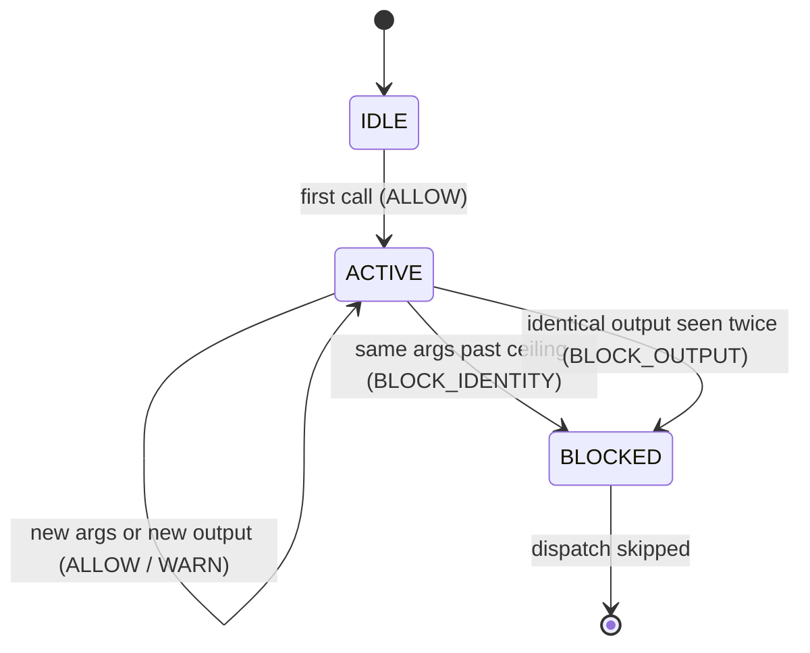

**Goal:** build the first loop that actually *acts*. Units 1–3 made the agent observable; now you
use that signal to change what the agent does next, inside a single turn. You will build a small
finite-state **gate** that watches an agent's tool calls and **blocks** a runaway — the
reflex-tier loop that, in Unit 0's war story, was the one thing that worked. Sense → decide → act
→ emit a verdict, in milliseconds, with no human and no model in the loop.

**Where this fits:** the first **reflex** unit (the first level of the autonomy gradient above
pure sensing). It consumes Unit 1's `trace` and Unit 2's vocabulary (it emits a `gate_blocked`
event). It is the safest possible loop to close automatically — narrow, deterministic, in-turn,
reversible — which is exactly *why* it is first: you earn the higher, riskier tiers later.

---

## An agent stuck in a loop is an unstable system

In Unit 0, an agent asked about its own metrics called one tool 24 times and another 50 times,
making no progress, until a safeguard stopped it. Control theory has a name for a system that
repeats the same move and never settles: **unstable** — it oscillates. The fix is the same one an
engineer reaches for: a **damper** that detects the oscillation and forces it to stop. That damper
is a feedback loop. It is the gate you build here.

The gate is a true **closed-loop controller**: it reads a signal (the tool call and its output),
compares it to a policy, and acts (allow, warn, or block) — then records why. `personal_agent`
implements exactly this in `orchestrator/loop_gate.py`: a `ToolLoopGate` holding one `ToolFSM`
(finite-state machine) per tool, and *"all decisions are returned as `GateResult`"* — the verdict
is data, not a silent side effect.

## Three signals, escalating

The gate watches for three distinct kinds of stuck, and treats them differently
(Reference: [`examples/04/loop_gate.py`](../examples/04/loop_gate.py)):

| Signal | What it catches | Response |
|---|---|---|
| **Call identity** | same `(tool, args)` called many times | allowed up to a ceiling, then **terminal** |
| **Consecutiveness** | same tool N times in a row | **advisory** — execute, but inject a hint |
| **Output identity** | the *same output* seen ≥2 times | **terminal** — block immediately |

The ordering of severity is the interesting part. Calling the same tool a few times in a row is
*suspicious* but sometimes legitimate (a retry after a transient error), so it is **advisory**:
the call runs, with a hint to the model that it may be looping. But **identical output is
terminal**, and the harness comment says why: *"Identical output is pathological."* A tool that
returns byte-for-byte the same result has given the agent no new information — continuing cannot
help, by definition. That is pure oscillation, and the gate damps it at once.

```python
def observe(self, tool, output):
    """Post-execution: identical output is pathological -> terminal BLOCK_OUTPUT."""
    h = stable_hash(output)
    fsm.output_counts[h] = fsm.output_counts.get(h, 0) + 1
    if fsm.output_counts[h] >= 2:
        fsm.blocked = True
        return GateResult(Decision.BLOCK_OUTPUT, f"identical output seen {fsm.output_counts[h]}x")
    return GateResult(Decision.ALLOW)
```

## The FSM: three states

Each tool moves through three states. A blocked tool is **terminal** for the turn — every further
call returns blocked without dispatching, so a wedged agent cannot keep paying for a tool that has
already proven useless:



Running the example against a tool that returns the same result every call, the gate stops it
almost immediately — the Unit 0 runaway, prevented:

```
iter 1: allowed
iter 2: warn — search 2x in a row (executing, with a hint)
iter 2: BLOCKED after execution — identical output seen 2x

stopped after 2 iterations (hard limit was 10).
```

Two iterations instead of fifty. The hard iteration limit still exists as a last resort, but the
gate makes it almost never the safeguard that triggers.

## Why this loop is safe to automate

This is the bottom of the autonomy gradient for a reason. The gate's action is **narrow** (it only
blocks one tool), **deterministic** (same inputs, same verdict — no model judgment), **in-turn**
(it acts in milliseconds, with full context), and **reversible** (the block lasts one turn). Those
four properties are what *earn* it full autonomy: you do not need a human to approve a loop-block,
because you can see exactly what it did and undo it trivially. Keep this test — the loops in
later units give up one property at a time, and each thing they give up is why they need more
supervision.

> **Security:** the gate is a control surface, so it is also an attack surface. An attacker who can
> make a tool return *slightly* varied output on each call (a timestamp, a nonce) defeats the
> output-identity check and keeps the loop alive — so pair it with the call-identity and
> consecutive ceilings, which do not depend on output. The reverse risk is denial of service:
> input crafted to trip the gate can **block a legitimate tool**, wedging the agent. Treat a high
> `gate_blocked` rate as a possible attack signal, not just a buggy agent.

> **Observe:** this unit emits a `gate_blocked` event (Unit 2's vocabulary) carrying the tool and
> the reason, stamped with the trace tuple (Unit 1). The loop it closes is immediate — *"is this
> tool still making progress? if not, stop."* Note the gate also **observes itself**: every
> decision is a `GateResult`, so the controller's own behavior is queryable. Watching the gates is
> itself a feedback loop (Unit 10) — the harness monitors its deterministic gates as a class
> (ADR-0053).

## Challenges

1. **Block the identity loop.** Drive the gate with the *same args* more than the per-signature
   ceiling. *Success:* it returns `BLOCK_IDENTITY` at the right call, and the tool's FSM is
   terminal for the rest of the turn.
2. **Distinguish retry from runaway.** Make a tool fail twice then succeed (different output each
   time). *Success:* the gate *warns* on consecutiveness but does **not** block, so a legitimate
   retry survives — and you can explain why output-identity would have been the wrong signal here.
3. **Make the verdict observable.** Aggregate the `gate_blocked` events from a run by `reason`.
   *Success:* a count per reason, and a one-sentence read on whether the agent is looping on
   *inputs* (same args) or *outputs* (stuck tool).

## Recap

- An agent repeating itself is an **unstable control system**; a runtime **gate** is the damper
  that closes the loop: sense the call → decide by policy → act (block) → emit a `GateResult`.
- The gate watches **three signals** — call identity, consecutiveness, output identity — and
  escalates: consecutiveness is advisory, but **identical output is terminal** because it is
  pathological (no new information).
- A per-tool **FSM** (IDLE → ACTIVE → BLOCKED) makes a blocked tool terminal for the turn, so a
  wedged agent stops paying for a useless call. Two iterations, not fifty.
- This loop is safe to **fully automate** because it is narrow, deterministic, in-turn, and
  reversible — the properties that *earn* autonomy. Later loops give them up one at a time.

## Next

**[Unit 5 — Budget as Feedforward Control](05-budget-feedforward.md):** the loop gate reacts to what already happened. Next you
build a gate that acts on what is *about* to happen — reserving against a projected cost *before*
the call, and denying it if it would breach the budget. That is feedforward control, and it is how
you stop an overspend you cannot take back.
