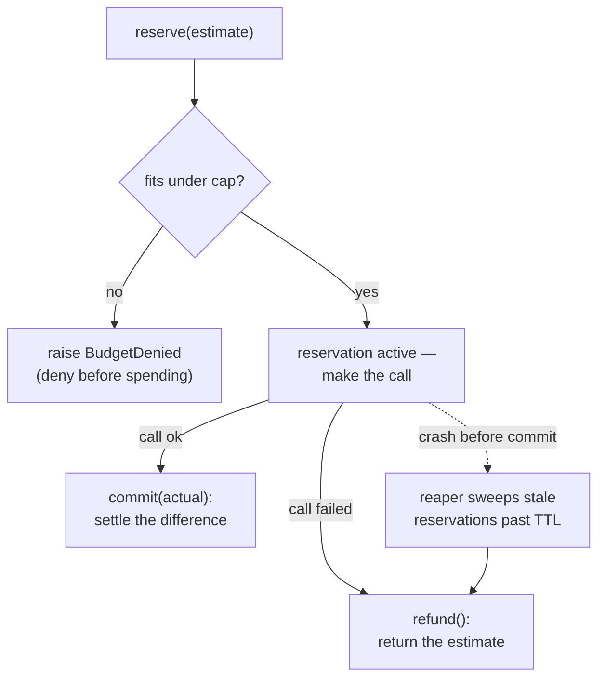

**Goal:** build a loop that acts on what is *about* to happen, not what already did. The loop gate
(Unit 4) reacts to a call after it runs — fine when the cost is a wasted iteration, wrong when the
cost is real money you cannot take back. You will build a **budget gate** that reserves against a
*projected* cost **before** the call and refuses it if it would breach the cap. This is
**feedforward control**, and it is the right shape for any action you cannot undo.

**Where this fits:** the second **reflex** unit — still in-turn and deterministic, but acting on a
*prediction* instead of a measurement. It reuses Unit 1's trace and Unit 2's vocabulary (it emits
`budget_reserved` / `budget_denied` events). It sets up a theme the rest of the course returns to:
the more irreversible the action, the earlier and more carefully a loop must intervene.

---

## Feedback reacts; feedforward predicts

Control comes in two shapes. **Feedback** waits for a measured error and corrects it — you spend,
you observe the overspend, you stop. **Feedforward** acts on a *prediction* of the outcome before
it happens — you estimate the spend, and you refuse the call if the estimate breaks the budget.

For most signals, feedback is enough: if latency creeps up, you notice and adjust next turn. But
money is different, and so is any irreversible action (sending an email, deleting a file, calling a
paid API). By the time pure feedback *detects* the overspend, the money is gone — there is no
"next turn" correction for a dollar already spent. So the budget loop must be **feedforward**: it
decides *before* the spend, on the estimate.

`personal_agent` does this with a transactional gate in `cost_gate/gate.py` (ADR-0065): a
**reserve / commit / refund** lifecycle that *"raises `BudgetDenied` on any failure"* at reserve
time — before the call is made.

## Reserve before you spend

The core move: open a reservation for the projected cost. If it fits under the cap, the call
proceeds; if not, the gate raises `BudgetDenied` and the call never happens
(Reference: [`examples/05/cost_gate.py`](../examples/05/cost_gate.py)):

```python
def reserve(self, estimate):
    """Open a reservation for a projected cost, or raise BudgetDenied if it won't fit."""
    if self.reserved_usd + estimate > self.cap_usd:
        raise BudgetDenied(f"reserve ${estimate:.4f} would exceed cap ${self.cap_usd:.2f}")
    rid = str(uuid4())
    self.reservations[rid] = Reservation(rid, estimate)
    self.reserved_usd += estimate
    return rid
```

Reserving on the **estimate** (not the actual) is the whole point: it is deliberately
conservative, holding back budget for a call before you know its true cost, so you can never
commit to a spend you cannot afford.

## Commit the truth; refund the rest

After the call, you know the real cost, which is almost always *less* than the estimate. `commit`
settles the difference (returning the over-estimate to the budget); `refund` returns the whole
reservation if the call failed. Both keep the running total honest:



Running the example with a $0.10 cap and $0.03 estimates, the over-budget call is refused *before*
it spends — even though the actuals so far are under the cap:

```
call 5: spent $0.0200 (est $0.0300); reserved now $0.0800
call 6: DENIED before spending — reserve $0.0300 would exceed cap $0.10 (already reserved $0.0800)
```

That gap — actuals at \$0.08 but the *reservation* tripping the cap — is feedforward working: the
gate protects the budget against the cost it has *committed to allow*, not just the cost already
spent.

## The crash case: the reaper

Feedforward has one failure mode pure accounting does not: what if the agent reserves, then crashes
*before* it can commit or refund? The reservation is stranded — budget held for a call that will
never settle, slowly using up all available budget. So the lifecycle needs a sweeper. The harness runs a
**reaper** on a 30-second cadence that *"sweeps stale `active` rows past their TTL … refunding them
— catches caller crashes between reserve and commit."* That is why `refund` is **idempotent**: the
reaper and the caller might both try to return the same reservation, and that must be safe. A
feedforward loop is only as reliable as its recovery path.

## Where it sits on the gradient

Like the loop gate, the budget gate is **reflex**: in-turn, deterministic, fully observed. But it
gives up *reversibility at the moment of action* — once a call is made, the spend is real — which
is exactly why it acts *before*, not after. That is the gradient's logic in miniature: the less you
can undo an action, the earlier in the loop you must decide about it.

> **Security:** a budget cap is a denial-of-service control — an uncapped agent (or a prompt that
> causes repeated retries) is a way to increase the cost to whoever pays, so the cap is a security
> boundary, not just a cost one. Two cautions: reservation ids must be unguessable (use UUIDs, as here) so a
> caller cannot commit or refund someone else's reservation; and watch for *estimate inflation* —
> if an attacker can drive up the per-call estimate, they can deny service by exhausting the cap
> with reservations that never spend.

> **Observe:** this unit emits `budget_reserved`, `budget_committed`, `budget_denied`, and
> `budget_refunded` events on the trace tuple. The loop it closes is *"can we afford the next
> action?"* — answered before the spend, not after. Snapshotting the cap utilization over time
> (the harness ships these counters to a dashboard) turns the gate's own state into a signal a
> higher loop can watch: are we denying too often? Is the cap set right?

## Challenges

1. **Deny before the spend.** Tune the cap and estimates so a call is denied while actual spending
   is still under the cap. *Success:* you can point to the reservation that tripped it and explain
   why feedback (counting actuals only) would have allowed the overspend.
2. **Survive a crash.** Reserve without committing or refunding, then write a `reap(ttl)` that
   refunds stale active reservations. *Success:* the budget returns to the right total, and calling
   `refund` twice on the same reservation is a no-op.
3. **Watch the controller.** Over a run, compute the denial rate (`budget_denied` / reserve
   attempts). *Success:* a single number, and a one-sentence judgment on whether the cap is too
   tight, too loose, or about right.

## Recap

- **Feedback reacts** to a measured error; **feedforward predicts** and acts before. For money and
  other irreversible actions, feedback is too late — there is no correcting a dollar already spent.
- The budget gate **reserves on the estimate before the call**, raising `BudgetDenied` if it would
  breach the cap; it deliberately holds back budget it has *committed to allow*.
- `commit` settles the actual (refunding the over-estimate) and `refund` returns a failed call's
  reservation; a **reaper** sweeps reservations stranded by a crash, which is why `refund` is
  **idempotent**.
- Still a **reflex** loop, but it gives up reversibility-at-action — so it must decide *before*
  acting. The less reversible the action, the earlier the loop intervenes.

## Next

**Unit 6 — Reflection: Self-Critique from Traces:** the reflex loops act in the moment on simple
rules. Next you climb to the **reflective** tier: after a turn finishes, the agent reads its own
trace and *critiques* it — a slower, judgment-based loop that produces a proposed improvement
rather than an instant block.
