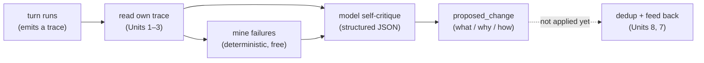

**Goal:** climb from the reflex tier to the **reflective** tier. The gates in Units 4–5 act in the
moment on simple rules. Now the agent does something slower and harder: after a turn finishes, it
reads its *own* trace and critiques it — producing a written, structured judgment about what went
well and what to change. You will build both halves: a deterministic pass that mines the failure
path from a trace, and a model pass that turns it into a structured **proposed change**.

**Where this fits:** the first **reflective** unit. It is the first loop that *consumes* the lens
you built in Units 1–3 — reflection reads the trace events those units emit. Unlike a gate, it does
not act in-turn; it runs after the turn and produces a *proposal*, not an instant block. Unit 7
then closes the loop by feeding that proposal back.

---

## A different kind of loop

The reflex gates were narrow, fast, and rule-based. A reflective loop is the opposite: it runs
*after* the turn, it uses the model's *judgment* rather than a fixed rule, and its output is not an
action but a **proposal** — "here is what I think should change, and why." This is the pattern the
research community calls **Reflexion** (Shinn et al., 2023 — an agent critiques its own trajectory
in words and uses that as feedback) and **Self-Refine** (Madaan et al., 2023 — iterative
self-feedback); Anthropic's *Building Effective Agents* names the same shape the
**evaluator-optimizer** loop. The harness implements it as the **Captain's Log**: one structured
reflection per turn.

It has two halves, and the first one needs no model at all.

## Half one: mine the failure path (deterministic)

Before you pay a model to think, extract the facts a critique should focus on. A trace already
records what failed and what the agent did next, so a deterministic pass can pull out the failure
path: which tool calls failed, and — by reading the *next* event — whether the agent retried or
gave up. This mirrors `personal_agent`'s `_extract_failure_excerpt`
(Reference: [`examples/06/reflection.py`](../examples/06/reflection.py)):

```python
for i, ev in enumerate(events):
    if ev.get("operation") == "tool_call_failed":
        nxt = events[i + 1] if i + 1 < len(events) else {}
        if nxt.get("operation") == "tool_call_started" and nxt.get("tool") == ev.get("tool"):
            recovery = "retry"
        elif nxt.get("operation") == "reply_ready":
            recovery = "gave up"
        else:
            recovery = "other"
        failed.append({"tool": ev["tool"], "error": ev["error"], "recovery": recovery})
```

Run against a turn where Elasticsearch timed out twice, it produces a clean excerpt — two failures,
recovery `retry` then `gave up` — with no model and no cost. *Cheap before smart*: the deterministic
pass focuses the expensive one.

## Half two: the structured self-critique

Now the model reads the trace (and the failure excerpt) and returns a **structured** judgment, not
free prose. The harness asks for exactly this shape — a `rationale`, a `proposed_change` with
`what` / `why` / `how`, and an `impact_assessment` — and persists it as a `CaptainLogEntry`:

```python
'Respond with ONLY JSON: {"rationale": str, '
'"proposed_change": {"what": str, "why": str, "how": str}, "impact_assessment": str}'
```

Structure is the point. A free-text "the agent should be better at Elasticsearch" cannot be
deduplicated, counted, or promoted; a typed `proposed_change` can be (Unit 8). The course example
keeps the shape minimal (`what` / `why` / `how`); the harness's `ProposedChange` adds a `category`
and a `scope`, which become the namespace Unit 8's dedup keys on. `personal_agent` generates this
with DSPy ChainOfThought *"(E-008: 0% parse failures)"* and falls back to manual JSON parsing if
that is unavailable — because a reflection you cannot parse
is a reflection you cannot use.



## Keep it joinable, and keep it honest

The reflection must link back to the turn it critiques. The harness stamps a `TelemetryRef`
carrying the originating `trace_id`, so a proposal can always be traced to the evidence that
produced it — the same joinability discipline from Unit 1, now applied to the loop's *output*. The
example emits a `reflection_created` event carrying that back-reference.

And a warning the rest of the course builds on: **a single reflection is a hypothesis, not a
fact.** The model might misread a one-off network blip as a systemic flaw. That is exactly why this
loop produces a *proposal* and stops — it does not act. Units 7 and 8 add the safeguards (relevance,
recurrence) that decide which proposals are worth believing, and Unit 9 keeps a human in the loop
for the risky ones.

> **Security:** reflection reads the *full* trace — tool arguments, errors, sometimes snippets of
> output — and sends it to a model, so redact secrets and personal data from the trace before it
> becomes a prompt (Observability Standard R5). A subtler risk: the `proposed_change` is
> model-generated, untrusted text. A poisoned tool result earlier in the turn could steer the
> critique toward a harmful "improvement," so a proposal is **never auto-executed** — it is data for
> the next loop, reviewed before it ever changes the system.

> **Observe:** this unit emits a `reflection_created` event with a `TelemetryRef` back to the
> critiqued `trace_id`, plus whether a proposal was produced and how many failures were found. The
> loop it *opens* is *"what should change?"* — but note it is **not closed here**: reflection
> produces a proposal and stops. Closing it (feeding it back) is Unit 7; trusting it (dedup) is
> Unit 8.

## Challenges

1. **Mine a clean turn.** Run the extractor on a trace with no failures. *Success:* it returns
   `None`, and you can explain why a successful turn should produce a lighter reflection (or none).
2. **Make the critique structured.** With an endpoint set, get the model to return the
   `rationale` / `proposed_change` / `impact_assessment` JSON, and reject a response that is not
   valid JSON. *Success:* a parsed proposal, or a clean fallback — never a crash on bad output.
3. **Trace the proposal to its evidence.** Given a `reflection_created` event, write the query that
   pulls the original turn's trace. *Success:* the proposal and the trace it critiques are joined
   by `trace_id` — the loop's output is as joinable as its input.

## Recap

- The **reflective** tier runs *after* a turn, uses the model's **judgment**, and produces a
  **proposal**, not an in-turn action — the **Reflexion / Self-Refine / evaluator-optimizer** pattern.
- It has two halves: a **deterministic** failure-path mine (cheap, no model) that focuses an
  expensive **structured self-critique** (rationale + `proposed_change` of what/why/how).
- **Structure makes it usable** — a typed proposal can be deduplicated, counted, and promoted; the
  harness uses DSPy for near-zero parse failures and links each reflection to its `trace_id`.
- A single reflection is a **hypothesis**, so the loop produces a proposal and **stops** — the
  safeguards come next.

## Next

**Unit 7 — Closing the Reflective Loop:** a reflection nobody reads changes nothing. Next you close
the loop — feeding a small, relevant slice of past reflections back into the next turn's context, so
the agent actually re-reads its own observations. It is the cleanest example in the course of an
agent's output becoming its future behavior.
