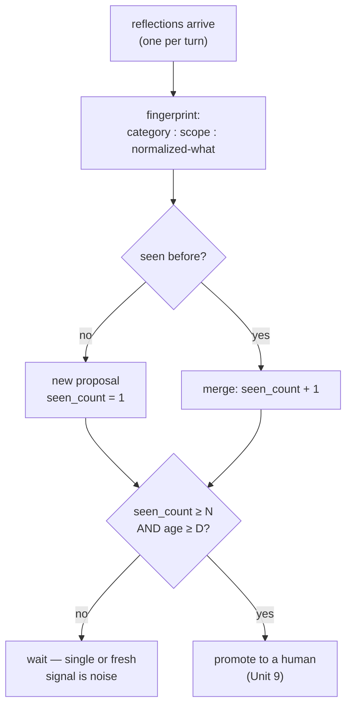

**Goal:** build the mechanism Unit 7 leaned on. There you surfaced only reflections with
`seen_count >= 2`, on the principle that *"single-instance reflections are noise; recurring
patterns are signal."* Now you build the part that produces that count — **deduplicating**
equivalent proposals into one, **counting** recurrences, and **promoting** only the patterns that
both recur and persist. This is **hysteresis**: a deadband that stops the slow outer loop from
acting on a single, fresh observation.

**Where this fits:** the first **deliberative** unit. It consumes the proposals Unit 6 produced,
and its output — a promoted proposal — is what Unit 9 sends to a human. Dedup and the
recur-and-mature gate are what make it safe to escalate a proposal at all.

---

## Don't act on one reading

A single reflection is a hypothesis (Unit 6): the model might have over-read one noisy turn. If the
agent acted on every first observation, it would oscillate — chase one anomaly, then another, never
settling. Control engineers prevent exactly this with **hysteresis** (a deadband: don't react until
the signal clears a threshold) and electronics with **debounce** (ignore a switch's first jittery
contacts). The promotion gate here is the same idea: wait for a pattern to *recur* before you act
on it.

But "recur" only works if you can tell that two differently-worded reflections are the *same*
proposal. That is the dedup problem, and it comes first.

## Fingerprint: collapse the duplicates

Give every proposal a deterministic **fingerprint** so equivalent ones collapse. The trick is to
normalize the text before hashing — lowercase, strip punctuation, drop stopwords, and **sort the
tokens** so word order stops mattering (Reference:
[`examples/08/hysteresis_dedup.py`](../examples/08/hysteresis_dedup.py)):

```python
def normalize(text):
    tokens = [t for t in _WORD.findall(text.lower()) if t not in STOPWORDS]
    return " ".join(sorted(set(tokens)))                       # token-sort = order-independent

def fingerprint(category, scope, what):
    return hashlib.sha256(f"{category}:{scope}:{normalize(what)}".encode()).hexdigest()[:16]
```

This is `personal_agent`'s `compute_proposal_fingerprint`: a hash of `category:scope:normalized_what`,
where the token sort means *"add retry logic"* and *"retry logic add"* produce the same fingerprint.
Two proposals sharing a fingerprint are merged, incrementing `seen_count`.

Be honest about the limit: this collapses **reorderings, stopwords, and punctuation** — *not*
synonyms. *"retry"* and *"retries"*, *"ES"* and *"Elasticsearch"* hash differently. True
semantic dedup needs embeddings (the same Phase-2 upgrade Unit 7's relevance filter wanted); the
deterministic fingerprint is the cheap, exact-match first pass.

## Promote: recur *and* mature

With a count in hand, the gate is two conditions, not one — a proposal must have **recurred**
(`seen_count`) *and* **persisted** (age), mirroring `personal_agent`'s `PromotionCriteria`
(`min_seen_count`, `min_age_days = 7`):



Running the example, seven incoming reflections collapse to four proposals, and only one clears
both bars:

```
7 incoming reflections -> 4 distinct proposals after dedup
  ...
promote if seen_count >= 2 AND age >= 7d:
  PROMOTED  (seen 3x, 9d)  Add a retry budget for Elasticsearch queries
  too new   (seen 2x, 3d)  Add a progress bar for long tool calls
  too few   (seen 1x, 1d)  Lower the summarizer temperature
  too few   (seen 1x, 10d) Parallelize the health probe
```

The two rejections are the whole point. *"Too new"* recurred but has not persisted; *"too few"* is
old but only seen once. Hysteresis needs **both** — a momentary spike and a single stubborn outlier
are both noise. Only the recurring, matured pattern is worth a human's attention.

## Where this sits on the gradient

This is a **deliberative** loop: slow (it spans many turns and days), and its output is not an
action but an *escalation* — a promotion. It deliberately gives up speed for confidence. That trade
is the gradient's logic again: the action it leads to (changing the system) is high-stakes, so the
loop in front of it is slow and conservative on purpose.

> **Security:** `seen_count` is a consensus signal, and consensus can be manufactured. An attacker
> who can drive the agent to emit the same proposal repeatedly — via repeated crafted inputs —
> could inflate a fingerprint's count to force promotion of a malicious change. Two defences:
> promotion does not auto-apply (a human still decides, Unit 9), and you should attribute
> `seen_count` to *distinct* sessions/causes, not raw repetition, so one hostile loop cannot vote
> many times.

> **Observe:** this unit emits `proposal_merged` (a duplicate collapsed) and `proposal_promoted`
> (a pattern cleared the gate), carrying the fingerprint and `seen_count`. The loop it closes is
> *"is this a recurring, persistent pattern worth escalating?"* The signal to watch is the
> promotion rate: too high and your thresholds are too loose (jitter); near zero and they are too
> tight (you never learn).

## Challenges

1. **Collapse a reorder.** Feed the same proposal with its words reordered and a stopword changed.
   *Success:* both land on one fingerprint with `seen_count = 2`, and you can state one rewording
   that should collapse but does *not* (a synonym) — and why.
2. **Tune the deadband.** Set `MIN_SEEN_COUNT = 1` and re-run. *Success:* one-offs now promote, and
   you can explain, in hysteresis terms, the oscillation that causes.
3. **Require both bars.** Construct one proposal that is recurring-but-new and one that is
   old-but-single. *Success:* neither promotes, and you can say why each fails a *different*
   condition.

## Recap

- A single reflection is **noise**; acting on it makes the agent oscillate. **Hysteresis** (a
  recur-and-mature deadband) is the fix — the mechanism behind Unit 7's `seen_count >= 2`.
- **Dedup** by a deterministic **fingerprint** of `category:scope:normalized_what`, where
  **token-sorting** makes it order-independent; duplicates merge and increment `seen_count`. It
  collapses wording/order, **not synonyms** (that needs embeddings).
- **Promotion** requires **both** recurrence (`seen_count`) and persistence (age) — a spike and a
  lone outlier are both rejected.
- This **deliberative** loop trades speed for confidence: its output is an *escalation*, because
  what it leads to is high-stakes.

## Next

**Unit 9 — Human in the Loop, Async:** a promoted proposal is a candidate change to the agent
itself — too high-stakes to apply automatically. Next you send it to a human over an asynchronous
channel, read the verdict back, and let it flow into the system: approve, reject (and suppress), or
re-evaluate. The human's judgment becomes the loop's closing signal.
