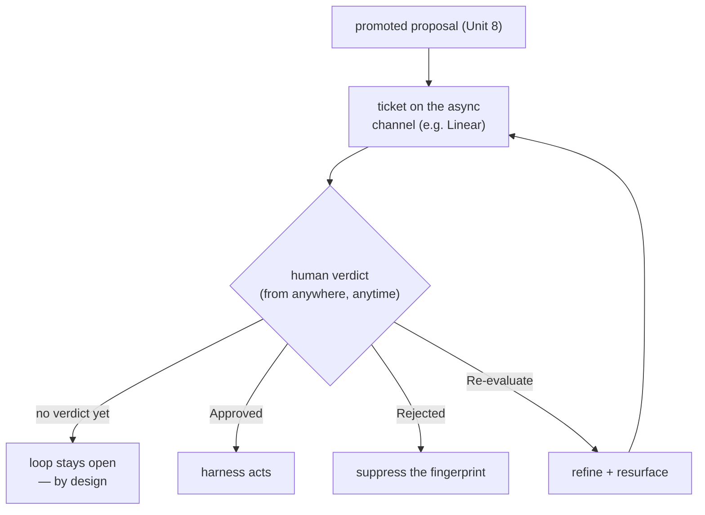

**Goal:** close a loop you should *not* close automatically. A promoted proposal (Unit 8) is a
candidate change to the agent itself — its prompt, its config, its behaviour. That is the most
irreversible, highest-stakes action in the course, so the loop stays **open until a human closes
it.** You will build the async approval channel: a promoted proposal becomes a ticket, a human
gives a verdict from wherever they are, a poller reads it back, and the verdict flows into the
system — approve, reject, or re-evaluate. The human's judgment is the loop's closing signal.

**Where this fits:** the top of the **deliberative** tier, and the ceiling of the autonomy
gradient. Everything below this acts on its own; this one does not. It consumes Unit 8's promoted
proposals and produces a human verdict that the harness acts on — or suppresses.

---

## The missing piece is feedback, not autonomy

It is tempting to make the self-improvement loop fully autonomous: the agent proposes a change,
then implements it. `personal_agent` deliberately does not, and ADR-0040 is blunt about why: *"The
critical missing piece is not autonomy — it is feedback. The agent generates proposals but has no
signal about whether they are valuable."* Before an agent can be trusted to change itself, you need
a channel for human judgment to flow *in* — and that channel is valuable on its own, long before
any autonomy.

This is the distinction between **human-in-the-loop** (a person must act for the loop to proceed)
and **human-on-the-loop** (a person supervises and can intervene). High-stakes self-modification
belongs firmly in the first category.

## An asynchronous channel

The human will not be watching. They triage on their own schedule, from a phone, days later — so
the channel must be **asynchronous**. Rather than build a custom approval UI, `personal_agent`
reuses Linear (its task tracker): a promoted proposal becomes an **issue**, and the human responds
with **labels** (Approved / Rejected / Re-evaluate), **states**, and **comments** — *"the project
owner triages proposals from their phone; the agent reads the feedback and responds."* A poller
reads the verdicts back and routes each one, the way `captains_log/feedback.py` dispatches
`handle_approved` / `handle_rejected` / `handle_deepen`
(Reference: [`examples/09/human_in_the_loop.py`](../examples/09/human_in_the_loop.py)):

```python
if t.verdict == "Approved":
    approved_for_action.append(t.fingerprint)        # the harness may now act
elif t.verdict == "Rejected":
    suppressed.add(t.fingerprint)                    # the rejection persists as signal
elif t.verdict == "Re-evaluate":
    ...                                              # refine and resurface
```



## The verdict is signal

The key move: a verdict is not just a gate, it is **data that feeds back**. A *rejection* is
recorded against the proposal's fingerprint, so when the same idea recurs (Unit 8), it is
**suppressed** rather than re-promoted — the human's "no" persists, and they are not asked twice.
Running the example, a rejected proposal that recurs is dropped on sight:

```
'c3d4' recurred, but the human rejected it before -> suppressed, not re-promoted.
```

This closes a quieter, higher loop too: because every verdict is captured, you can measure whether
your proposals are getting *better* over time (the harness tracks an acceptance signal per
proposal class). The human is not just a gate on this proposal; their judgments are training signal
for the proposal generator — the reason RLHF-style human feedback works at all.

## Honesty: what ships, and what doesn't

This is the most important place in the course to separate the shipped from the aspirational. The
**human-closed** loop — propose, promote, human-verdict, suppress-or-act — is real and runs. The
**fully autonomous** loop — where the agent reads an approved issue and implements the change
itself — is *not* shipped: ADR-0040 lists it as Phase 3, *"meta-learning pending,"* with unmet
prerequisites (proposal quality unevaluated, no external-agent delegation built). Most "self-improving
agent" demos quietly assume that last step works. Here it is explicitly a human who closes the loop,
and that is a feature: you earn autonomy by first proving, through feedback, that the proposals are
worth trusting.

> **Security:** the human verdict is the safety gate for self-modification, so the channel's
> **authenticity** is critical — only the owner's verdicts may count. If an attacker can post an
> "Approved" label or comment, they can approve a malicious change to the agent; authenticate the
> channel and treat any verdict whose provenance you cannot verify as no-verdict. And remember the
> proposal text is untrusted (Unit 6): a reviewer should see it rendered as data, never executed,
> and be wary of proposals written to social-engineer an approval.

> **Observe:** this unit emits `feedback_polled` (with the verdict) and `proposal_suppressed`,
> stamped on a `system:feedback` trace. The loop it closes is the whole self-improvement arc —
> *"should the agent change itself, and did a human agree?"* The signal to watch is the
> accept/reject rate over time: a rising acceptance rate is evidence the proposal generator is
> improving, and the first thing you would measure before considering any move up to autonomy.

## Challenges

1. **Route three verdicts.** Drive the poller with Approved, Rejected, and Re-evaluate tickets.
   *Success:* each lands in the right bucket, and a re-evaluated ticket returns to the channel
   rather than acting or suppressing.
2. **Make rejection persist.** Reject a proposal, then feed the same fingerprint in again.
   *Success:* it is suppressed without re-promoting, and you can explain why a verdict has to be
   stored as signal, not just consumed once.
3. **Defend the channel.** Add a verdict from an unverified author. *Success:* your poller ignores
   it, and you can state what authentication the real channel needs before a verdict may change the
   agent.

## Recap

- High-stakes self-modification stays **human-in-the-loop**: the loop is **open until a human
  closes it**, on purpose — *"the critical missing piece is not autonomy, it is feedback"* (ADR-0040).
- The channel is **asynchronous** (e.g. Linear): a promoted proposal becomes a ticket; a human
  responds with labels/comments from anywhere; a poller reads the verdict back and routes it.
- A **verdict is signal**: a rejection is recorded so the proposal is **suppressed** if it recurs,
  and the accept/reject rate measures whether proposals are improving (RLHF-style feedback).
- Be honest: the human-closed loop **ships**; the fully **autonomous** self-implementation loop is
  **pending** (ADR-0040 Phase 3). You earn autonomy by first proving proposal quality with feedback.

## Next

**Unit 10 — Watching the Apparatus:** you have built loops at every tier. Next you build the loop
that watches *them* — meta-monitoring that checks the observability itself is intact (is the signal
still joinable?), the gates still fire, and the background loops still run. The observer, observed.
