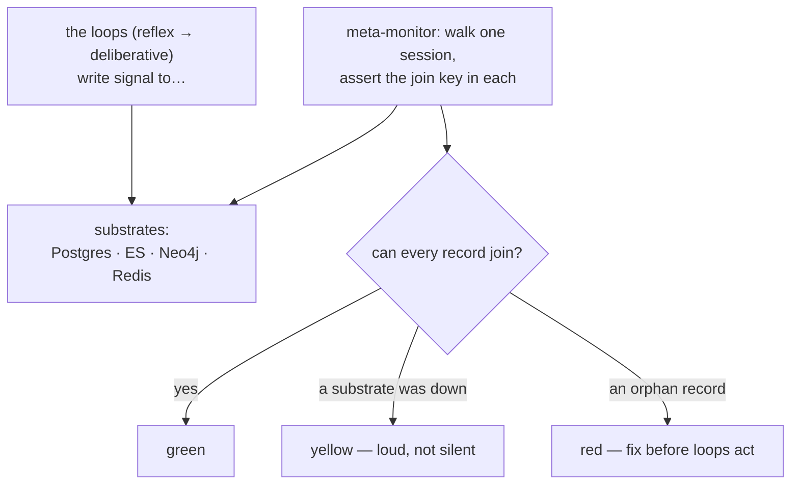

**Goal:** build the loop that watches the other loops. You have feedback loops at every tier now —
but each one trusts the signal beneath it, and that signal can become invalid without any alert
(Unit 1's cost ledger with 4,077 NULL `trace_id`s did exactly that). The **meta** tier closes a loop
around the apparatus itself: a monitor that periodically checks the observability is still intact —
that a run is still joinable across every store — and that the gates and background loops still run.
The monitor is itself monitored.

**Where this fits:** the **meta** tier — above every loop you have built. It consumes nothing new;
it audits the substrate the whole course rests on. It is also where the by-hand approach starts to
strain (a walk across four different stores), which sets up Unit 11.

---

## A loop that trusts bad signal is worse than no loop

Every loop so far acts on telemetry: the gate reads tool outputs, the budget reads costs, reflection
reads traces. If that telemetry quietly stops being joinable — a NULL `trace_id`, a substrate that
drifted out of sync — the loops do not stop. They keep acting, now on **noise**, confidently. That
is more dangerous than no loop at all, because it looks like it is working.

So you need a loop whose entire job is to verify the apparatus. `personal_agent`'s **joinability
walker** (ADR-0074 Phase 5) does this: it picks a recent session and walks every substrate —
Postgres, Elasticsearch, Neo4j, Redis — asserting that for every record, the identity tuple exists
and matches. Anything that fails to join is an **orphan**. This is the continuous version of the
one-time audit that found the 4,077-row bug: catch the rot as it starts, not months later.

## Loud degradation

The subtle part is what happens when the monitor itself cannot check something. If Neo4j is
unreachable this tick, the walk must **not** report "all good" — that is a false green, the worst
outcome, because it tells you the apparatus is healthy when you actually have no idea. So each
substrate is checked independently, and the result distinguishes three states
(Reference: [`examples/10/joinability_walk.py`](../examples/10/joinability_walk.py)):

```
healthy                      -> GREEN  (0 orphan(s))
a record lost its trace_id   -> RED    (1 orphan(s))
neo4j unreachable            -> YELLOW (0 orphan(s))
```

`personal_agent`'s walker wraps *"each substrate walk in a `try/except` such that one substrate
[being down] and the rest of the walk continues … [making] 'couldn't run' and 'ran, one substrate
down' distinguishable signals,"* and `aggregate_outcome` reduces the per-substrate verdicts
worst-first to `green` / `yellow` / `red` / `skipped`. A 7-day all-green streak is the gate that
says the observability is trustworthy.



## The homeostatic loop that runs it

Meta-monitors only help if they run on their own. `personal_agent` drives them from the
**brainstem scheduler** — a background loop that, on a cadence, runs consolidation, lifecycle
cleanup, the joinability probe, and the Captain's Log promotion, each tick minting its own
`SystemTraceContext`. That is the classic **MAPE-K** pattern from autonomic computing
(**M**onitor → **A**nalyze → **P**lan → **E**xecute over a shared **K**nowledge base) — a system
that regulates itself, the software version of homeostasis. Watching the gates as a class is the
same idea (ADR-0053, *Proposed*): the gateway makes several deterministic decisions per request,
and a monitor turns those decisions into a signal a higher loop can act on.

> **Security:** the meta-monitor is a tampering warning. If a run suddenly stops being joinable, the
> benign explanation is a bug — but the hostile one is an attacker severing the links to cover
> their tracks. Loud degradation is what denies them a silent path: a monitor that went green when
> it could not actually check would let tampering pass unnoticed. Make the monitor's *own* failure
> the loudest signal you have.

> **Observe:** this unit emits a `joinability_walk` outcome (`green`/`yellow`/`red`, orphan count)
> on a `system:joinability` trace. The loop it closes is the one underneath all the others — *"is my
> observability still intact?"* — and it is the only loop whose subject is the apparatus rather than
> the agent's work. Watch the streak: a broken green run means stop trusting every downstream loop
> until it is fixed.

## Challenges

1. **Catch the orphan.** Drop the `trace_id` from one substrate record and run the walk. *Success:*
   it reports `red` with the specific orphan, not a vague failure.
2. **Refuse the false green.** Mark a substrate unreachable. *Success:* the outcome is `yellow`, not
   `green`, and you can explain why a silent green here is the most dangerous result of all.
3. **Schedule it.** Sketch how a background tick (like the brainstem scheduler) would run this walk
   hourly and alert on the first non-green. *Success:* you can name the MAPE-K stages your sketch
   maps onto.

## Recap

- A loop acting on **un-joinable signal** is worse than no loop — it fails confidently. The **meta**
  tier closes a loop around the apparatus itself.
- The **joinability walker** picks a session and asserts the identity tuple across every substrate;
  anything that fails to join is an **orphan** — the continuous form of the audit that caught Unit
  1's 4,077-NULL bug.
- **Loud degradation:** "couldn't check" (yellow) must never look like "all good" (green). A false
  green hides exactly the failure you built the monitor to catch.
- A **homeostatic scheduler** runs these probes on a cadence — textbook **MAPE-K** / autonomic
  computing. The observer must itself be observed.

## Next

**[Unit 11 — Meeting the Standard: OpenTelemetry at the Boundary](11-opentelemetry.md):** walking one run across four
different stores by hand is where the hand-rolled approach finally strains. Next you meet the
standard that solves exactly this — OpenTelemetry — and learn to map your own trace onto it, and to
decide *whether* to adopt it rather than assuming you should.
