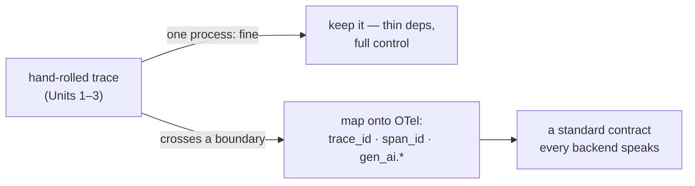

**Goal:** meet the standard you have been hand-building all along — and decide whether to adopt it.
Across Units 1–3 you built a `trace_id`, an event vocabulary, and spans. In Unit 10 you walked one
run across four different stores and felt the hand-rolled approach strain. That strain is the
**need**: a bespoke format is fine inside one process, but the moment signal must cross
processes, services, and substrates, you need a shared contract. **OpenTelemetry** is that contract
— and it is, almost exactly, the thing you already built.

**Where this fits:** the payoff unit. It does not add a new loop; it standardizes the signal every
loop depends on, at the boundary where that matters. It is also the headline of this course's
companion analysis of `personal_agent` — the real adopt-or-not decision.

---

## You already built OpenTelemetry

Strip OpenTelemetry to its core and it is: a **trace** (one logical operation) made of **spans**
(timed steps), each with a `trace_id`, a `span_id`, and a `parent_span_id` for hierarchy, plus
**attributes** as structured key-values, propagated across boundaries by a standard context. Look
back at Unit 1: you built `trace_id` and parent/child propagation by hand. You were building an
OpenTelemetry trace without knowing its name.

So mapping is mechanical, not a rewrite (Reference:
[`examples/11/to_otel.py`](../examples/11/to_otel.py)):

```json
{
  "name": "chat.completion",
  "trace_id": "b57c52344ee0426cb1047d6ac746119e",
  "span_id": "c03aa2542f914831",
  "attributes": {
    "gen_ai.operation.name": "chat",
    "gen_ai.system": "openai",
    "gen_ai.request.model": "gpt-oss-120b",
    "gen_ai.usage.input_tokens": 1840,
    "gen_ai.usage.output_tokens": 210,
    "session.id": "..."
  }
}
```

The `gen_ai.*` keys are OpenTelemetry's **GenAI semantic conventions** — the standard's agreed names
for the operation, the model, and token usage. Use them and any OTel-aware backend (a collector,
Langfuse, Phoenix, Arize, Tempo) understands your spans with no bespoke parsing. (The conventions
are still evolving and now live in their own spec, so treat any field not yet stable — a cost
attribute, for example — as custom until it lands.) Your own join key rides along as a
custom attribute, still joinable. This is precisely how `personal_agent` describes its own
`telemetry/trace.py`: *"OpenTelemetry-compatible without the full OTel SDK."*

## The decision: adopt, or stay compatible

Here is where this course departs from the Foundations habit of "build it by hand, then switch to
the library." The switch is not automatic — it is a **decision**, and the honest answer is *it
depends*:

| Reach for the OTel SDK when | Stay hand-rolled + compatible when |
|---|---|
| signal crosses process / service / substrate boundaries | a single process owns the whole trace |
| you want a collector and standard backends | a few-dependencies budget, full control of the shape |
| several teams must share one trace contract | the GenAI conventions are still moving and change often |

`personal_agent` made the second choice deliberately: an OTel-*shaped* layer, no SDK dependency.
That is **not** a failure to modernize — it is a defensible trade for a single-owner, thin-deps
system. The lesson of this unit is the opposite of "always adopt the standard": it is *know the
standard, speak it at the boundary, and adopt the machinery only when crossing that boundary is
worth the dependency.* Build the need first; then resolve it.



## What this buys the loops

Standardizing at the boundary is not housekeeping — it is what lets the higher-autonomy loops exist
at all. Unit 10's joinability walk had to reach across four stores; a shared trace contract is what
keeps a run joinable *across* them as the system grows from one process to many. The autonomy
gradient's top tiers depend on cross-substrate signal, and the standard is how that signal survives
the boundary. You adopt OpenTelemetry for the same reason you did everything else in this course:
to keep the loop trustworthy.

> **Security:** a standard wire format is also a standard *exfiltration* surface. OTel backends
> ingest whatever you put in span attributes, and the GenAI conventions invite you to attach prompts
> and completions — exactly the content most likely to carry secrets and personal data. The upside
> is that standard names make redaction systematic: you know precisely which attributes hold content
> and can strip them at the exporter. Authenticate the OTLP endpoint, and never ship `gen_ai` prompt
> bodies to a third-party backend you have not vetted.

> **Observe:** this unit standardizes the signal itself — the through-line's foundation. There is no
> new loop to close, but it is what keeps every earlier loop's signal joinable once the system spans
> more than one process. The thing to measure after adopting: does a single trace still stitch end to
> end across services? That is the Unit 10 walk, now run against a standard.

## Challenges

1. **Map a turn.** Take a multi-step turn from Unit 3 and emit each phase as an OTel span sharing
   one `trace_id`, with `gen_ai.*` attributes (including `gen_ai.operation.name`) on the model-call
   span. *Success:* a backend could reconstruct the turn from your spans alone.
2. **Make the decision out loud.** For one system you know, write the adopt-vs-compatible call using
   the table above. *Success:* a one-paragraph decision that names the boundary (or its absence) as
   the deciding factor — not fashion.
3. **Plan the boundary migration.** Sketch how `personal_agent` would adopt OTel *at the boundary*
   (an exporter at the substrate seam) while keeping its lightweight in-process layer. *Success:* you
   can say what changes and what stays — a partial migration, not a rewrite.

## Recap

- The strain of Unit 10 — one run across four stores — is the **need** for a standard. A bespoke
  format is fine in one process; crossing boundaries needs a shared contract.
- **OpenTelemetry is what you already built**: traces, spans, `trace_id`/`span_id`/`parent_span_id`,
  attributes — plus **GenAI semantic conventions** (`gen_ai.operation.name`, `gen_ai.request.model`,
  `gen_ai.usage.*`, …) that every OTel backend understands. Mapping is mechanical.
- Adoption is a **decision, not a default**: reach for the SDK at the boundary; stay hand-rolled and
  *compatible* for a single-process, few-dependencies system — `personal_agent`'s real, defensible choice.
- Standardizing at the boundary is what keeps cross-substrate signal joinable as the system grows —
  the precondition for the top of the autonomy gradient.

## Next

**[Unit 12 — The Measured Default](12-the-measured-default.md):** the final unit gathers the whole arc into a decision — which
loops to close automatically, which to keep human-closed — and treats evals the way this course
treats everything: as a hypothesis to measure, not a gate to pass. The measured default the
instrumentation earned.
