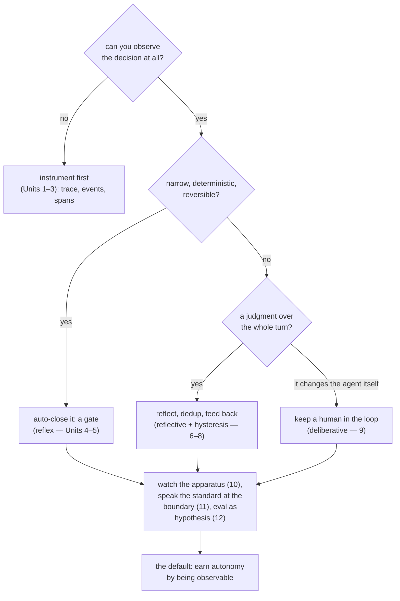

**Goal:** gather the whole course into one decision and one discipline. The decision is the
**autonomy gradient** as a tree: which loops you close automatically, and which you keep
human-closed. The discipline is how you know — **evals run as a hypothesis, not a gate.** This is
the measured default the instrumentation earned, not the author: don't ship a black box, and earn
autonomy by being observable.

**Where this fits:** the final unit. It does not add a tier; it ties the five together (sense →
reflex → reflective → deliberative → meta) and adds the outermost loop — evaluation — that tells
you whether any of it is working.

---

## Evals as the outermost loop — a hypothesis, not a gate

Every loop in this course changes the agent's behaviour. The outermost loop asks: *is the behaviour
actually good?* The tempting answer is a pass/fail test suite. `personal_agent` deliberately rejects
that for agent behaviour, and its canonical eval set (FRE-453) states the stance plainly: **"Every
expectation is a hypothesis … the harness reports MATCH/MISMATCH as findings; nothing gates on them
… The first run is the behavioural baseline — we run it to *learn*, not to pass."**

Why not gate? Because agent behaviour is not a unit test — a "mismatch" often means *your
expectation* was wrong, not the agent. Gating on it trains you to make the agent pass the test
rather than be good. So comparisons are **findings**, and only one thing is allowed to fail the run
(Reference: [`examples/12/eval_as_hypothesis.py`](../examples/12/eval_as_hypothesis.py)):

```
findings (hypotheses, never gates):
  MATCH    "what's 2+2?" -> direct (expected direct)
  MATCH    'summarize my notes from last week' -> memory (expected memory)
  MATCH    'research the latest on vLLM batching' -> tools (expected tools)

instrument health OK: every case was observable. Exit 0 regardless of match rate.
```

The one hard gate is **instrument health**: did every case actually produce telemetry? An eval you
cannot observe proves nothing — so the run fails only if a case emitted no trace, never on a
mismatch. This is the whole course in one assertion: *the thing you require is observability, not a
particular answer.*

And eval traffic is **isolated** — tagged `system:eval` with an `eval_mode` flag — so it never
pollutes the production telemetry the learning loops feed on. A feedback loop that learned from its
own test runs would be measuring test traffic, not real use.

## The measured default: the autonomy gradient as a decision

Here is the course, as the decision tree it was built to earn. For any loop you are tempted to let
an agent run, walk it:



Read it as a rule. **Can't see it? Don't automate it** — instrument first. **Narrow, deterministic,
reversible?** Close the loop in-turn (a gate). **A judgment?** Reflect, but dedup before you act, and
feed it back as an observation, not an order. **Changes the agent itself?** Keep a human in the loop
until the feedback proves the proposals are worth trusting. **All of it?** Watch the apparatus, speak
a standard at the boundary, and measure the loops as hypotheses. The further an action is from
narrow-deterministic-reversible, the more observation and supervision it must earn before it runs
alone.

## What ships, and the current limit

The honest summary the course has kept returning to: the reflex and reflective loops are **closed
and shipped** — they act on their own today. The deliberative loop is **human-closed by design**, and
the *fully autonomous* self-improvement loop (the agent implementing its own approved changes) is
**not shipped** — `personal_agent` marks it pending (ADR-0040 Phase 3). That is not a gap to
apologize for; it is the thesis in practice. You do not get autonomy by asserting it. You earn it,
one tier at a time, by being able to see the loop well enough to trust it.

> **Security:** evals are also your **safety regression net** — the cheapest place to catch a change
> that quietly weakened a guardrail (a gate that stopped firing, a budget that stopped denying).
> Keep a few adversarial cases in the set: a *newly* failing safety case should not silently pass as
> a finding — route it to human review and hold the release, even though the harness itself still
> exits non-zero only for an observability failure. And keep eval isolation strict: eval traffic that
> leaks into the learning loop is a path to poison the agent through its own test set.

> **Observe:** the capstone is observability turned on itself — the eval's one hard gate is whether
> the run was *observable*. Implement it in the real system: the final loop emits instrument-health
> telemetry and a match-rate baseline, and refuses to pass a run it could not see. Everything else in
> the course was
> practice for this: a loop you cannot observe is a loop you cannot trust, and trust is the entire
> point of letting an agent act on its own.

## Challenges

1. **Refuse to gate on quality.** Make one eval case mismatch. *Success:* the run still exits 0,
   reports the mismatch as a finding, and you can explain why gating on it would be the wrong
   incentive.
2. **Gate on observability instead.** Make one case emit no telemetry. *Success:* the run exits
   non-zero, and you can state why "unobservable" is the one failure this course will not tolerate.
3. **Place your own loop.** Take a loop from your own system and run it down the decision tree.
   *Success:* you can say which tier it belongs to, whether to auto-close it, and the one signal you
   would watch to earn the next step of autonomy.

## Recap

- **Evals are the outermost loop, run as a hypothesis**: MATCH/MISMATCH are *findings*, the first
  run is a baseline, and the only hard gate is **instrument health** — an eval you cannot observe
  proves nothing. Eval traffic is **isolated** from the learning loop.
- The **measured default** is the autonomy gradient as a decision tree: instrument first; auto-close
  the narrow/deterministic/reversible; reflect-and-dedup the judgments; keep a human on what changes
  the agent; watch the apparatus and speak a standard at the boundary.
- Be honest about the edge: reflex/reflective **ship**, deliberative is **human-closed**, full
  autonomy is **pending** — by design.
- The one rule under all of it: **don't ship a black box. Earn autonomy by being observable.**

## Where this leaves you

You have built a feedback loop at every tier of the autonomy gradient and the observability that
makes each one trustworthy — by hand, grounded in a real agent harness, and standardized only where
the boundary demanded it. The course ends where it began: an agent is full of loops whether you
design them or not, and the difference between a system you can trust and a black box is whether you
can *see* them. Take the decision tree to your own agent, find the loop you cannot observe yet, and
start there.
