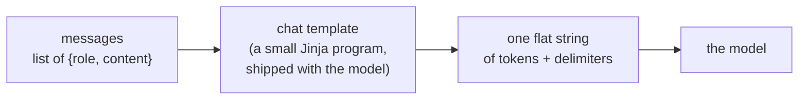

**Goal:** make the **chat template** concrete — the per-model step that turns your tidy
`messages` list into the single string of tokens the model actually reads. Once you see it,
three things that look like magic become obvious: why even an empty message costs tokens,
why the same text counts differently on different models, and why a "thinking" model can
answer with nothing at all.

**Where this fits:** Section 1 planted the idea (*messages vs. the string the model sees*)
and Section 2 read the response envelope. Here we look at the bridge between them — *before*
Section 4 turns it into a token budget.

---

## Messages go in, one string comes out

You send a list:

```python
[{"role": "system", "content": "You are concise."},
 {"role": "user", "content": "Hello"}]
```

The model never sees that list. Models read **one flat sequence of tokens** — plain text
with a few special marker tokens. Something has to turn the structured list into that flat
string, and that something is the **chat template**.



The template is a small program written in **Jinja2**. It does not live in your code — it
is **metadata that ships with the model** (in its tokenizer/server configuration). The
server loads it and applies it to every request automatically. You never write the
delimiters by hand; you just send `messages`, and the right template runs on the other side.

---

## See its effect — through the standard API

We can't print the rendered string with only the standard Chat Completions API, and this
course uses **no local tokenizer**. But we don't need to: the server reports
`usage.prompt_tokens` — the token count *after* templating — so we can **measure** the
template's footprint. Create **`work/template_cost.py`**:

```python
from common import get_client, MODEL

client = get_client()

def prompt_tokens(text: str) -> int:
    r = client.chat.completions.create(
        model=MODEL, messages=[{"role": "user", "content": text}], max_tokens=1,
    )
    return r.usage.prompt_tokens          # tokens AFTER the template is applied

print("empty :", prompt_tokens(""))       # not zero!
print("'hi'  :", prompt_tokens("hi"))
```

```bash
python work/template_cost.py
```

The empty message is **not zero**. That number is the template's **fixed overhead** — the
role markers and the trailing "your turn" cue that wrap *every* request before the model
reads it. You're paying it on each call, on top of your actual text. *(Reference:
[`examples/03/template_cost.py`](../examples/03/template_cost.py).)*

> **Why this matters now:** Section 4 measures token counts and budgets the context window.
> That overhead you just saw is why a "one-word" prompt is never one token — and why the
> count is model-specific. You met the *what* here; Section 4 spends it.

---

## What the template actually looks like

Templates differ by model, but a widely used, easy-to-read format is **ChatML**. Here is an
*illustrative* ChatML template — a normal Jinja loop over your messages:

```jinja
<|im_start|>{{ message.role }}
{{ message.content }}<|im_end|>
<|im_start|>assistant

```

Read it, don't write it. For the two messages above it produces:

```
<|im_start|>system
You are concise.<|im_end|>
<|im_start|>user
Hello<|im_end|>
<|im_start|>assistant
```

- `<|im_start|>` / `<|im_end|>` are **special tokens** marking turn boundaries; the role is
  just text after the marker.
- The dangling `<|im_start|>assistant` at the end is the **generation prompt**: "your turn —
  continue from here." (That's the `add_generation_prompt` branch.)

This is ChatML for illustration — **not** the exact template your model uses. You generally
**cannot fetch your model's real Jinja through the standard API** without a local tokenizer
(which we avoid). That limitation is itself the lesson: the template lives with the model,
on the server. The honest, portable move is to *measure* its effect, as you just did.

---

## Different model, different template

Because the template belongs to the model, **the same messages become a different string —
and a different token count — on every model**. Here is the empty-message overhead measured
across four endpoints with identical code:

| Model (server) | Template overhead (`""`) | `max_tokens=16` reply |
|---|---|---|
| `gpt-oss-120b` | 63 | empty (spent thinking) |
| a reasoning Qwen | 10 | empty (spent thinking) |
| an instruct Qwen | 12 | text, cut off |
| OpenAI `gpt-4o-mini` | 7 | text, cut off |

Nine-fold difference in fixed overhead, from the *same* request. Don't assume — measure:
`python scripts/preflight.py` reports your endpoint's overhead (and much more) for you.

---

## Harmony: a richer template (a first look)

Our model, `gpt-oss-120b`, doesn't use ChatML. It uses OpenAI's **harmony** format, which is
richer: alongside the normal turns, it gives the model separate **channels** — one for
*private reasoning* and one for the *final answer*. That extra structure is part of why its
overhead is larger (63 tokens above), and it is the reason a reasoning model can return an
**empty** reply when `max_tokens` is small: the budget was spent in the reasoning channel
before any answer-channel token appeared (you saw this in Section 2).

That's all you need here — harmony is *why the template is bigger and why thinking is
separate*. The reasoning channel, the tokens it costs, and the `reasoning_effort` dial are
the whole of **Section 6**; we pick them up there.

---

## Optional bonus: see the real rendered string

*If* your server happens to expose the non-standard `/tokenize` endpoint (some do, most
don't — it is not part of the OpenAI API),
[`examples/03/show_template.py`](../examples/03/show_template.py) prints the actual rendered
string and its token ids, so you can see the real delimiters for your model. When the
endpoint isn't available — the normal case — it falls back to the standard `usage` token
count. Either way it's a peek behind the curtain, not something the course depends on.

---

## How to think about it in practice

- **Budget the overhead.** Every request pays the template's fixed token cost; short prompts
  are never as cheap as they look (Section 4).
- **Counts are model-specific.** Don't hard-code "this prompt is N tokens" — measure it on
  the model you actually use.
- **Never hand-write delimiters.** You send `messages`; the server applies the template. If
  you paste `<|im_start|>`-style markers into your *content*, you're not helping — see below.
- **Roles map to template slots.** `system`, `user`, `assistant`, and later `tool` /
  `developer` (Sections 6, 14) are all rendered by the same template into their marked
  sections.

---

> **Security:** the template boundary is a **trust boundary**. The special tokens that
> separate turns are exactly what an attacker would forge: untrusted text that contains
> fake `<|im_start|>`/role markers is trying to *inject a turn* and escape its `user` slot —
> a form of prompt injection. Reputable servers treat your `content` as data and escape it,
> but never assume; this is precisely why you let the template add delimiters and never
> build them by hand. The full treatment is Section 21.

## Challenges

1. **Measure your overhead.** Run `work/template_cost.py` and state your endpoint's empty-
   message token count. *Success:* you can say how many tokens every request costs before
   your text is even added.
2. **Compare two models.** If you can point `MODEL` at a second model (or use the preflight
   on two endpoints), compare their empty-message overhead. *Success:* you can show the
   counts differ and explain why (different template).
3. **Bonus — see the string.** *Only if* `/tokenize` is available, run
   `examples/03/show_template.py` and find the exact generation-prompt suffix the template
   appends after the last message. *Success:* you can quote it. (If it's not available, say
   so — that's the expected, standard-API answer.)

---

## Recap

- The **chat template** is a per-model Jinja program (shipped with the model) that renders
  your `messages` into one flat token string with special delimiters — the model's real
  input.
- You can't print that string with the standard API and no tokenizer, but `usage.prompt_tokens`
  lets you **measure** it; the non-zero empty-message count is the template's fixed overhead.
- The template belongs to the model, so **the same messages cost different tokens on
  different models** — measure, don't assume.
- `gpt-oss-120b` uses **harmony**, which adds private reasoning **channels** — why its
  overhead is larger and why a tight `max_tokens` can return empty (full story in Section 6).

## Next

**Section 4 — Tokens & the Context Window:** now that you know *why* token counts have a
floor and vary by model, you'll measure them in earnest and turn `usage` into a budget:
input + output must fit in the model's context window.
