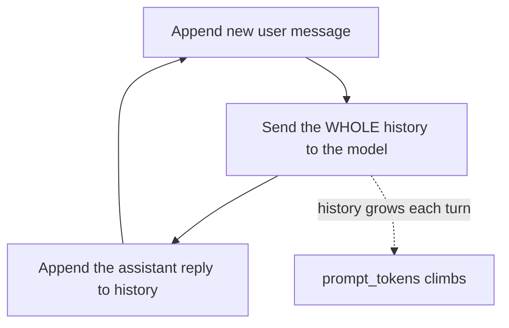

**Goal:** understand that the API is **stateless** — it remembers nothing between calls —
and build a multi-turn conversation yourself by keeping the history. Then learn to keep
that history inside the token budget with windowing and summarization.

**Where this fits:** every call so far was one-shot. Real assistants hold a conversation,
and *you* are responsible for the memory. This underpins tools (Section 14), RAG
(Section 20), and agents (Section 23) — they all manage a growing message list.

---

## The server remembers nothing

This surprises people: there is no "conversation" on the server. Each
`chat.completions.create(...)` is independent. To make the model aware of earlier turns,
**you resend the entire history every time** — as a growing `messages` list.

The loop is always the same:



1. Append the new `user` message to your history.
2. Send the **whole** history.
3. Append the `assistant` reply to your history.
4. Repeat.

Build it. Create **`work/chat.py`** (scripted turns, so it runs without typing):

```python
from common import get_client, MODEL

client = get_client()
history = [{"role": "system", "content": "You are a concise travel assistant."}]

user_turns = [
    "I'm planning a trip to Japan.",
    "What's the best season to visit?",        # 'visit' relies on remembering Japan
    "And what should I pack for that season?",  # relies on remembering the season
]

for turn in user_turns:
    history.append({"role": "user", "content": turn})
    response = client.chat.completions.create(model=MODEL, messages=history)
    reply = response.choices[0].message.content
    history.append({"role": "assistant", "content": reply})   # <-- don't forget this

    print(f"USER: {turn}\nASSISTANT: {reply}")
    print(f"   (prompt_tokens: {response.usage.prompt_tokens})\n")
```

```bash
python work/chat.py
```

Two things to notice:

- The later turns ("visit", "that season") only make sense because the earlier turns are
  in the history. Delete the `history.append(reply)` line and the model goes amnesiac.
- **`prompt_tokens` climbs every turn** — you resend (and pay for) the whole conversation
  each time. That's the problem the rest of this lesson solves. *(Reference:
  [`examples/13/chat_loop.py`](../examples/13/chat_loop.py).)*

> **Want it interactive?** Replace the `for turn in user_turns` loop with
> `while True: turn = input("you: ")`. The mechanics are identical — append, send,
> append.

> **Drop the reasoning.** When you append the assistant turn, keep only its `content`,
> **not** its `reasoning_content` (Section 6). The thinking was scratch work; resending it
> just wastes context and money.

---

## Keeping history inside the budget

Because input + output ≤ the context window (Section 4), an ever-growing history
eventually crowds out the answer — and gets expensive (Section 11). Two standard fixes,
both in **`work/trim.py`**:

**1. Sliding window** — keep the system message plus the last N turns, drop the rest:

```python
from common import get_client, MODEL

client = get_client()


def sliding_window(history, keep_turns=4):
    system = [m for m in history if m["role"] == "system"]
    rest = [m for m in history if m["role"] != "system"]
    return system + rest[-keep_turns:]
```

Simple and cheap, but the model truly forgets anything older than the window.

**2. Summarize** — replace old turns with a short model-written summary, so the *facts*
survive even though the verbatim turns don't:

```python
def summarize(messages):
    transcript = "\n".join(f"{m['role']}: {m['content']}" for m in messages)
    r = client.chat.completions.create(
        model=MODEL,
        messages=[{"role": "user", "content":
                   "Summarize this conversation in 2 sentences, keeping key facts:\n"
                   + transcript}],
        max_tokens=120,
    )
    return r.choices[0].message.content.strip()
```

A common production pattern combines them: keep the last few turns verbatim, and replace
everything older with a running summary stored as a `system` message.

```bash
python work/trim.py
```

*(Reference: [`examples/13/trim_history.py`](../examples/13/trim_history.py).)*

> **"Memory" beyond one conversation.** Persisting facts across *sessions* (a user's
> preferences, past orders) is a database problem, not a model one: store the facts, then
> retrieve and inject the relevant ones — which is exactly the retrieval pattern of
> Section 20.

---

> **Security:** Conversation history is attacker-reachable: a user can put anything into it, and you replay it every turn. Sanitize what you persist, and don't trust an earlier turn just because it's "in the history."

## Challenges

1. **Prove statelessness.** In `work/chat.py`, comment out the
   `history.append(reply)` line. *Success:* the model can no longer answer the
   follow-ups — it has no memory of Japan.
2. **Bound the cost.** Apply `sliding_window(history, keep_turns=2)` before each call in
   a longer conversation. *Success:* `prompt_tokens` stops growing without breaking
   recent context.
3. **Summarize-and-continue.** Build a loop that, once the history passes ~8 messages,
   summarizes the oldest turns into a system note and keeps only the last 2. *Success:*
   the assistant still "remembers" an early fact via the summary after many turns.

---

## Recap

- The API is **stateless**: to hold a conversation you keep a `messages` list and resend
  it **whole** every turn (append user → send → append assistant).
- Resending the history makes `prompt_tokens` — and cost — grow each turn.
- Keep it bounded with a **sliding window** (drop old turns) and/or **summarization**
  (compress old turns into facts).
- Don't resend `reasoning_content`; cross-*session* memory is a retrieval problem
  (Section 20).

## Next

**Section 14 — Tool / Function Calling:** you'll let the model call *your* code — defining
a tool, watching the model ask to use it, running it, and feeding the result back.
