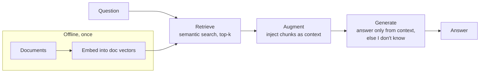

**Goal:** make the model answer from *your* documents instead of its training data (or
its imagination). You'll build a small RAG pipeline end to end — embed a corpus, retrieve
the most relevant pieces for a question, inject them into the prompt, and generate a
grounded answer — and watch it refuse to make things up when the answer isn't there.

**Where this fits:** this combines the chat model (Sections 1–7) with embeddings
(Section 19) and prompt construction (Section 12). It's the most common way to put an LLM
to work on private, fresh, or domain-specific data.

> Needs `EMBED_MODEL` set, same as Section 19.

---

## The problem RAG solves

The model only knows what it was trained on. Ask about your company's policies, last
week's events, or a private document, and it will either not know — or worse, **make up a
confident, plausible, wrong answer** (a hallucination, Section 5).

**RAG** (Retrieval-Augmented Generation) fixes this with a simple pipeline:




1. **Retrieve** — find the few pieces of *your* text most relevant to the question
   (semantic search from Section 19).
2. **Augment** — put those pieces into the prompt as context.
3. **Generate** — tell the model to answer **only** from that context.

The model brings language skills; *you* bring the facts. Done right, answers are grounded
and checkable.

---

## Build a RAG pipeline

We'll use a tiny knowledge base about a made-up company (so the model can't already know
it — which makes grounding obvious). Create **`work/rag.py`**. Start with the corpus and
the Section 19 helpers:

```python
import numpy as np
from common import get_client, MODEL, EMBED_MODEL

client = get_client()

DOCS = [
    "Acme Corp's return policy allows returns within 30 days with a receipt.",
    "Acme Corp was founded in 1987 in Portland, Oregon.",
    "Acme Corp's warranty covers manufacturing defects for 2 years.",
    "Acme Corp ships to the US and Canada only.",
    "The Acme widget weighs 1.2 kilograms and comes in blue or red.",
]

def embed(texts):
    r = client.embeddings.create(model=EMBED_MODEL, input=texts)
    return np.array([d.embedding for d in r.data])

def cosine(a, b):
    return float(a @ b / (np.linalg.norm(a) * np.linalg.norm(b)))

DOC_VECS = embed(DOCS)          # embed the corpus ONCE, up front
```

**Retrieve** — rank documents by similarity and take the top `k`:

```python
def retrieve(query, k=2):
    q = embed([query])[0]
    scored = sorted(((cosine(q, DOC_VECS[i]), DOCS[i]) for i in range(len(DOCS))),
                    reverse=True)
    return [doc for _, doc in scored[:k]]
```

**Augment + generate** — put the retrieved text in the prompt with a strict grounding
instruction:

```python
def answer(query):
    context = "\n".join(f"- {c}" for c in retrieve(query))
    prompt = ("Answer the question using ONLY the context below. "
              'If the context does not contain the answer, say "I don\'t know".\n\n'
              f"Context:\n{context}\n\nQuestion: {query}")
    r = client.chat.completions.create(
        model=MODEL, messages=[{"role": "user", "content": prompt}], temperature=0)
    return r.choices[0].message.content

print(answer("How long is Acme's warranty?"))   # grounded -> "2 years"
print(answer("Who is Acme's CEO?"))              # not in corpus -> "I don't know"
```

```bash
python work/rag.py
```

The warranty question gets a correct, grounded answer. The CEO question — which *no*
document answers — should produce **"I don't know"** rather than a confident fabrication.
That refusal is the payoff: grounding turns "plausible guess" into "answer or honestly
decline." *(Reference: [`examples/20/rag.py`](../examples/20/rag.py).)*

---

## The knobs that matter

- **Chunking.** Real documents are too big to embed whole. Split them into chunks
  (paragraphs, or ~a few hundred tokens with slight overlap) and embed each. Too big →
  retrieval is imprecise; too small → context gets fragmented. Our one-sentence "docs"
  are already chunk-sized.
- **`k` (how many to retrieve).** More context = more chance the answer is present, but
  more tokens (cost, Section 11) and more noise. Start small (3–5) and tune.
- **The grounding instruction.** "Use ONLY the context; say 'I don't know' otherwise" is
  what prevents the model from falling back on its own (possibly wrong) knowledge.
- **Citations.** Ask the model to quote or cite which retrieved chunk it used, so answers
  are auditable.

> **This is where untrusted text enters your prompt.** Retrieved documents become part of
> the instructions the model reads — which is exactly the attack surface for **prompt
> injection**. Section 21 is next for a reason.

> **Scaling up.** Re-embedding and looping over every document per query is fine for a
> handful; for real corpora you store vectors in a **vector database** that does fast
> nearest-neighbor search. The retrieve→augment→generate shape is identical.

---

> **Security:** Retrieved documents are **untrusted input** — the classic indirect prompt-injection vector. Delimit them, and never let text you fetched act as instructions (Section 21).

## Challenges

1. **Force a grounded refusal.** Ask three questions your `DOCS` can't answer. *Success:*
   all three get "I don't know," not invented facts.
2. **Show retrieval matters.** Bypass `retrieve` and pass *all* docs as context vs only
   the top 1. *Success:* you can describe the trade-off (accuracy vs tokens/noise).
3. **Add citations.** Number the docs and change the prompt to require "(source N)" in
   the answer. *Success:* answers cite the chunk they used.
4. **Add your own data.** Replace `DOCS` with 5–10 facts about something you know.
   *Success:* it answers your questions and declines on gaps.

---

## Recap

- **RAG** = retrieve relevant text (embeddings, Section 19) → inject as context → generate
  an answer constrained to that context.
- It grounds answers in *your* data and, with the right instruction, makes the model say
  **"I don't know"** instead of hallucinating.
- Tune **chunking**, **`k`**, the **grounding instruction**, and add **citations**.
- Retrieved text is untrusted input — straight into Section 21 (security).

## Next

**Section 21 — Security & Guardrails:** now that tools (Section 14) and retrieved content
(Section 20) put outside text into your prompts, we look at **prompt injection** and how
to defend against it.
