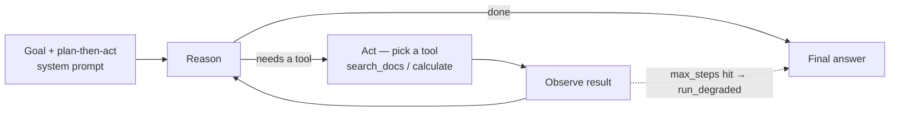

**Goal:** assemble the pieces you've built into an **agent** — the tool loop (Section 15)
given a goal, a system prompt that makes it plan, and several tools (including search) it
can use across multiple steps. You'll see that "agent" isn't a new technology; it's
composition.

**Where this fits:** this is where the advanced arc converges. Tools (13–14), retrieval
(19), memory (12), and guardrails (20) come together. After this you can read any "agent
framework" and recognize the engine underneath.

> **Reminder — needs tool calling.** The agent is built on the tool loop, so your endpoint
> must support **tool calling** (OpenAI-style `tools` / `tool_choice`). If `tool_calls` is
> always empty, that's why. See the README's "What your endpoint needs to support."

---

## What an agent actually is

Strip away the buzzword and an agent is:

> **a loop** (Section 15) **+ a goal + tools + a system prompt that says "plan, then act"
> + stop conditions.**

The model reasons about the task, picks a tool, sees the result, reasons again, picks the
next tool, and eventually decides it's done and answers. This reason→act→observe cycle is
often called **ReAct**. You already wrote the loop; an agent just gives it direction and
more capable tools.




---

## Build an agent

We'll give it two tools — a document **search** and the **calculator** — and a task that
needs both, in sequence. Create **`work/agent.py`**. Tools first (search is keyword-based
here so it runs without an embedding model; in production this would be RAG from
Section 20):

```python
import ast, json, logging, operator, sys, uuid
from common import get_client, MODEL

# JSONL telemetry to stdout (redirect it to a file); the final answer to stderr.
logging.basicConfig(level=logging.INFO, format="%(message)s", stream=sys.stdout)
log = logging.getLogger("agent")
client = get_client()

DOCS = [
    "The Acme widget weighs 1.2 kilograms.",
    "Acme Corp ships to the US and Canada only.",
    "Acme Corp's warranty covers defects for 2 years.",
]
_OPS = {ast.Add: operator.add, ast.Sub: operator.sub, ast.Mult: operator.mul,
        ast.Div: operator.truediv, ast.Pow: operator.pow, ast.USub: operator.neg}

def calculate(expression):
    def ev(n):
        if isinstance(n, ast.Constant) and isinstance(n.value, (int, float)): return n.value
        if isinstance(n, ast.BinOp) and type(n.op) in _OPS: return _OPS[type(n.op)](ev(n.left), ev(n.right))
        if isinstance(n, ast.UnaryOp) and type(n.op) in _OPS: return _OPS[type(n.op)](ev(n.operand))
        raise ValueError("unsupported")
    return str(ev(ast.parse(expression, mode="eval").body))

def search_docs(query):
    words = query.lower().split()
    hits = [d for d in DOCS if any(w in d.lower() for w in words)]
    return "\n".join(hits) if hits else "no results"

TOOLS = {"calculate": calculate, "search_docs": search_docs}
```

The schemas and a **planning system prompt** — this is what turns the loop into an agent:

```python
SCHEMAS = [
    {"type": "function", "function": {"name": "search_docs",
        "description": "Search the company knowledge base.",
        "parameters": {"type": "object", "properties": {"query": {"type": "string"}},
                       "required": ["query"]}}},
    {"type": "function", "function": {"name": "calculate",
        "description": "Evaluate an arithmetic expression.",
        "parameters": {"type": "object", "properties": {"expression": {"type": "string"}},
                       "required": ["expression"]}}},
]

SYSTEM = ("You are a research agent. Break the task into steps. Use search_docs to look "
          "up facts and calculate for arithmetic. Rely only on tool results -- do not "
          "invent facts. When you have enough information, give a short final answer.")
```

Now the loop — the same engine from Section 15, with the system prompt, the registry, and
**joinable logging** (Section 10). Every model call and every tool result is stamped with a
shared `trace_id` and a `step`, so the whole run reconstructs from the logs:

```python
def run_agent(task, session_id, max_steps=6):
    trace_id = uuid.uuid4().hex[:8]              # one trace per agent run
    messages = [{"role": "system", "content": SYSTEM}, {"role": "user", "content": task}]
    for step in range(max_steps):
        response = client.chat.completions.create(
            model=MODEL, messages=messages, tools=SCHEMAS, tool_choice="auto")
        msg = response.choices[0].message
        log.info(json.dumps({"event": "model_call", "session_id": session_id,
            "trace_id": trace_id, "step": step,
            "tool_calls": [tc.function.name for tc in (msg.tool_calls or [])],
            "completion_tokens": response.usage.completion_tokens if response.usage else None}))
        if not msg.tool_calls:
            return msg.content
        messages.append({"role": "assistant", "content": msg.content,
                         "tool_calls": [tc.model_dump() for tc in msg.tool_calls]})
        for tc in msg.tool_calls:
            fn = TOOLS.get(tc.function.name)             # only known tools run
            args = tc.function.arguments                 # raw JSON string until parsed below
            try:
                args = json.loads(tc.function.arguments)
                result = fn(**args) if fn else f"error: unknown tool {tc.function.name}"
            except Exception as err:
                result = f"error: {err}"
            log.info(json.dumps({"event": "tool_call", "session_id": session_id,
                "trace_id": trace_id, "step": step, "tool": tc.function.name,
                "args": args, "result": str(result)[:120]}))
            messages.append({"role": "tool", "tool_call_id": tc.id, "content": str(result)})
    # Hit the cap -- log the degradation loudly; don't return a "fine" answer silently.
    log.info(json.dumps({"event": "run_degraded", "session_id": session_id,
        "trace_id": trace_id, "reason": "max_steps", "max_steps": max_steps}))
    return "(stopped: reached max_steps)"

session_id = uuid.uuid4().hex[:8]
answer = run_agent("How much do 3 Acme widgets weigh in total, in kilograms?", session_id)
print(answer, file=sys.stderr)
```

```bash
python work/agent.py
```

Watch the JSONL stream by: a `model_call` line, then the `tool_call` lines it triggered,
then the next `model_call` — every line sharing one `trace_id`, ordered by `step`. The
agent `search_docs`-es for the widget weight, reads `1.2 kg`, `calculate`s `3 * 1.2`, and
answers `3.6 kg` — a two-step path you didn't hard-code, now fully reconstructable from the
logs. *(Reference: [`examples/23/agent.py`](../examples/23/agent.py).)*

---

## Trace the whole run

That logging is one of the highest-value things you can add to an agent. A single run makes
many model calls and tool executions; without a shared key they scatter across your logs as
unsortable noise — rich instrumentation that still can't answer "what did this run *do*?"
It's not a missing-log problem, it's a **missing-foreign-key problem** (Section 10). So we
stamp every record — `model_call` and `tool_call` alike, the *same shape* — with:

- a **`trace_id`** minted once per `run_agent` call (the whole run), and
- a **`step`** index (the loop iteration), so events read back in order,

while the caller passes a **`session_id`** that can span *several* runs in one conversation.
These are exactly Section 10's joining ids; here they earn their keep. To replay a run, filter
on one value:

```bash
grep '"trace_id": "..."' agent.jsonl     # every model call + tool result, in order
```

Two habits make this trustworthy:

- **Stamp identity where you write the line, every line.** If the tool half of the loop
  didn't carry the `trace_id`, half your run would be invisible — and you'd only notice
  while debugging the run you can't see. An optional join key is one that's missing exactly
  when you need it.
- **Make degradation loud.** When the agent stops *short* of finishing — here, hitting
  `max_steps` — log it as its own event (the `run_degraded` line above) instead of returning
  a stopped-string the caller might mistake for a real answer. A silent stop that *looks*
  like success is the worst failure mode. (Tool errors aren't silent either: each is
  captured in its `tool_call` record's `result` and fed back to the model.) Now "the agent
  gave a wrong answer" is something you can *investigate* — read the trace, find the step
  where a tool returned the wrong thing or the model mis-planned.

Production tracing (OpenTelemetry, or hosted tools like LangSmith) formalizes this with
nested **spans** — each step gets a `span_id` and a `parent_span_id` so sub-steps form a
tree — but it's the same shared-id idea you just wired in by hand.

## What makes agents reliable (and what doesn't)

Agents are powerful but failure-prone — they take multiple model calls, and an early
mistake compounds. The habits that keep them sane are ones you've already met:

- **Stop conditions.** A `max_steps` cap (and ideally a token/cost budget, Section 11) so
  a confused agent can't loop forever.
- **Validated tools + least privilege** (Section 21). The agent chooses tool arguments —
  validate them, allowlist tools (the registry does this), and gate destructive actions.
- **Errors as feedback.** Returning tool errors to the model lets it recover; crashing
  doesn't.
- **Memory management** (Section 13). Long agent runs build long histories — window or
  summarize.
- **Observability** (Section 10). Log each model call *and* tool result with a shared
  `trace_id` so the whole run joins up, and emit a **loud event when the agent stops short**
  (hits the cap). One `grep` should replay a run; a silent stop that looks like success is
  the failure mode you can't debug.

> **Do you even need an agent?** Agents shine when the steps *aren't* known in advance. If
> you already know the sequence ("retrieve, then summarize"), a plain pipeline is cheaper,
> faster, and more predictable. Reach for an agent when the path genuinely depends on what
> the model finds along the way.

> **Frameworks.** LangChain, LlamaIndex, the OpenAI Agents SDK and others package this
> loop with extras. You now understand the engine they're wrapping — which makes them a
> convenience, not a black box.

---

> **Security:** An agent compounds every earlier risk. Give it least-privilege tools, keep a human in the loop for irreversible actions, and run all tool execution inside the sandbox (Sections 16–17).

## Challenges

1. **Add a tool, watch it plan.** Add a `convert_kg_to_lb` tool and ask "How much do 3
   widgets weigh in pounds?" *Success:* the agent chains search → calculate/convert.
2. **Make it decline.** Ask something the docs don't cover. *Success:* with the "rely
   only on tool results" instruction, it says it doesn't know rather than inventing.
3. **Budget it.** Add a running token counter (sum `usage`, Section 11) and stop the
   agent when it exceeds a cap. *Success:* the agent halts on budget, not just step count.
4. **Replay a run.** Capture the JSONL with `python work/agent.py > agent.jsonl` (telemetry
   is on stdout; the answer prints to stderr), then `grep '"trace_id": "..."' agent.jsonl`.
   *Success:* you get every `model_call` and `tool_call` for that run, in `step` order — the
   whole trace reconstructed from one key. Force `max_steps=1` and confirm a `run_degraded`
   line appears rather than a silent stop.

---

## Recap

- An **agent** = the tool loop + a goal + tools + a "plan then act" system prompt + stop
  conditions (the **ReAct** cycle).
- It composes everything: tools (13–14), retrieval (19), memory (12), guardrails (20),
  observability (9), cost control (10).
- Reliability comes from **caps, validated/least-privilege tools, errors-as-feedback, and
  logging** — not from trusting the model.
- Stamp every model call and tool result with a shared **`trace_id`** (and a `session_id`
  across runs), and log degradation **loudly** — a whole run should replay from one `grep`.
  This is the difference between an agent you can debug and one you can only stare at.
- Prefer a plain pipeline when the steps are known; use an agent when the path is
  data-dependent.

## Next

**Section 24 — Evaluation & Testing:** an agent that *sometimes* works isn't done. We'll
measure quality with golden tests and an LLM-as-judge so you can tell whether changes
help or hurt.
